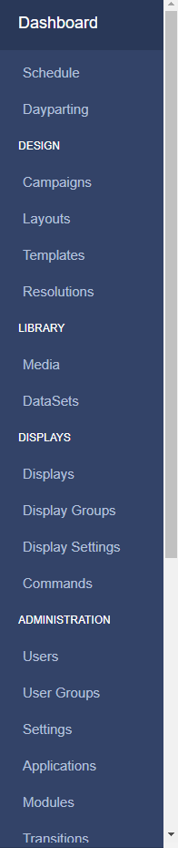

<!--toc=tour-->

# Navigation

All **CMS pages** are categorised into sections and are accessible from the CMS **Main** **Menu** for ease of navigation. This menu can be placed vertically on the left hand side or horizontally along the top of the CMS, based on [User Preference](tour_user_profile.html#preferences)

{tip}
If you are using 1.8 the menu will only be placed vertically on the left hand side as standard.
{/tip}

{tip}
The menu will only show the items enabled for each User to see!
{/tip}

### Dashboard

This is a direct link to the logged in Users assigned [Dashboard](tour_status_dashboard.html) (homepage). 

### Schedule

Create, view and manage [Events](scheduling.html) for each Display in your signage network. Create your own [Dayparts](scheduling_dayparting.html) to include when scheduling events.

### Design

Create and manage [Layouts](layouts.html)/[Campaigns](layouts_campaigns.html) and utilise [Templates](layouts_templates.html).

### Library

Create reusable [Playlists](media_playlists.html) and store file-based [Media](media.html) for re-use and design. Store tabular data using [DataSets](media_datasets.html).

### Displays

The Display section contains all pages needed for managing connected [Displays](displays.html).

### Administration

Manage all [Users](users_administration.html)/[User Groups](users_groups.html)**, **CMS Settings and [Modules](https://xibo.org.uk/manual/en/media_modules.html).

{nonwhite}
For CMS Settings administration please click [here](https://xibo.org.uk/docs/setup/xibo-cms-settings)
{/nonwhite}

### Reporting

View Display statistics, Proof of Play as well as Library Usage by User/User Group [Reports](displays_metrics.html).

### Advanced

Access Log and Session information as well as Audit Trail and [Fault Reporting](troubleshooting.html).

{nonwhite}
Advanced information regarding logs and Audit Trails for administrators can be found [here](https://xibo.org.uk/docs/setup/troubleshooting-for-administrators)
{/nonwhite}