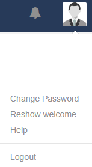

<!--toc=tour-->

# Navigation

All **CMS Pages** are categorised into sections and are accessible from the **Menu** located on the left hand side of the CMS, for ease of navigation.

{tip}
The Menu will only show the items each User has permission to see!
{/tip}

### Dashboard

A direct link to the logged in **Users** assigned Dashboard (homepage).

### Schedule

Create, view and manage **Events** for each Display in your signage network.

### Dayparting

Create your own **Dayparts** to include when Scheduling Events.

### Design

Create and manage **Layouts** and **Campaigns** and utilise **Templates**.

### Library

Store file-based **Media** for re-use and design and store tabular data using **DataSets**.

### Displays

The Display section contains all pages needed for managing your connected **Displays**.

### Administration

Manage all **Users**/**User Groups**, **CMS** **Settings** and **Modules**.

### Reporting

View **Display statistics** and **Proof of Play** reports.

### Advanced

Troubleshooting.

## Profile Icon

In the top right-hand corner of the CMS use the Profile Icon to access **User-specific** data and options.

{tip}
All new Users are strongly advised to navigate to the Profile Icon menu to change their password the first time they log into the CMS.
{/tip}