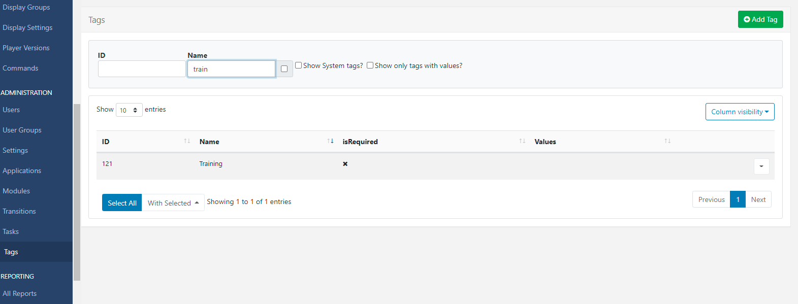
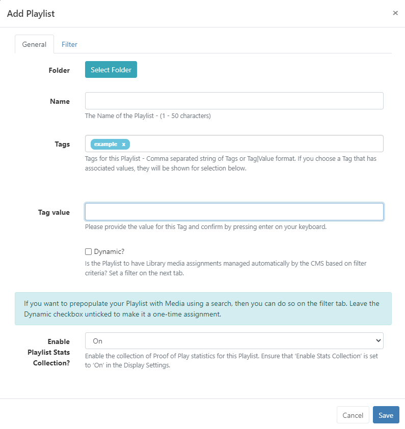
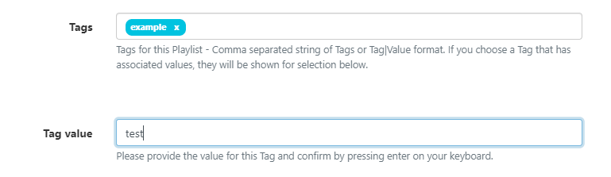

<!--toc=tour-->

# Tags

{version}
**Note:** If you are using a CMS earlier than v3.0.0 please click [here](tour_tags_2.html)
{/version}

Tags can be assigned to **Layouts**, **Campaigns**, **Templates**, **Playlists**, **Media** and **Displays/ Display Groups** in order to bring about organisation and structure within the CMS.

{tip}
Tags can be used in search fields throughout the CMS to narrow down returned results!
{/tip}

Tags that have been added can be viewed,edited and deleted by navigating to **Tags** under the **Administration** section of the CMS.

{tip}
Use the available options to filter Tags and only see only those that have set associated Values!
{/tip}

## Edit/Delete Tags

- Click on the Row Menu of a Tag to **Edit** or **Delete**.

- Select **Edit** to rename, set associated Values and enable/disable the Required Value function.

When adding Tags you can optionally create a **Tag value** to be associated with the Tag:

* Free type the **Tag Value** to be used with the Tag:

* Click enter on your keyboard to confirm. 

The Tag field will update to show the `Tag|Value`

The next time this Tag is entered the associated Value will be shown for selection. 

Tags can have a **Required Value** enabled so that a Value must be selected in order for a User to save the form. This is enabled by editing the Tag from the Tags grid.

Tags can be deleted individually or removed in bulk:

- Click to highlight which Tags you wish to delete and use the **With Selected** drop down at the bottom of the grid
- Select **Delete** .

{tip}
The deletion of Tags is irreversible, so use with care!
{/tip}

## Assigning Tags

On entering text in the Tag field on forms, an auto-complete helper will show possible matches to make it easier for Users to see what Tags are available to select from.

- You can see in the image below that the `colour` Tag already has associated values of `Red, Green and Blue`  shown as Tag values to select from.

{tip}
If the Tag Value is already known then this can also be typed in the field using the `Tag|Value` format.

Users can add an associated value to a Tag without an existing predefined value using the Tag Value field. Enter the Value you wish to associate with the Tag in the Tag value field and click enter. If you do not wish to enter a Tag value, then this field can be left blank.

Tags can also be assigned to multiple elements using the [With Selected](tour_grids.html#multi-select) option on multiple pages throughout the CMS.

When exporting a Layout the **Layout Tag** will also be exported. Select the **Import Tags** option to add the Tag on Layout import if required.
{/tip}