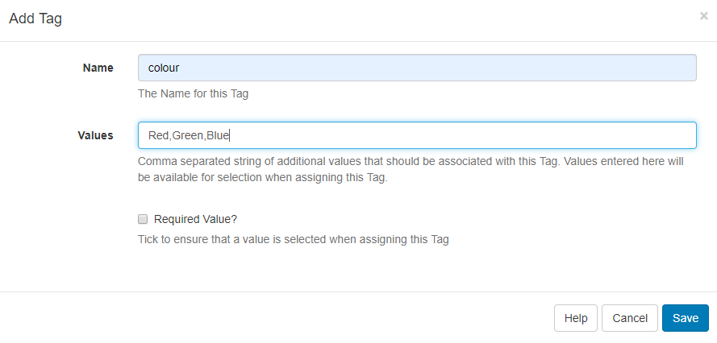
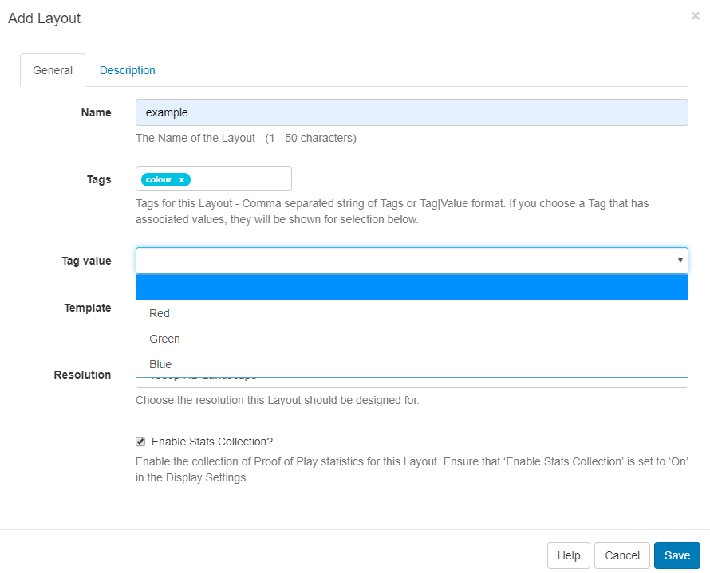
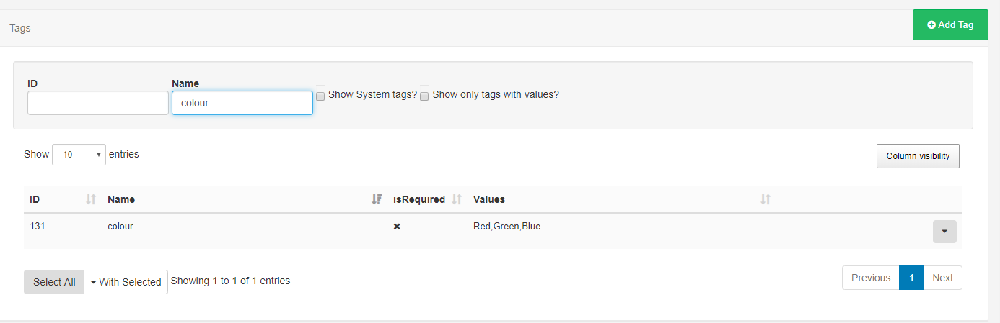

# Tags

{tip}
**Please note:** If you are using a v3 CMS, please click [here](tour_tags.html)
{/tip}

Tags can be assigned to **Layouts**, **Campaigns**, **Templates**, **Playlists**, **Media** and **Displays/ Display Groups** in order to bring about organisation and structure within the CMS.

{tip}
Tags can be used in search fields throughout the CMS to narrow down returned results!
{/tip}

Tags that have been added can be viewed,edited and deleted by navigating to **Tags** under the **Administration** section of the CMS.

## Edit/Delete Tags

- Click on the row menu of a selected tag to **Edit** or **Delete** .

- Select **Edit** to rename, set associated Values and enable/disable the Required Value function.

Tags can optionally have set associated **Values**, which will show for selection when assigning the Tag: 

Tick the Required Value checkbox to ensure that a **Value** has to be selected when assigning this Tag. When selected, Users will be given a drop down menu to show the associated available Values from which to select. The User will not be able to save the form until they have selected a value.

Tags can be deleted individually or removed in bulk:

- Click to highlight which Tags you wish to delete and use the **With Selected** drop down at the bottom of the grid
- Select **Delete** .

{tip}
The deletion of Tags is irreversible, so use with care!
{/tip}

## Assigning Tags

Tags can be added to a Layout**,** Campaign**,** Template, Playlist, Media files, Displays and Display Groups which will then show in the Tags grid.

When assigning Tags, User's can enter the Tag and can also include the **Value** if already known using the following format: `Colour|Red`.

If the **Required Value** checkbox has been ticked for this Tag then a Value must be selected in order to save the form with Associated Values available to view by using the **Tag value** drop down.

{tip}
From v2.3.6, you can add an associated value to a Tag without an existing predefined value using the Tag Value field. Enter the Value you wish to associate with the Tag in the Tag value field and click enter. If you do not wish to enter a Tag value, then this field can be left blank.
{/tip}

A User can filter by the Tag to see associated Values:

Tick the **Show only tags with Values** check box to only see the Tags that have Values.

{tip}
When exporting a Layout the **Layout Tag** will also be exported. Select the **Import Tags** option to add the Tag on Layout import if required.
{/tip}

