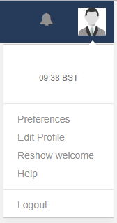
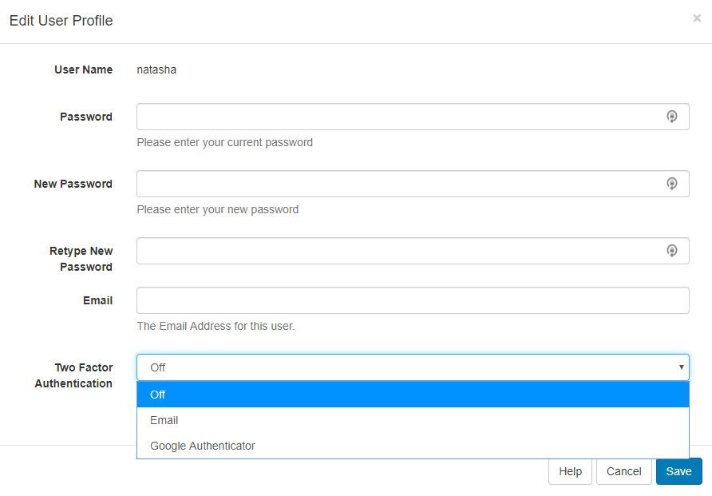

# Two Factor Authentication

For added security, Users can set **Two Factor Authentication** options for **Email** or **Google Authenticator** to complete login by entering a code, to further confirm their identity when logging into the CMS.

{tip}
Please ensure that your Administrator has entered a **Sending Email** address on the CMS **Settings** page, **Network** tab prior to the set up of Two Factor Authentication.
{/tip}

Navigate to the **Profile icon** in the top right hand corner of the CMS and click on **Edit Profile**.

Use the dropdown menu for **Two Factor Authentication** and select from one of the two options:

## Email

Each time a User enters their **Username** and **Password** to login they will also receive an **email**, to the address provided, containing a 6 digit **code** to enter to complete log in.

Ensure that an email address has been provided on this form and press **Save**. 

## Google Authenticator

Each time a User enters their **Username** and **Password** to login they will need to access the **Google Authenticator app** to enter the 6 digit **code** displayed.

Install the [Google Authenticator app](<https://play.google.com/store/apps/details?id=com.google.android.apps.authenticator2>) to your mobile device.

Scan the QR code shown on the Edit User Profile form and enter the code displayed into the Access Code field and Save to complete the set up.

{tip}
You will need to enter your password to verify any changes made to the Two Factor Authentication options.{/tip}

## Generate Recovery Codes

Once you have saved either **Email** or **Google Authenticator** as an option, go back to the **Profile Icon** and select **Edit Profile** to **Generate** recovery codes. Copy the generated recovery codes and store them in a safe place like password manager. Click on **Save** to make the codes active.

Click on **Show** at anytime to see your generated recovery codes.

{tip}
Clicking on Generate will invalidate all existing codes.
{/tip}

{tip}
In the event access is lost to the configured email address or app with a User unable to retrieve recovery codes, this can be reset from the [Edit User form](.<https://xibo.org.uk/manual/en/users_administration.html#editing_users>). Once ticked the User can reconfigure the options from the User Profile as before.
{/tip}