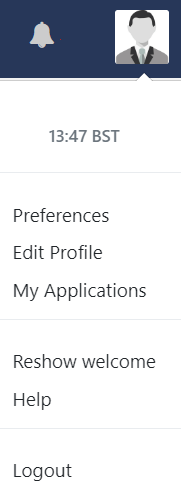
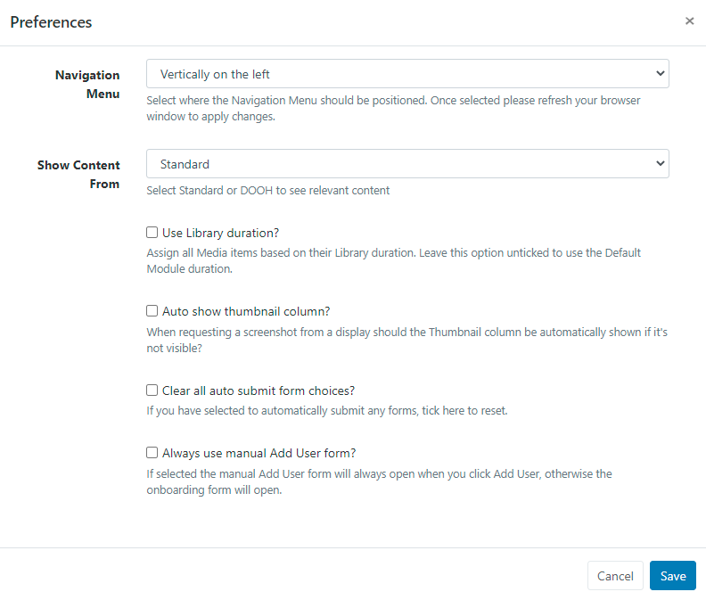

<!--toc=tour-->

# User Profile

The **User Profile** is used to set Preferences, Edit Profile and manage options for the logged in User.

Located in the top right of the CMS, click on the icon to open.

{tip}
The CMS time and timezone that has been set in the **Regional** settings is displayed here!
{/tip}

{nonwhite}
For further information regarding post installation set up, please click [here](https://xibo.org.uk/docs/setup/xibo-cms-post-installation-setup-guide)
{/nonwhite}

## Preferences

 

- Use the drop down menu to select how you would like the **Navigation Menu** to be positioned for the CMS.

  {tip}
  Once selected and saved, ensure you refresh your browser to apply the change.
  {/tip}

- Use the drop down to view only relevant content as, **Standard** CMS content or **DOOH** content.

  {tip}
  DOOH content can be a separate view for Users that have authorised DOOH Applications as viewed under [My Applications](users_administration.html#my_applications).
  {/tip}

- **Force current Library duration** so that any changes made to the media item in the Library are not pulled into Layouts.

- Use this option to automatically show the thumbnail column when requesting screenshots from Displays.

- This option allows a User to reset all forms that have been selected to automatically submit.

  {tip}
  The Auto Submit form functionality is available from v3.0.0, for more information see [Grids](tour_grids.html)
  {/tip}

- Select this option to always show a manual 'Add User' form when adding new User's to the system. When disabled, the onboarding wizard will be used instead.

  {tip}
  Use pre configured User Groups for easier User onboarding using the wizard, available from v3.0.0!
  {/tip}

## Edit Profile

The Edit User Profile form allows a logged in User to:

- Change **Passwords**
- Update a User **Email** address

- Enable [Two Factor Authentication](tour_two_factor_authentication.html) 

## Reshow Welcome

Take a short tour of the CMS to assist with navigation and functionality.

## Help

Click to view the User Manual for guidance and improve understanding of the CMS features and functionality.

## Logout

Click to securely logout of the CMS Instance after each User session.

{tip}
All new Users are strongly advised to navigate to the User Profile menu to change their password the first time they log into the CMS.
{/tip}