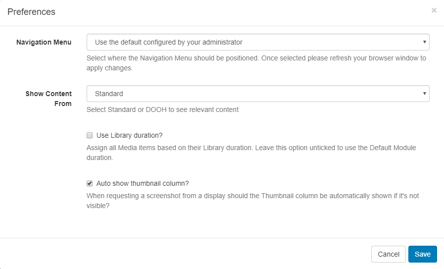
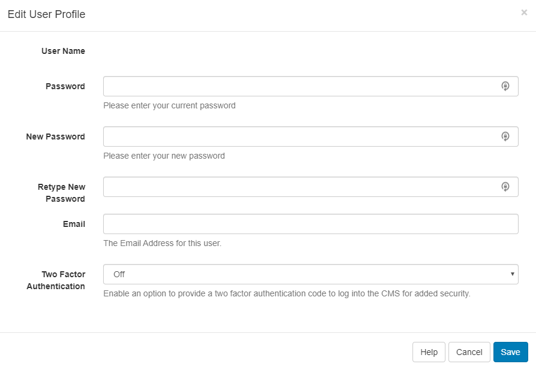

# User Profile

The **User Profile** can be used to set preferences and options for the logged in User.

Located in the top right of the CMS, click on the icon to open.

{tip}
The CMS time and timezone that has been set is displayed here!
{/tip}

## Preferences

 

- Select how you would like the **Navigation Menu** to be positioned.

  {tip}
  Once saved, ensure you refresh your browser to apply changes.
  {/tip}

- Use the drop down to view only relevant content as, **Standard** CMS content or **DOOH** content.

  {tip}
  DOOH content can be a separate view for Users that have authorised DOOH Applications as viewed under [My Applications](<https://xibo.org.uk/manual/en/users_administration.html#my_applications>).
  {/tip}

- Select to use the **Library duration** or **Module defaults** for all assigned Media.

- Tick to automatically show the thumbnail column when requesting screenshots.

## Edit Profile

- Change **Passwords**
- Update a User **Email** address

- Enable [Two Factor Authentication](<https://xibo.org.uk/manual/en/tour_two_factor_authentication.html>) 

## Reshow Welcome

Take a short tour of the CMS to assist with navigation and functionality.

## Help

Click to view the User Manual to give a greater understanding of CMS features and functionality.

## Logout

Click to securely logout of the CMS Instance.

{tip}
All new Users are strongly advised to navigate to the User Profile menu to change their password the first time they log into the CMS.
{/tip}