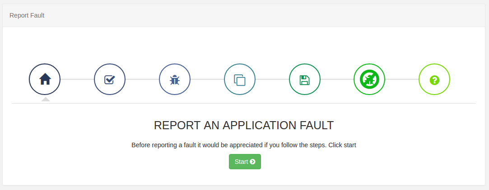

# User Support 

{white}

Please contact your administrator.

{/white}

{nonwhite}

So you can get the best support from us we ask that you provide us with specific information when contacting us with a support request:

- The version of the software that you are using.
- Description of the issue you are experiencing.
- Detailed steps so that the issue can be recreated by our team.
- Download a troubleshoot zip file from the CMS central ‘error log’ and attach to your support ticket.

## CMS error log

The CMS collects messages from all the components within the platform; CMS, Players, API, Maintenance etc and so is a valuable resource when investigating issues.

CMS logging can be provided from the **Report Fault** page located under the Advanced section of the Menu. Click on start to be taken through the fault wizard which will guide you through the steps to collect and download a troubleshoot.zip file.

{tip}
Follow our guide on [How to record logs for a CMS issue using Report Fault.](https://community.xibo.org.uk/t/how-to-record-logs-for-a-cms-issue-using-report-fault/30290)
{/tip}

Depending on the issue that you are experiencing, we may ask for additional information.

## Provide a screenshot of the Player Status

Access the status page on Players by following the steps for the Player type:

**Windows / Linux** - Whilst Xibo is running, click `i` on the keyboard to open the Status screen.

**Android** - Connect a mouse to your device and click on the screen whilst Xibo is running. Choose ‘Status’ from the Action bar at the top of the screen.

**webOS / Tizen** - Press the OK or Enter button on your webOS remote control whilst Xibo is running and choose 'Status' from the Action bar at the top of the screen.

## Contacting us…

Customers on a Professional, Business or Enterprise Plan have access to our experts on our Help Desk. Please open a ticket via [My Account](https://xibosignage.com/my-account/tickets?open=true) if you need assistance.

### Community Forum

The [Xibo Community](https://community.xibo.org.uk/) provides a wealth of knowledge and expertise from its members as well as our own support team, with many answered questions, support guides and feature walkthroughs accessible to all.

{/nonwhite}