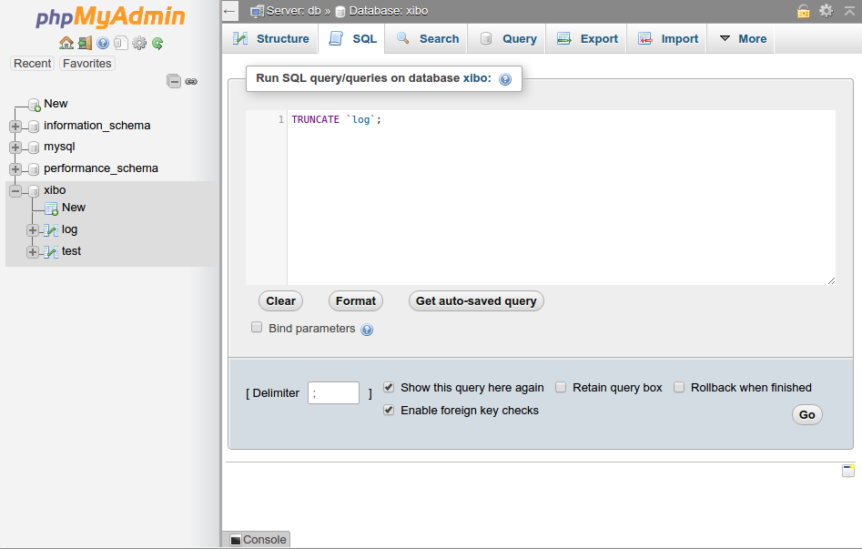
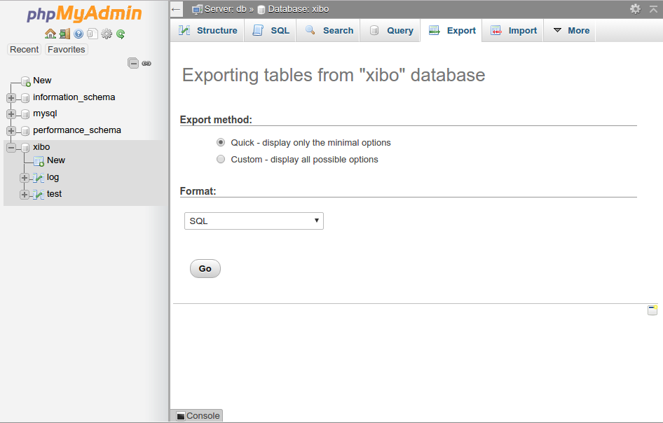

<!--toc=cms_upgrade-->
# Switching to Docker
Installations prior to 1.8 will be "Custom/Manual" installations and should be migrated
to Docker during the upgrade. Please follow the below instructions:

Review the Docker installation guide for your choice of platform which can be found here:
[Install CMS](install_cms.html)

Follow that guide, until you get to the step where the CMS is initially bootstrapped.
*Do not run the `docker-compose up` command.* When you get to that step, please return
here, and pickup.

If your server is already running a webserver, then you will need to pay specific attention
to the instructions on running on custom port numbers.

Once you have Docker installed, and have extracted the [[PRODUCTNAME]] Docker Release
Archive, and created your config.env file, you should continue from this point.

In the same directory as you extracted the `docker-compose.yml` file, create the following
directory structure:

    shared
         |
         - backup
         - cms
             |
             - library

Copy the library files from your existing install in to `shared/cms/library` - so for
example, you might have `shared/cms/library/10.jpg`.

On your existing Xibo installation, empty your log table by using the CMS Web Portal
to go to the `Log` page and clicking on `Truncate`, or by running `TRUNCATE log` from a
MySQL prompt with your Xibo database selected.

Export your database from your old installation by running the following,
  e.g. `mysqldump -u user -p database-name > shared/backup/import.sql`

where `user` is the Xibo database user. You will be prompted for the password. You can find
both those values in the `settings.php` file in your old Xibo installation directory.

If you're not comfortable using the mysqldump command, then see the [following section](#exporting_with_phpmyadmin)
which covers using PHPMyAdmin if you have that available, however, please note that PHPMyAdmin is
known to have issues exporting very large database backups reliably.

It is CRITICAL that your import.sql file contains only the [[PRODUCTNAME]] database that you
wish to upgrade. It must not contain multiple databases. Specifically, it must not contain a
`USE db_name` command.

Save your 1.7 (or 1.8) database export as `shared/backup/import.sql`

We can now bring up the new CMS containers with your old data.

Run the following:

    docker-compose up -d

or if you're using a custom ports or remote mysql docker-compose file,

    docker-compose -f custom.yml up -d

where custom.yml is that custom file you've created.

That will cause the containers to be created for your database, web server and XMR server.

After a period of time (allow up to 10 minutes), you should see the CMS webpage appear at
`http://localhost` or `http://localhost:port` if you're running on a custom port.

Since we're importing a non-Docker based installation, there's a couple of additional steps
to take which require direct modification of the database. If you're running with an external
database, then please run the SQL commands listed below directly on your remote database
instead of running these commands from inside the Docker console.

First, run `docker ps` to list all running docker containers, and find there the name of
the database container. It will be the one with `web` in the name - so for example
`[[PRODUCTNAME]]_cms-web_1`.

Once you have the database container name, run the following to get to a shell inside the web
container

    docker exec -ti [[PRODUCTNAME]]_cms-web_1 bash

Next run the following

    mysql -h mysql -u cms -p cms

You will be prompted for a password. It will be the one that you chose in config.env for MySQL.

Assuming the correct password is entered, you'll be presented with a MySQL command prompt.

Run the following commands:

    UPDATE `setting` SET `value`="/var/www/cms/library/", userSee=0, userChange=0 WHERE `setting`="LIBRARY_LOCATION";
    UPDATE `setting` SET `value`="tcp://cms-xmr:50001", userSee=0, userChange=0 WHERE `setting`="XMR_ADDRESS";
    UPDATE `setting` SET `value`="Apache" WHERE `setting`="SENDFILE_MODE";
    exit

Run `exit` again to return to your local machine shell.

Finally delete any files inside `shared/cms/library/cache` directory (you may need to use sudo
or be the root user on a Linux system to do so).

You should then be able to log on to the 1.8 web interface using an administrative user account.
The passwords will be the same as your old 1.7 installation used.

## Exporting with PHPMyAdmin

The example above uses `mysqldump`, however if your environment does not have
`mysqldump` it is possible to use `phpmyadmin` to generate a backup. Care must
be taken to ensure that a database is selected in the left hand pane **before**
going to the export tab. Failure to do this will result in the export containing
the existing database name, which may not match the new name in Docker.

Step 1:

Step 2:

