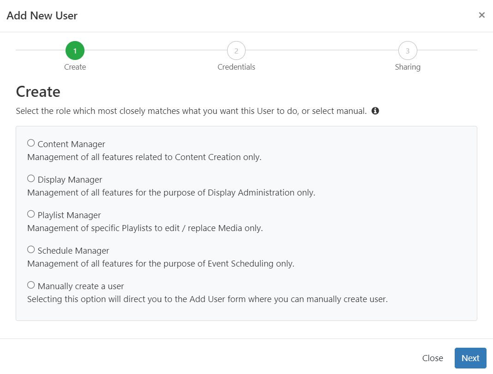
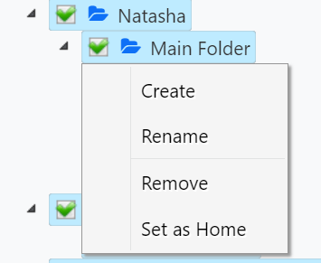
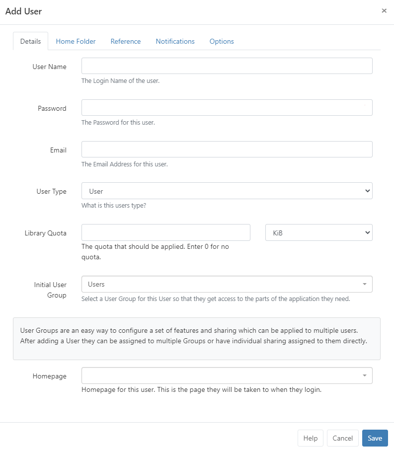
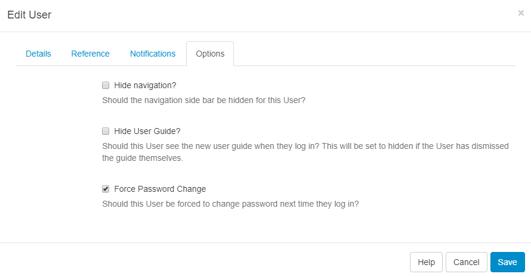

# User Administration

[[PRODUCTNAME]] allows for individual access for multiple Users provided with a **Username** and **Password** to the CMS.

Users are added to the CMS by Super Admins and granted access within the CMS from their assigned [User Type](users_administration.html#content-user-types) and [User Group](users_groups.html) in which they will inherit the applied [Features and Sharing](users_features_and_sharing.html).

{tip}
Users can be assigned to one or multiple User Groups!
{/tip}

### User Ownership

All items created in the CMS by an individual User are owned by that User. Ownership of an item (be it a Layout, Media file or Scheduled Event) gives that User full editing rights including the ability to share with other Users.

## User Types

Every User must be assigned 1 of the 3 available User Types:

### Super Admin User

Super Admin Users have access to all parts of the CMS, regardless of any inherited Feature and Sharing options set to any User Groups they have been assigned to. This also includes full access to ALL Media, Layouts and Schedules added by any other User of the system. 

{tip}
A Super Admin User is created during the installation process to have full access rights to the CMS in order to set it up. We suggest having at least one Super Admin User to act as the last contact point for the CMS system.
{/tip}

### Group Admin User

Group Admin Users only have access to the parts of the CMS as assigned to the User Group that they belong to. In addition, they will have access to all Media, Layouts and Schedules of all other Users assigned to that User Group as well as their own Media, Layouts and Schedules.

### User

A User will only have access to the parts of the CMS as assigned to the User Group they belong to as well as access to their own Media, Layouts and Schedules.

{version}
User Types are pre-configured and cannot be modified!
{/version}

## Adding Users to the CMS

Users are administered in the CMS by clicking on **Users** under the **Administration** section on the CMS main menu. The Users grid will open for you to add and manage Users:


{nonwhite}
{cloud}
Xibo Cloud Hosting customers have access to the helpdesk as part of the hosting service. Please ensure that the default user account named `xibo_admin` is not modified or removed so that our helpdesk agents can assist you with your CMS as and when required.
{/cloud}
{/nonwhite}

{white}
{cloud}
Please ensure that the default user account named `cms_admin` is not modified or removed so that you can be assisted you with your CMS as and when required.
{/cloud}
{/white}

- To add new Users, click on the **Add User** button. 


There are two ways in which Users can be added, via an onboarding wizard using pre-configured User Groups or adding manually.

{tip}
The onboarding wizard and pre-configured Groups are available for new v4 installations and for users who upgrade to v4 who have not previously utilised User Groups in their earlier versions! 
{/tip}



Select from one of the pre-configured **User Groups** and continue through the steps of the **Onboarding Wizard** or select the last option **Manually create a user** to be taken to the [Add User](users_administration.html#content-add-user-form) form.

### Onboarding wizard

- Select a [User Group](users_groups.html) and click **Next**

  {tip}
  [Features](users_features_and_sharing.html) have been pre-configured for these groups common functions. These can be further modified to suit by editing the User record!
  {/tip}

- Create a **User Name** and **Password** which will be used as the User login and identify the User within the CMS.

  {tip}
  The password must contain at least 8 characters and include upper and lower case letters as well as at least one number or special character!
  {/tip}

- Complete the Email address for this user, click **Next**

  {tip}
  A user can enter/edit their email address after login from the [User Profile!](tour_user_access.html#content-edit-profile)
  {/tip}

- Select a [Folder](tour_folders.html) to easily share user objects with the new User.

  {tip}
  We recommend using Folders to make sharing user objects with multiple Users a simplified process. All items contained or moved into a Folder will inherit the View, Edit, Delete [Share](users_features_and_sharing.html#content-share) options that have been enabled for Users/User Groups. 
  {/tip}

- A [Home Folder](tour_folders.html#content-home-folder) can be optionally set for a User by right clicking a Folder and selecting the **Set as Home** option:

  

- **Save** all changes.

{version}
When allowing others Users, (such as a Group Admin Users) to add Users using the Onboarding Wizard, ensure that **Folders** has been enabled in [Features](users_features_and_sharing.html) if they are required to Share Folders with a User for viewing and editing!
{/version}

### Add User Form

Use the form to manually add a User to the CMS:



{tip}
To always show the manual **Add User form** when adding new Users to the system instead of the onboarding wizard, use the option available in **Preferences** from the [User Profile](tour_user_access.html#content-user-profile)!
{/tip}

Enter the required information for each tab:

- Create a **User Name** and **Password** which will be used as the User login and identify the User within the CMS.

  {tip}
  The password must contain at least 8 characters and include upper and lower case letters as well as at least one number or special character!
  {/tip}

- Complete the Email address for this user so they can receive notifications from the CMS, click **Next**

  {tip}
  A user can enter/edit their email address after login from the [User Profile!](tour_user_access.html#content-user-profile)
  {/tip}

- Use the drop down to select a **User Type**

- Enter a maximum amount of [Library Quota](users_administration.html#content-library-quota) allowed to be uploaded to the Library for this User, information can be found in the section below.

- Select which [User Group](users_groups.html) this User should belong to so that they can access the relevant parts of the CMS as required for their role.

  {tip}
  Use **System Notifications** as the initial User Group for Users that do not require access to anything within the CMS but require notification emails when there are system issues as System Administrators!
  {/tip}

- Use the drop down to select from the choice of [Dashboards](users_dashboards.html) for the Users 'Homepage' to only allow access to the relevant parts of the CMS. The User will be taken to this Dashboard after first login.

### Library Quota

[[PRODUCTNAME]] includes a Library Quota system so that Users/User Groups can be assigned a quota (expressed in kilobytes) to determine the maximum amount of content a User/User Group can upload. Putting a value of **0** means the User has an unlimited Library Quota.

The largest quota that can be resolved for the User is always the quota that is applied and excludes the unlimited quota.

{tip}
**Example:**

- User A has a quota of 100 MB assigned to their User record.
- Group 1 has a quota of 50 MB assigned to the Group record.
- Group 2 has a quota of 120 MB assigned to the Group record.

User A belongs to Group 1 and Group 2 so therefore their Library Quota is 120 MB (as this is the largest quota applied).

User A leaves Group 2 so their Library Quota is now 100 MB (as the largest applied quota).

User A is re-assigned an unlimited quota (0), their Library Quota is now 50 MB as they still belong to Group 1 (which has 50 MB quota applied and therefore any unlimited quota is excluded.)
{/tip}

#### Home Folder

A [Home Folder](tour_folders.html#content-home-folder) can be optionally set for a User by right clicking a Folder (or creating a new Folder) and select the **Set as Home** option.

#### Reference

This tab has been included to optionally provide reference information for a User. Once added, this information can be viewed in the Users grid and via the API.

#### Notifications

Select the type of notifications the User should receive, **System** or **Display** if applicable.


#### Options

Apply further options for the User as required:

- Hide the side navigational bar.
- Hide the New User guide when they log in.
- Force a User to change their password the next time they log in.

### Force Password Change

Use this function from the **Options** tab to ensure that 'new' Users change the password first given to them to access the system or if a User account password has been reset:



Users will be redirected to a page to reset their password, the next time they log in.

## Editing Users

Use the row menu for a selected User to make changes.

{tip}
Easily manage [User Group](users_groups.html) membership, [Home Folders](/manual/en/tour_folders.html#home-folders) as well as [Feature](users_features_and_sharing.html) access from this menu.

Make any required changes to the User record by clicking **Edit**.

{/tip}

### Reset Two Factor Authentication

If a User loses access to their email or Google Authenticator app and has no access to any saved recovery codes, use the check box from the Edit User form to **Reset Two Factor Authentication**.

Once ticked the Two Factor Authentication will be set to ‘Off’ for this **User Profile** with any stored secret codes cleared. The User can now set up [Two Factor Authentication](tour_user_access.html#content-two-factor-authentication) from the User Profile as before.

{tip}
Use the Column visibility button to dd the **Two Factor** column to the Users grid. This will give you an overview of what Two Factor Authentication Users have set (Disabled / Email / Google Authenticator).

If you cannot access the CMS then run the following sql directly in the database to clear 2FA data for a specified User `{yourUserId}` , userId can be found in the User table.

```
UPDATE `user` SET `twoFactorSecret` = NULL,
`twoFactorTypeId` = 0,
`twoFactorRecoveryCodes` = NULL
WHERE userId = {yourUserId}
```

{/tip} 

## Deleting Users

Use the row menu to Delete a User from the CMS. A confirmation form will open up and give you further options regarding the items currently owned by that User.

{tip}
Deleting a User is irreversible and will remove all their owned items including; Media, Layouts and Schedules, even if these items are being used by other Users in the system. **Reassign items** to another User using the selector to make them the new owner of all the items currently owned by the User you wish to delete. Alternatively, use the **Retired** checkbox at the bottom of the Edit User form so that the items remain in use in the system with the User unable to log in. 

[[PRODUCTNAME]] doesn't place any limits on the number of Users that can be added.

{/tip}

{nonwhite}

{cloud}

With our **Xibo Cloud Hosting** we do not impose limits on concurrent access or licence User access in any way.

{/cloud}

{/nonwhite}

#### Next...

[User Groups](users_groups.html)