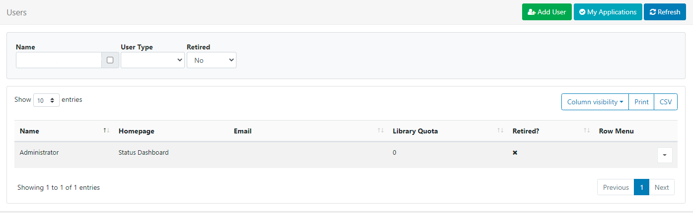
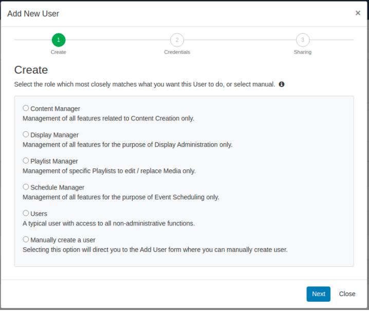
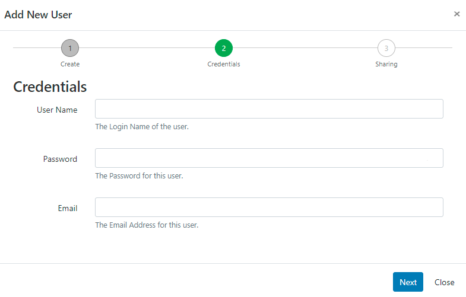
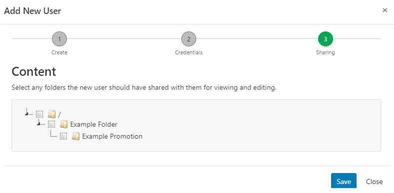
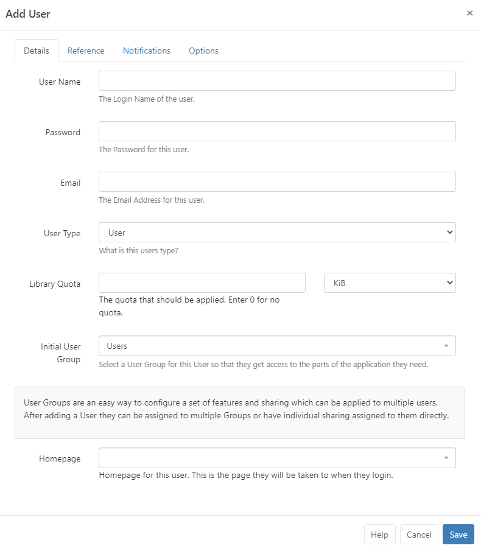
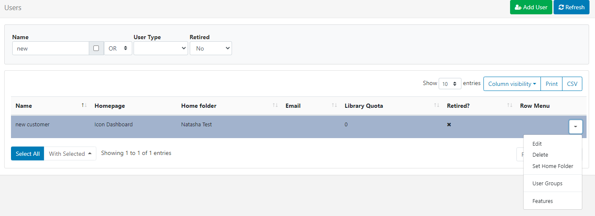
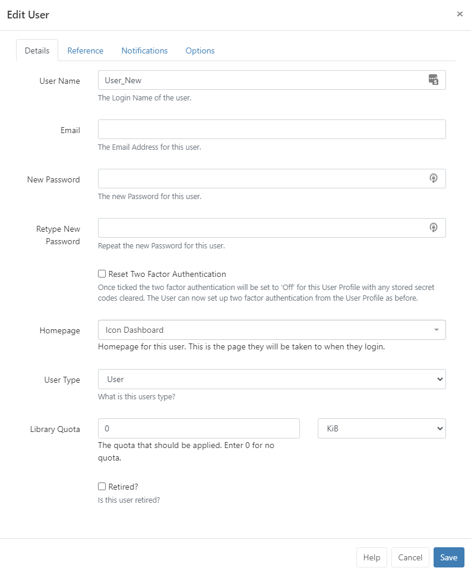

<!--toc=users-->

# User Administration

{tip}
If you are using a CMS earlier than v3.0.0 please use the following link: [Users Administration](users_administration_2.html)
{/tip}

Users are administered in the CMS by clicking on **Users** under the **Administration** section on the main menu. The Users [Grid](tour_grids.html) will open for you to add new and manage existing Users.



{nonwhite}
{cloud}
Xibo in the Cloud customers have access to the helpdesk as part of the hosting service. Please ensure that the user account named `xibo_admin` is not modified or removed so that our helpdesk agents can assist you with your CMS as and when required.
{/cloud}
{/nonwhite}

{white}
{cloud}
Please ensure that the user account named `cms_admin` is not modified or removed so that you can be assisted you with your CMS as and when required.
{/cloud}
{/white}

## Adding Users

Click on the **Add User** button. 

There are two ways in which Users can be added, via an onboarding wizard using pre-configured User Groups or information manually added.

{tip}
The onboarding wizard and pre-configured Groups are available for new v3 installations and for users who upgrade to v3 who have not previously utilised User Groups in earlier versions!
{/tip}



Select from one of the pre-configured **Groups** to go through the **Onboarding Wizard** or select the last option to **Manually create a user** to be taken to the **Add User** form:

### Onboarding wizard

- Select a Group and click **Next**

  {tip}
  [Features](users_features_and_sharing.html) are pre-configured for the groups common functions and can be modified to suit by Editing the User record!
  {/tip}

  

- Create a **User Name** and **Password** which will be used as their login and to identify the User within the CMS.

  {tip}
  The password must contain at least 8 characters and include upper and lower case letters as well as at least one number or special character!
  {/tip}

- Complete the Email address for this user, click **Next**

  {tip}
  A user can complete/edit their email address after login from the [User Profile!](tour_user_profile.html)
  {/tip}

- Select from available **Folders** to share objects with the new User.

  {tip}
  All objects contained or moved into a Folder will inherit the View, Edit, Delete [Share](users_features_and_sharing.html) options that have been enabled for Users/User Groups!
  {/tip}
  
  

{tip}
When allowing Users, (such as a Group Admin) to add Users using the Onboarding Wizard, ensure that Folders is enabled in [Features](users_features_and_sharing.html) if they are required to Share Folders with the User for viewing and editing!
{/tip}

{nonwhite}
For further information regarding Folder Administration click [here!](https://xibo.org.uk/docs/setup/folders-administration)
{/nonwhite}

- **Save**

  The newly created User will be added and can be viewed in the Grid.

### Add User form



{tip}
To always show the manual Add User form when adding new user's to the system instead of the onboarding wizard, use the option available in **Preferences** from the [User Profile](tour_user_profile.html)!
{/tip}

#### Details

- Create a **User Name** and **Password** which will be used as their login and to identify the User within the CMS.

  {tip}
  The password must contain at least 8 characters and include upper and lower case letters as well as at least one number or special character!
  {/tip}

- Complete the Email address for this user, click **Next**

  {tip}
  A user can complete/edit their email address after login from the [User Profile!](tour_user_profile.html)
  {/tip}

- Use the drop down to select from the three available [User Types](user_types.html)

- Assign the maximum amount of content allowed to be uploaded to the Library for this User. Enter 0 for no quota to be applied.

- Select which [User Group](users_groups.html) this User should belong to so that they can access the relevant parts of the system as required.

  {tip}
  Use **System Notifications** as the Initial User Group for Users that do not require permission to anything within the CMS but need notification emails when there are system issues as System Administrators!
  {/tip}

- Use the drop down to select from the choice of [Dashboards](tour_status_dashboards.html) for the Users 'Homepage' which the User will be taken to after login.

#### Reference

Use this tab to optionally complete information to be used as a reference to view and organise your Users.

#### Notifications

- Choose if the User should receive **System** or **Display** Notifications by ticking the checkboxes.


#### Options

Further options can be applied for the User as required:

- Hide the side navigational bar.
- Hide the New User guide when they log in.
- Force a User to change their password the next time they log in.

{tip}
[[PRODUCTNAME]] doesn't place any limits on the number of Users that can be added.
{/tip}

{nonwhite}

{cloud}

With **Xibo in the Cloud** we do not impose limits on concurrent access or licence User access in any way.

{/cloud}

{/nonwhite}

## Editing Users

Use the Row Menu for a User to make changes by selecting from the options available:



{tip}
Manage [User Group](users_groups.html) membership as well as [Features](users_features_and_sharing.html) from this menu!
{/tip}

Click on **Edit** to open the **Edit User** form so that changes can be made to the User record as required.




## Reset Two Factor Authentication

If a User loses access to their email or Google Authenticator app and has no access to any saved recovery codes, use the check box and tick to **Reset Two Factor Authentication**.

Once ticked the Two Factor Authentication will be set to ‘Off’ for this **User Profile** with any stored secret codes cleared. The User can now set up [Two Factor Authentication](tour_two_factor_authentication.html) from the User Profile as before.

{tip}
Add the **Two Factor** column to the Users grid using the **Column visibility** button. This will give you an overview of what Users have set with regards to Two Factor authorisation. (Disabled / Email / Google Authenticator)


{/tip}

{tip}
If you cannot access the CMS then run the following sql directly in the database to clear 2FA data for a specified User `{yourUserId}` , userId can be found in the User table.

```
UPDATE `user` SET `twoFactorSecret` = NULL,
`twoFactorTypeId` = 0,
`twoFactorRecoveryCodes` = NULL
WHERE userId = {yourUserId}
```

{/tip}


## Force Password Change

Use this function to ensure that 'new' Users change the password first given to them to access the system or if a User account password has been reset.
Click on the **Options** tab and tick the box **Force Password Change**, Save.


Users will be redirected to a page to reset their password, the next time they log in.

  

## Deleting Users

Remove a User from the Row Menu, **Delete** option. A confirmation form will open up and give you further options regarding the items currently owned by that User.

{tip}
Deleting a User is irreversible and will remove all their owned items including; Media, Layouts and Schedules, even if these items are being used by other Users in the system. **Reassign items** to another User using the selector to make them the new owner of all the items currently owned by the User you wish to delete. Alternatively, use the **Retired** checkbox at the bottom of the Edit User form so that the items remain in use in the system with the User unable to log in. 
{/tip}

## My Applications

[[PRODUCTNAME]] contains an API that allows 3rd party applications to connect and consume its data. 

{tip}
**Add Applications** and **Add DOOH Applications** and configure from **Applications** under the **Administration** section of the main menu. 
{/tip}

Before using an **Application** each User must authorise the application to act on their behalf within the CMS. Once  authorised it can be viewed by clicking on the **My Applications** button to open a current list.

  

{tip}
At the current time the CMS does not provide individual Users with a method of revoking access to an application, however, an admin can remove an application completely.
{/tip}