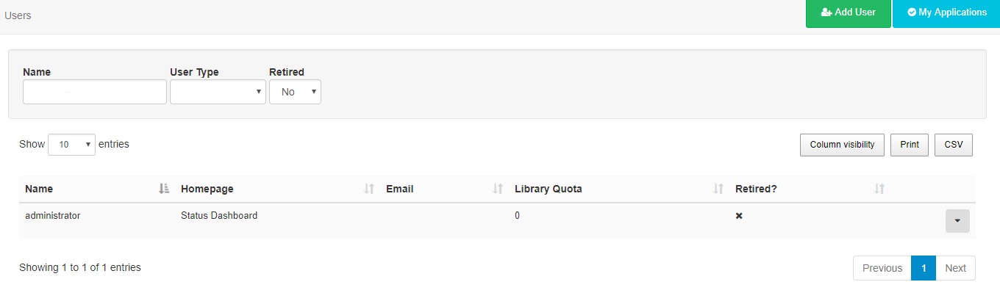
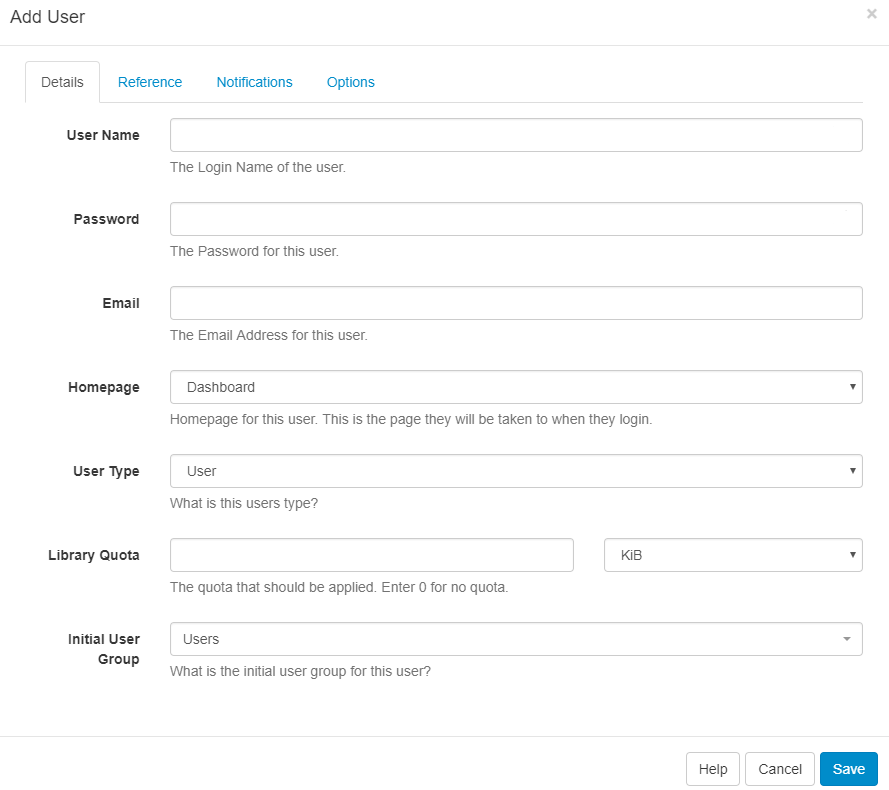
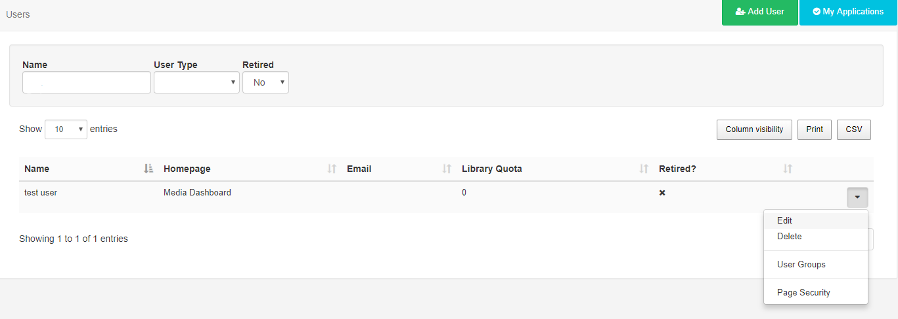
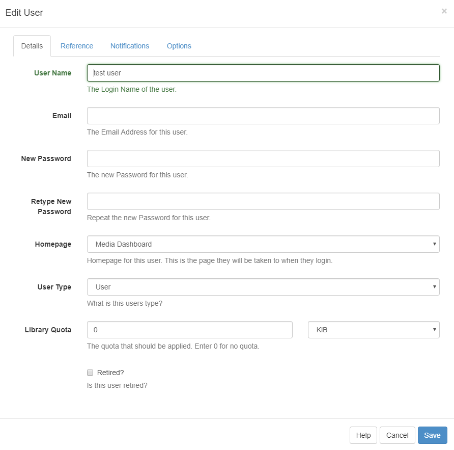

<!--toc=users-->

# User Administration

Users are administered in the CMS by clicking on Users under the Administration section on the menu. The Users grid will open for you to manage and add Users.

## Adding Users

Click on the **Add User** button and complete the form fields as required.

### Details

**Username** - create a Username for the User, to be used for **login** and identifying the User.

**Password** - create a Password for the User, to be used for **login**.

**Email** - include an email address for the User (used for password reset / CMS notifications).

**Homepage** - select the first page or choice of **Dashboard** the User will see after login. 

**User Type** - use the drop down to select from the three **User Types** available.

**Library Quota** -  assign a quota to determine the **maximum** amount of content allowed to be uploaded to the Library. 

**Initial User Group** - select which group the **User** should belong to.

{tip}

Use **System Notifications** as the Initial User Group for Users that do not require permission to anything within the CMS but need notification emails when there are system issues (System Administrators).

{/tip}

### Reference

Optionally complete information to be used as a reference to view and organise your Users.

### Notifications

Choose if the User should receive Notifications by ticking the checkboxes.

### Options

Select the options as necessary for the User.

{tip}
[[PRODUCTNAME]] doesn't place any limits on the number of Users that can be added.

{/tip}

{nonwhite}

{cloud}

With **Xibo in the Cloud** we do not impose limits on concurrent access or licence User access in any way.

{/cloud}

{/nonwhite}

## Editing Users

Use the row menu for the User record you wish to make changes to and select **Edit**.

An Edit User form will open so that changes can be made as needed.

## Force Password Change

Use to ensure that **new Users** change the password first given to them to access the system or if a User account password has been **reset**.
Edit the User record and click on the Options tab. Tick the box **Force Password Change**, Save.

Users will be redirected to a page to reset their password, the next time they log in.

  

## Deleting Users

Delete a User in the same way by using the row menu for the selected User.
A confirmation form will open up and give you further options regarding the items currently owned by that User.

{tip}

Deleting a User is irreversible and will remove all their owned items including; Media, Layouts and Schedules, even if these items are being used by other Users in the system. **Reassign items** to another User using the selector to make them the new owner of all the items currently owned by the User you wish to delete. Alternatively, use the **Retired** checkbox at the bottom of the Edit User form so that the items remain in use in the system with the User unable to log in. 

{/tip}

## My Applications

[[PRODUCTNAME]] contains an API that allows 3rd party applications to connect and consume its data. Before using an application each User must authorise the application to act on their behalf within the CMS.

Once an application is authorised it can be viewed by clicking on the **My Applications** button to open a current list.

  

{tip}

At the current time the CMS does not provide individual Users with a method of revoking access to an application, however, an admin can remove an application completely.

{/tip}