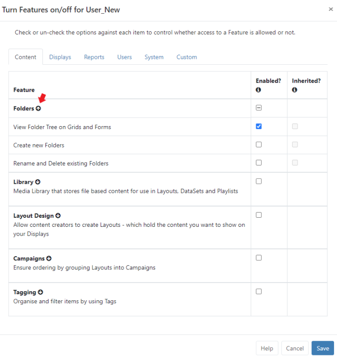
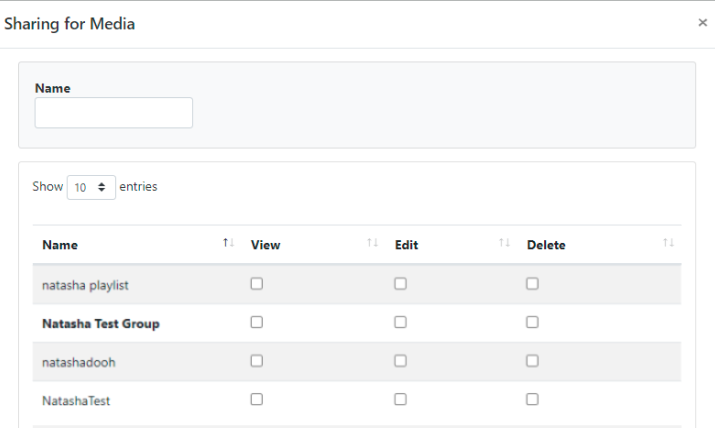

<!--toc=users-->

# Features and Sharing

{tip}
If you are using a version earlier than v3.0.0 please use the following link: [Permissions](users_permissions.html)
{/tip}

Access is controlled for Users and User Groups using two concepts:

1. **Features ** - control what a User can see and do within the CMS
2. **Share** - controls View, Edit and Delete options for user objects such as; Folders, Media, Playlists, DataSets, Layouts, Displays/Display Groups.

When used in conjunction with each other, these concepts ensure that only the relevant parts of the CMS are visible to Users/User Groups with the appropriate level of interaction applied for objects.

## 1. Features

From the **Administration** section of the menu, click on **Users** or **User Groups**. 

- Use the Row Menu for the selected User or User Group and select **Features** from the dropdown menu.

This tabbed form contains all Features that can be controlled by enabling/disabling access.

{tip}
When viewing an individual user record, the **Inherited** column will show if any Features are already enabled from [User Group](users_groups.html) memberships!
{/tip}

Each **Feature** contains a 'Feature Set'. Use the arrow to expand to see all the Features within that set.

A line shown in the check box, as in the above image, shows you that selected Features from the 'set' have been enabled. Expand to see what has been enabled and to make further edits if required. A blue tick in the check box tells you that all Features within the set have been enabled.

{tip}
Make it easier to onboard new Users by using the predefined User categories which contain the required Feature access for the type of User or manage Feature access via [User Groups](https://xibo.org.uk/manual/en/users_groups.html). If you need to give further access to specific Users within User Groups, assign these directly on their individual User record.
{/tip}

## 2. Share

User objects within the CMS can have options applied so that the User/User Group has the necessary access rights.

- Use the Row Menu for the object and select **Share** from the dropdown menu.

- Use the form to enable/disable **View**, **Edit** and **Delete** options for both individual Users and User Groups (User Groups are shown in bold).

{tip}
**Please note:** In order for Users to enable **Share** options for objects, the User would need to have the 'Allow Sharing capabilities for all User objects' Feature enabled which is within the **User functions** subset of **User** Features.
{/tip}

{tip}

### Scenario:

All members of a User Group need to edit DataSet data with only one specific User able to delete data.

First ensure that the User Group can access DataSets and then apply the appropriate edit options for the DataSet(s)

Actions to take:

- Use the Row Menu for the User Group and select **Features**
- From the **Content** tab expand the **Library** Feature set
- Tick to enable  'Allow edits including deletion to all data contained within a DataSet independently to Layouts'
- Go to **DataSets** under the **Library** section of the CMS and use the Row menu for the selected DataSet and select **Share**
- Tick **View** and **Edit** for the **User Group**
- Tick **Delete** for the **User** (View and Edit are already enabled for the Group so do not need to be ticked for the User)

{/tip}

The highest editing level will always be used for Users. If a User belongs to two groups where one group has Delete enabled for an object and the other does not, the User will have Delete access for the object.

{tip}
Sharing options for **Regions** and **Widgets** are assigned by using the [Tools Menu](https://xibo.org.uk/manual/en/layouts_tools.html) in the Layout Designer!
{/tip}

Modifications made to items are available in 'real time' which means that the next time a User interacts with the object the newly set options will be applied.

{tip}
Use **With Selected** at the bottom of [Grids](tour_grids.html) to perform bulk actions with Sharing!
{/tip}

{tip}
When logged in, a **User** will only see a list of other Users from their own User Group on clicking **Share**. A **Super Admin User** will see all Users in the system.
{/tip}

{tip}
Share permissions on an item can be changed by the owner, Group Admin or a Super Administrator.
Share permissions for Display and Display Groups, that have no owner, can only be changed by a Super Administrator.
{/tip}

### Folders

Create Folders and assign **Share** options to easily set the required access for Layouts, Library Media, DataSets, Displays / Display Groups etc, saved within that Folder for Users/User Groups. 

{nonwhite}
For further information on Folder Administration, click [here](https://xibo.org.uk/docs/setup/folders-administration)
{/nonwhite}

