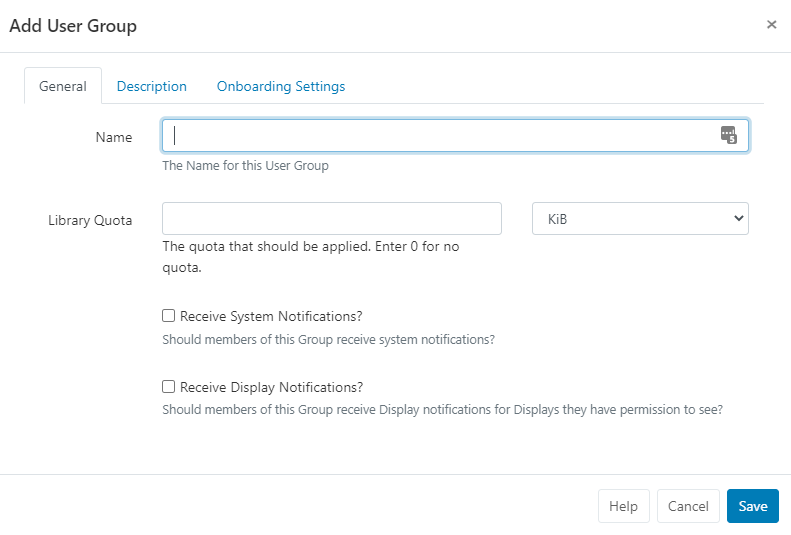
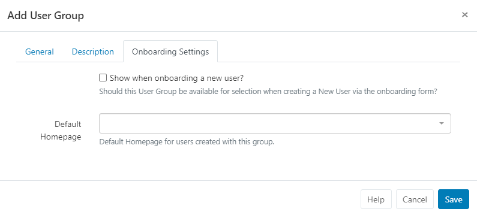
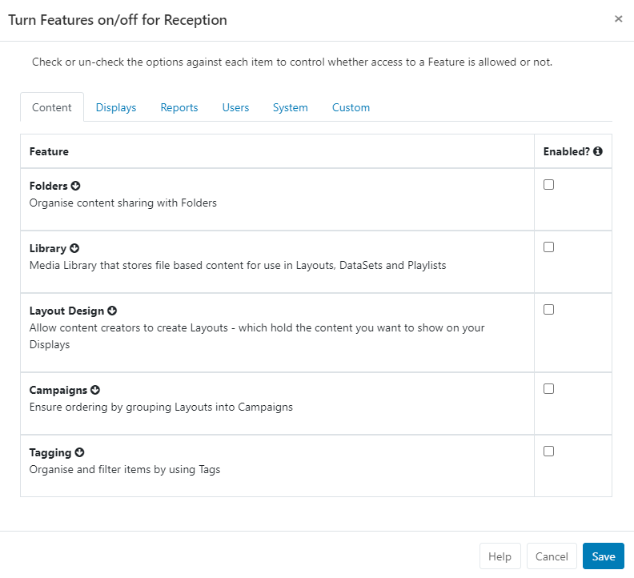

<!--toc=users-->

# User Groups

If you are using a CMS earlier than v3.0.0, please use the following link: [User Groups](users_groups_2.html)

User Groups allow for a selected group of Users to share and edit Media, Layouts and Schedules within the group.

[[PRODUCTNAME]] comes with a set of pre-configured User Groups for common functions for new installations.

These Groups already have the required Features enabled to allow Users to carry out the chosen role, and can be modified if necessary.

{tip}
Using User Groups makes it easier to onboard new Users and manage system access. Users will inherit the [Features and Sharing](users_features_and_sharing.html) enabled for the User Group!
{/tip}

Create new and manage existing by clicking on **User Groups** under the **Administration** section of the menu.

{tip}
User Groups that you create can be enabled to be shown for the [New User](users_administration.html) onboarding wizard!
{/tip}

Create a new Group by clicking on the **Add User Group** button to open the form:

### General

- Use this tab to give your User Group an identifiable **Name**
- Assign a **Library Quota** to the group to determine the maximum amount of content allowed to be uploaded to the Library. Enter 0 if no quota should be applied. Please speak to your administrator regarding any applied Library Quota's.
- Enable the **Notification** options if required for the Group.

### Description

Provide optional text to describe the created Group. 

{tip}
If enabled, this description will be shown for onboarding new Users and so should describe the Groups role to make it clear for selection!
{/tip}

### Onboarding Settings

This tab controls the options for onboarding new Users.

- Use the checkbox to include this User Group for selection when using the onboarding wizard for new User's.
- Use the dropdown to select a [Dashboard](tour_status_dashboard.html) to be used as a homepage for Users created with the Group.

Once all tabs have been created click to **Save**.

## Group Members

Once created, Users can be assigned to the Group using the **Row Menu** and clicking on **Members**:

- Use the checkboxes to assign **Users** to the **Group**, and click to Save.

{tip}
Users can be assigned to one or more **User Groups** for ease of sharing and collaboration!
{/tip}

{tip}
User Membership can also be controlled from the User Grid using the Row Menu. Click on **User Groups** to open the **Manage Membership** form!
{/tip}

## Features

Click on **Features** from the **Row Menu** to control the required access for the User Group:

For further information see the following page: [Features and Sharing](users_features_and_sharing.html)

{tip}
Use the **Copy** function on the Row Menu to easily modify Features to create new User Groups!
{/tip}

