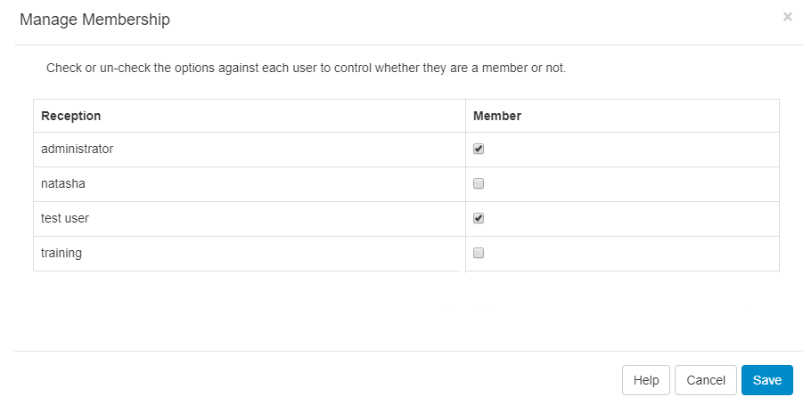

# User Groups

User Groups are an easy way to configure [Features and Share](users_features_and_sharing.html) options to apply to multiple Users who are members of a particular User Group.

{tip}
User Groups makes it easier to onboard new Users and manage system access. Users will inherit the  Feature and Sharing options enabled for the group!
{/tip}

Create your own User Groups are select from a set of pre-configured groups, created to serve common functions in the CMS, available for new installations.

{version}
**Note:** Pre-configured User Groups are available for new v4 installations and for users who upgrade to v4 who have not previously utilised User Groups in  their earlier versions!
{/version}

The pre-configured User Groups already have the required Features enabled to allow Users to carry out the chosen role. These can be modified if required to suit.

{version}
**Note:** The Display Manager User Group does not have the rights to add and authorise new Displays as this is a Super Admin high level function. Once added, a Super Admin user can add new Displays to [Folders](https://xibosignage.com/manual/en/tour_folders#content-saving-to-folders) or give [Share](https://xibosignage.com/manual/en/tour_folders#content-sharing-options) access rights to this User Group for Display Management purposes.
{/version}

## Create User Groups

User Groups are administered from **User Groups** under the **Administration** section of the main CMS menu. The User Group grid will open for you to add and manage User Groups:

{tip}

Add User Groups to suit your specific needs and enable them to be shown for the [New User](users_administration.html) onboarding wizard to make it easier to add Users to the right User Group from the start!
{/tip}

To add a new group, click on the **Add User Group** button and enter the required information for each tab:

#### General

- Give your User Group a **Name** to identify it within the CMS
- Enter a maximum amount of [Library Quota](users_administration.html#content-library-quota) allowed to be uploaded to the Library for this User Group. Enter 0 if no quota should be applied. 
- Select the type, **System** or **Display**, if the User Group should receive notifications.

#### Description

Provide optional text to describe the created Group. 

{tip}
If enabled to show for onboarding new Users, this description (such as the Groups role) will be shown to make it clear for selection.
{/tip}

#### Onboarding Settings

Use this tab to control the options for onboarding new Users:

- Tick if you want to include this User Group for selection when using the onboarding wizard.
- Use the dropdown to select the [Dashboard](users_dashboards.html) which will be used as a homepage for all members of this group.
- Click to Save.

### Group Members

Once added to the grid, add Users to the User Group by using the row menu:

- Click on **Members**

- Select which **Users** should belong to the selected **User Group**.
- Click to **Save**.

{tip}
Users can be assigned to one or more **User Groups** for ease of sharing and collaboration!

Membership can also be controlled from the User grid by using the row menu and selecting  **User Groups** to open the **Manage Membership** form!
{/tip}

### Features

Control the User Groups access to the relevant parts of the CMS by selecting [Features](users_features_and_sharing.html) from the row menu.

### Copy

Make a **Copy** of an existing User Group from the row menu to make adjustments and easily create new Groups to suit your requirements.

#### Next...

[Features and Sharing](users_features_and_sharing)
