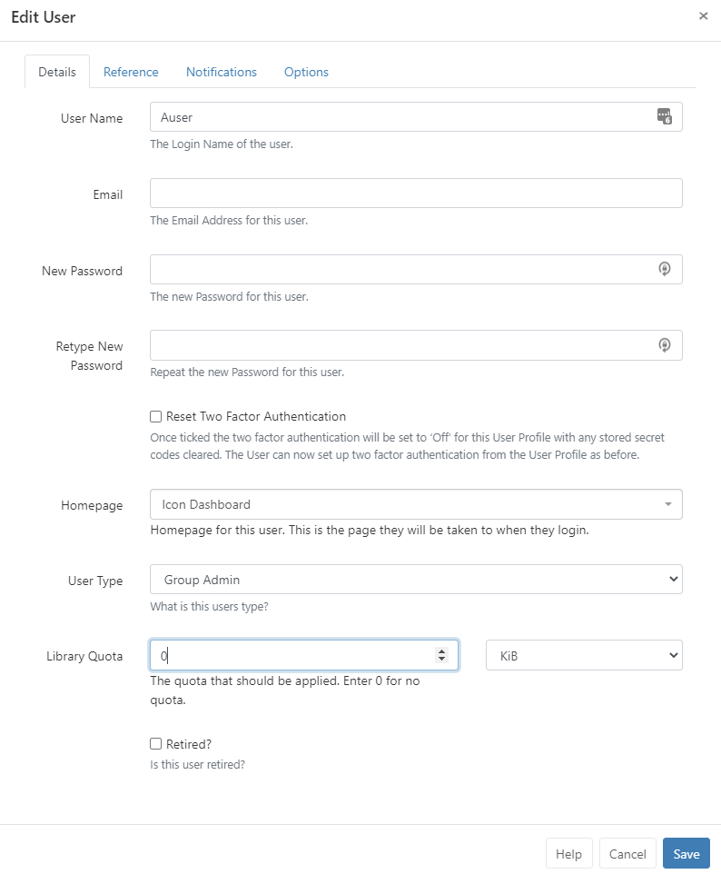

<!--toc=tour-->

# Library Quota

[[PRODUCTNAME]] includes a **Library Quota** system so that **Users** and **User Groups** can be assigned a Library quota to determine the maximum amount of content they can upload.

Quotas can be assigned on User and User Group **Add/Edit forms** and are expressed in kilobytes. 

Putting a value of **0** means the User/User Group has an unlimited Library quota.

The **largest** quota that can be resolved for the User is always the quota that is applied and excludes the unlimited quota.

#### Example:

- User A has a quota of 100 MB assigned to their User record
- Group 1 has a quota of 50 MB assigned to the Group record
- Group 2 has a quota of 120 MB assigned to the Group record

User A belongs to Group 1 and Group 2, therefore their library quota is 120 MB (as this is the largest quota applied).

User A leaves Group 2 which means their quota is now 100 MB (as the largest applied quota).

User A is re-assigned an unlimited quota (0), their Library quota is 50 MB as they still belong to Group 1 (the largest Library quota).