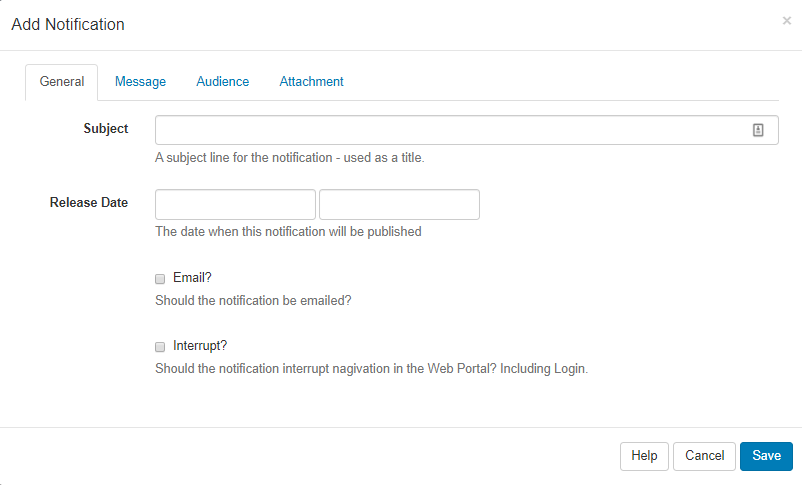

<!--toc=users-->

# Notifications

[[PRODUCTNAME]] has a **Notification System** to keep Administrators and Users of the CMS informed of important system events and other user-created notifications, such as [Schedule Event Reminders](scheduling_events#Reminders.png).

{tip}
Please ensure that your Administrator has entered a **Sending Email** address on the CMS Settings page, **Network** tab prior to using Notifications.

If you are using v1.8 of the CMS,  you can find these settings on the **Maintenance** tab.
{/tip}

## Notification Drawer

Notifications for a logged in User appear at the top right of the screen with unread notifications shown in red next to the Alarm bell icon. The Notification Drawer can be accessed by clicking on the Alarm bell icon.

{tip}
The Notification Drawer is shown when a User or User Group has the **Notification Drawer** permission, without this permission the Alarm bell icon will not be shown.
{/tip}

Click on the Alarm bell to open the Notification Drawer, which will show the last 5 notifications received. Unread notifications will be shown in black text and read notifications in a light grey text.

Click on the title of each notification to open a popup to read the full notification.

{tip}
Notifications will only show in the Notification Drawer if their release date has passed and if the logged in User has been assigned the notification.
{/tip}

## Notification Centre

Notifications can be created by authorised Users, those that have permission, by using the **Notification Centre** link at the bottom of the Notification Drawer and clicking on the **Add Notification** action button.

### General

**Subject** - title for your Notification

**Release Date** -  use the date and time picker to select when you want your Notification to be sent.

**Email** - choose to send to the email address recorded in the CMS against the User record. 

**Interrupt** - Users would be automatically redirected to a page to show the full Notification and would need to click on **Continue** to carry on navigating the CMS.

{tip}
Ensure that **Enable Email Alerts** has been set to **On** in the Administration Settings page, **Maintenance** tab.
{/tip}

### Message

Use the text editor to create and format the message body of your Notification. 

{tip}
If you are going to use the [Notification Widget](media_module_notifications.html) to target your message to Display/Display groups the formatting you use here would be replaced with the formatting as applied in the Widget.
{/tip}

### Audience

**Users** - Select one or more Users/User Groups

**Non users** - additional emails can be entered here to receive notifications

**Displays** - Select one or more Display/Display Groups to show the notification within Scheduled Layouts. (Scheduled Layouts must already include the Notification Widget to target Displays successfully).

### Attachment

**Add an attachment** - click to upload an attachment to your Notification.

{tip}
Attachments can also be downloaded from the Notification centre.
{/tip}

## Editing Notifications

Edits to a Notification will be altered in the CMS web portal but any emails generated which have already been sent will not be recalled.

## System Notifications

[[PRODUCTNAME]] raises various **System Notifications** to report on the health of the system as a whole. Notifications are emailed to the Admin email address configured in Settings, Maintenance tab. Notifications will also be sent to Users who belong to groups configured to receive System Notifications or who have been configured to receive these notifications themselves. This configuration is managed on the User/User Group Edit form.