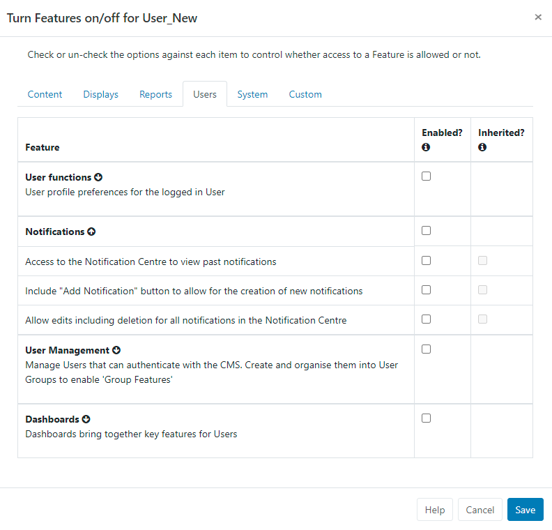

<!--toc=users-->

# Notifications

[[PRODUCTNAME]] has a **Notification System** to keep Administrators and Users of the CMS informed of important system events and other user-created notifications, such as [Schedule Event Reminders](scheduling_events.html#reminders).

{version}
**Note:** Ensure that your Administrator has entered a **Sending Email** address on the CMS Settings page, **Network** tab prior to using Notifications.

If you are using a 1.8.x CMS,  you can find these settings on the **Maintenance** tab.
{/version}

## Notification Drawer

Notifications for a logged in User appear at the top right of the screen with unread notifications shown in red next to the Alarm bell icon. 

The Notification Drawer is accessed by clicking on the Alarm bell icon.

{tip}
The Notification Drawer is shown for Users / User Groups that have the appropriate [Features](users_features_and_sharing.html) enabled. From Features click on Users set of Features and apply from the Notification options available.
{/tip}

{version}
**Note:** If you are using a version earlier than 3.0.0, the Notification Drawer is shown when a User/User Group has the Notification Drawer [Permission](users_permissions.html) enabled for **Page Security** settings. Without this enabled the Alarm bell icon will not be shown.
{/version}

Click on the Alarm bell to open the **Notification Drawer**, which will show the last 5 notifications received. Unread notifications will be shown in black text and notification that have already been read in a light grey text.

Click on the title of each notification to open a popup to read the full notification.

{tip}
Notifications will only show in the Notification Drawer if their release date has passed and if the logged in User has been assigned the notification.
{/tip}

## Notification Centre

Notifications can be created by authorised Users (those that have enable Feature access/permission) by using the **Notification Centre** link at the bottom of the Notification Drawer and clicking on the **Add Notification** action button.

### General

- Include a **Subject** title for the notification.

- Select a **date** and time to send.

- Tick to optionally send the notification as an **Email**.

  {tip}
  Notifications will be sent to the email address recorded in the CMS User record for selected Users as defined on the **Audience** tab.
  {/tip}

- Use the **Interrupt** option to automatically redirect Users to a page that will show the Notification in full. Users would need to click on **Continue** to carry on navigating the CMS.

  {tip}
  Ensure that **Enable Email Alerts** has been enabled from the **Maintenance** tab on the **Administration Settings** page!
  {/tip}

### Message

- Use the text editor to create and format the message body of your Notification.

  {tip}
  If you are going to use the [Notification Widget](media_module_notifications.html) to target your message to Display/Display groups the formatting you use here will not be used as it will be replaced with the formatting configured in the Notification Widget.
  {/tip}

### Audience

- Select **Users/User Groups** who should receive this notification.
- Enter email addresses for those that are **Non users** of the CMS but need to receive this notification.
- Select the **Display/Display Groups** that should show the notification. 
  {tip}
  Layouts need to already be in the schedule and contain the [Notification Widget](media_module_notifications.html) to target Displays successfully!
  {/tip}

### Attachment

- Upload a file to **Add an attachment** to the notification.

  {tip}
  Attachments can also be downloaded from the **Notification centre**.
  {/tip}

## Editing Notifications

Edits to a Notification will be altered in the CMS web portal but any emails generated which have already been sent will not be recalled.

## System Notifications

[[PRODUCTNAME]] raises various **System Notifications** to report on the health of the system as a whole. Notifications are emailed to the **Admin** email address configured in **Settings** from the **Network** tab. 

{version}
**Note:** If you are using a 1.8.x of the CMS,  you can find the **Admin** email address on the **Maintenance** tab!
{/version}

Notifications will also be sent to Users who belong to groups configured to receive System Notifications or who have been configured to receive these notifications themselves. This configuration is managed on the User/User Group Edit form.