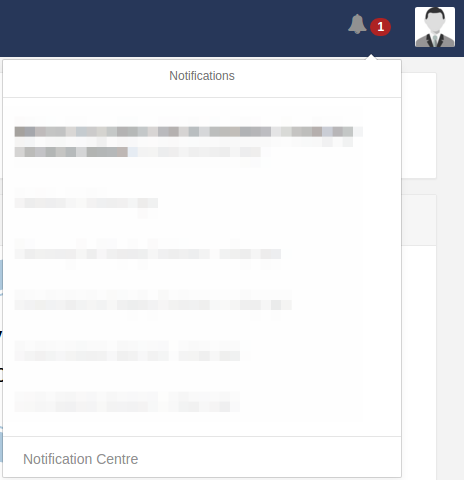
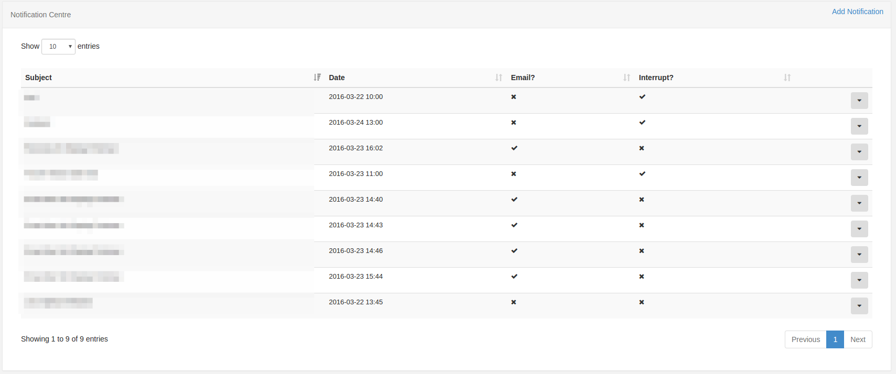

<!--toc=users-->
# Notifications
[[PRODUCTNAME]] has a notification system to keep the administrators and users of the CMS informed of important system
events and other user created notifications.

## Notification Drawer
Notifications for the logged in user appear in the notification drawer at the top right of the screen. The notification 
drawer can be accessed by clicking on the Alarm bell icon.

The number of unread notifications is shown next to the Alarm bell.

Clicking on the Alarm bell opens the notification drawer and shows the last 5 notifications. Unread notifications are 
shown in black text and read ones in a light grey. Each notification can be read by clicking on the title which will open
a popup containing the full notification.

The notification drawer is shown when a user or group has the "Notification Drawer" permission, without this permission the 
bell icon is not shown.

### Automatic notifications
Users may see some notifications after login or navigate (moving to a different page in the CMS). Where an automatic
 notification is shown the user is taken to a page showing the full notification and they must click "Continue..." to 
 reach their original destination.

## Notification Centre
Notifications are created in the notification centre which can be accessed by authenticated users from a link at the bottom
 of the notification drawer. The notification centre link is shown when a user or group has the "Notifications" permission.
 
The notification centre is a standard CMS administration screen with a grid showing all notifications.
 
 

Notifications have the following properties:

 - Subject
 - Body
 - Release Date
 - Is Email?
 - Is Interrupt?
 - One or more Users/UserGroups
 - One or more Displays/DisplayGroups
 
Notifications will only show in the notification drawer if their release date has been passed and if the logged in user
has been assigned the notification.

If the notification has been configured for email and the user has an email address recorded in the CMS against their
user account, then the notification will be emailed by the CMS maintenance system. **Maintenance must be configured for
email notifications to be sent.**

### Editing Notifications
When editing a notification is should be noted that the notification will be altered in the CMS web portal according to
the edits made, but that any emails generated which have already been sent will not be recalled.

## System Notifications
[[PRODUCTNAME]] raises various system notifications to report on the health of the system as a whole. These notifications 
will be emailed to the maintenance alert email address configured in Settings. They will also be sent to users who belong
to groups configured to receive system notifications or who have been configured to receive these notifications themselves.

This configuration is managed on the User/User Group Edit form.