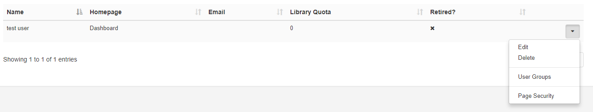
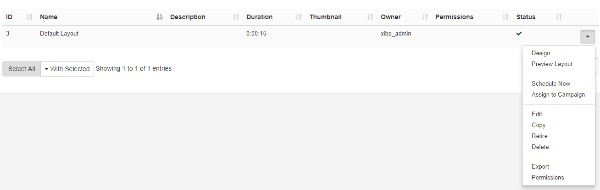
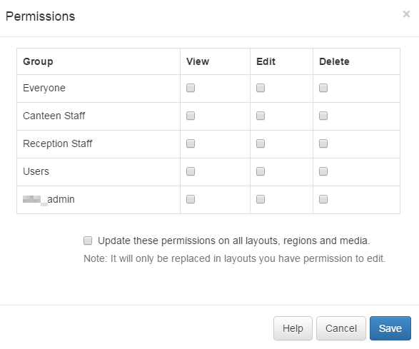

<!--toc=users-->

# Permissions

Permissions can be assigned to both **User** and **User Groups** to allow or restrict access to System and **User Objects** within the CMS.

Permissions are presented as two concepts:

1. **System Objects** (restrict or allow access to view pages)
2. **User Objects** (view, edit, delete options for Media, Layouts, Display Schedules)

These concepts used in conjunction with each other, ensure that only relevant parts of the CMS are visible with assigned permissions with regards to the ability to **view**, **edit** or **delete** associated objects for that particular User/User Group. 

## System Objects

Assign permissions to ensure that only the relevant sections of the CMS are visible. Apply against any User or User Group, located under the Administration section of the menu, click on **Page Security** from the row menu for your selected User/User Group.

### Access Control List

Use this form to select what areas of the **CMS** are to be visible for that User/User Group as appropriate. 

**Please note:** In order to set further permissions with regards to User Objects the User/User Group would need to have access to **view** the Page/Menu item in the first instance.

{tip}
An owner of a Layout who want to set **Permissions** for other Users to view/edit and delete their Layout would need to have the **User** option ticked to be able to **View** Users.
{/tip}

{tip}

Make it easier to onboard new Users by managing system access via [User Groups](users_groups.html). If you need to give more permissions to specific Users within User Groups, assign these directly on their individual User record.

{/tip}

## User Objects

Assign **view**, **edit**, **delete** permissions on the object itself. The following objects have assignable permissions: 

- Campaigns
- Layouts
- Regions in Layouts
- Widgets (Media on a Region’s Playlist)
- Templates
- Library Media
- DataSets
- Displays and associated Schedules
- Display Groups and associated Schedules
- Dayparts

Select the object and use the row menu to select **Permissions**:

Use this form to assign Permissions to both Users and User Groups.
{tip}
The logged in User will only see a list of Users in their own User Group. Super Admin will see all Users.
{/tip}

Optionally use the checkbox to cascade permissions to items contained underneath. For example, as permissions are being assigned to a Layout if this box was checked then all Regions, Playlists and Widgets within the selected Layout would have the same assigned permissions. 

{tip}
From v2.2.0 Administrators can set the option to select this checkbox by default for all Users from the **Defaults** tab on the **Settings** page.
{/tip}

Modifications made to items are available in ‘real time’ this means the next time a User interacts with the object the newly set permissions are applied.

{tip}

### Scenario:

All members of a User Group need to edit DataSet(s) data with only one specific User able to delete.

**Permission actions to take:**

1. System Objects - ensure that DataSets have been set to **view** for the User Group

2. User Objects - select the DataSet(s) and assign **view** and **edit** permissions for the Group.

3. User Objects - select the DataSet(s) and **delete** permissions for that specific User. (**View** and **edit** permissions are already in place as Group permissions so do not need to be ticked).

   {/tip}

The highest permission is always used for Users (if a User belongs to 2 groups with one having edit permissions and the other does not, the User will have edit permissions)

Permissions on an item can be changed by the owner, Group Admin or a Super Administrator.

Permissions for Display and Display Groups, that have no owner, can only be changed by Super Admins.