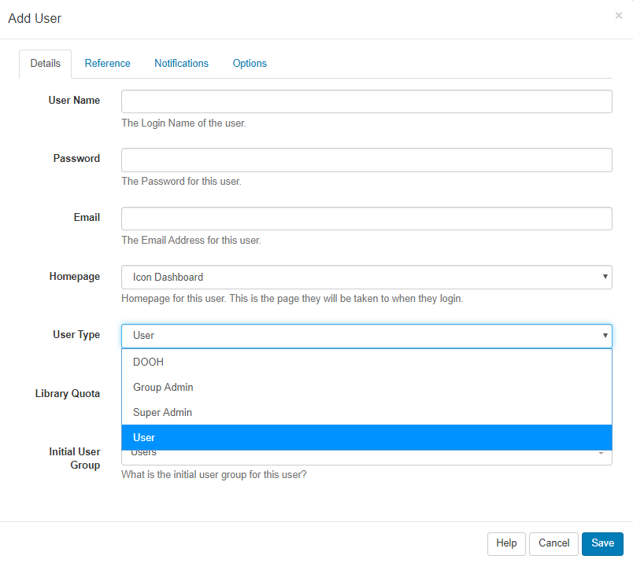

<!--toc=users-->

# User Types

Every User is assigned 1 of 3 User Types:

- **Super Admin** 

- **Group Admin**

- **User**

  

{tip}

User Types are pre-configured and cannot be modified.

{/tip}

## Super Admin

Super Admin Users have access to every part of the CMS including **all** Media, Layouts and Schedules added by other Users of the system.
Super Admin Users have access to the entire CMS regardless of any permissions set to a User Group that they are assigned to.

{tip}

During installation, a **Super Admin User** is created who would, therefore, have full access to the entire CMS. We suggest having at least one Super Admin User to act as the last contact point for the CMS system.
{/tip}  

## Group Admin

Group Admin Users only have access to the parts of the CMS as assigned to the User Group they belong to. In addition, they will have access to all Media, Layouts and Schedules of all other Users assigned to that User Group as well as their own Media, Layouts and Schedules.

## User

A User will only have access to the parts of the CMS as assigned to the User Group they belong to as well as access to their own Media, Layouts and Schedules.

{tip}

User Type is selected when first adding a User and can be edited from the individual User record.

{/tip}