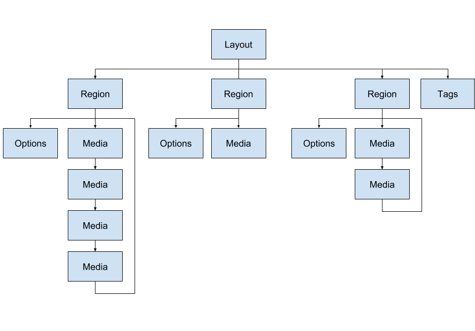

<!--toc=api-->
# [[PRODUCTNAME]] Layout Format - XLF
XLF is a standard XML document used to completely describe a Layout and its resources. The CMS manages the creation of XLF files and will insure they are valid XML before transmission to the Player.

It is the Player's sole responsibility to parse the Layout files, request any necessary resources and put the Layout on screen for playback.

To simplify the explanation the XLF will be considered in two parts:

 - Structure
 - Media

## Structure
The Layout structure defines the Layout width, height and the Regions it is divided into. It is an XML document with the `<layout>` as the root node. Layouts are designed by the end user and can therefore have different combinations of Regions and Media.

*Note:* in 1.8 onward the CMS refers to "Widgets" being added to Region Timelines - for the Player this is translated into `<media>` nodes.



The structure part of a Layout XLF is shown below:

``` xml
<layout schemaVersion="3" width="1920" height="1080" background="126.jpg" bgcolor="#FF3399">
    <region id="1" width="1920" height="1080" top="0" left="0" zindex="1">
        <media/>
		<options>
			<loop>0</loop>
			<transitionType></transitionType>
			<transitionDuration></transitionDuration>
			<transitionDirection></transitionDirection>
		</options>
    </region>
	<tags>
		<tag>default</tag>
	</tags>
</layout>
```
This is a 1080p landscape Layout with a single full screen region.

A XLF will always have 1 Layout node (the root element of the document) and one or more region nodes. A Layout without any regions should be considered invalid.


### Layout
The Layout node provides the following options:

 - schemaVersion: The schema version for this Layout.
 - width: The Layout Width.
 - height: The Layout Height.
 - background: The path to the background image (optional).
 - bgcolor: A HEX colour for the background.


#### Dimensions 

The Player is responsible for rendering the Layout at the appropriate aspect ratio, according to its own dimensions. The Player might be full screen, or windowed and can be *any* resolution. It must therefore be capable of rendering a Layout at the largest width or height it can support, centrally on screen and to add "black bars" to each side.

The XLF provides the width/height of the Layout and the width/height/position of each Region. These are the dimensions the Layout was **designed** at - for example a Layout might be 1920x1080 in dimension. If the Player is 1920x1080 also, then a 1:1 rendering can occur, but if the player is 1280x720 or even 1080x1920, scaling must occur.


### Regions
The Region nodes provide the following options:

 - id: The `regionId`.
 - width: The Region width.
 - height: The Region height.
 - top: The Region position from the top of the Layout.
 - left: The Region position from the left of the Layout.
 - zindex: The order this Region should be drawn on the screen (0 first, with each new region on top).
 - options: A region node provides additional options in its `<options>` node. These are optional elements and should be provided with sensible defaults in the Player, possible options are shown below.


#### Loop

The Loop option is only applicable when there is only 1 media item in the region. It controls whether that one media item should be reloaded after it finished or not. When `loop = 0` the expired media item should be left on screen until the entire Layout has finished. When `loop = 1` the item should be removed and replaced with the same item again.

The default is 0 (don't loop) as the most common use case is to have a logo, text, clock, etc which you want to stay on screen for the whole time that other content it playing. You set its duration to something very low - e.g. 5 seconds - it expires fast and remains on screen until the other content has expired, at which point the whole Layout has expired and it is removed.


#### Transition
The Transitions attached to the Region are referred to as "Region Exit Transitions". They are the transition that should be shown when the Layout is finishing. Refer to the below [Transitions](#transitions) section for more information.


### Media
There are 3 terms in [[PRODUCTNAME]] used to describe Media:

- Modules: A component in the software responsible for handling a particular type of file or data source, adding and configuring it, and rendering it.
- Media (in the CMS): Files Stored in the Library
- Media (in the XLF): Items to Play
- Widgets: A Module assigned to a Region Timeline or Playlist

Media nodes represent the Widgets added to the Region in the CMS - they could come from a Playlist or directly from the Region timeline. The CMS will pre-calculate which Widgets should be shown in a Region and will add them as Media nodes in the XLF. Media appears as `<media>` nodes within `<region>` nodes on a Layout. 

Media should be played in the order is appears in the XLF and looped once finished. The only time a Region is not looped is if there is only 1 Media node and the `loop` option is set to 0.

Media Nodes have attributes common to all types of Media and Options Nodes which are specific to the Media Module. There are set of core modules documented here, 3rd party modules should provide their own documentation notes.

``` xml
<media id="" duration="" type="" render="">
	<options>
		<uri></uri>
		<transIn></transIn>
		<transInDuration></transInDuration>
		<transInDirection></transInDirection>
		<transOut></transOut>
		<transOutDuration></transOutDuration>
		<transOutDirection></transOutDirection>
	</options>
	<raw>

	</raw>
</media>
```

 - id: The `mediaId` of this media node (in 1.7 and later this is the CMS `widgetId`)
 - duration: The duration in seconds that this media item should be played (unless overridden as described below)
 - type: The type of media module
 - render: The render type, either `native` or `html`
 - options -> uri: The uri of the save location as presented in `RequiredFiles`. This is common to all library based media.

Additional options may be present from **v5** onwards

``` xml
<media>
    <audio>
        <uri volume="100" loop="1" mediaId="12">1.mp4</uri>
    </audio>
    <commands>
        <command>code</command>
    </commands>
</media>
```

The most important information on a Media node is the `type` and `render`.


### Type and Render

The Media node in the XLF attempts to tell the Player how it should be played using the `type` and `render` attributes. The render attribute can either be `native` or `html` and the type attribute is set to the type of Widget the Media node represents.

HTML render mode means that the CMS will provide a `html` file via `GetResource` which the Player can open in an embedded browser (at the appropriate size) to render the Media. 

Native render mode means that the Player is entirely responsible for rendering that Media and the CMS does not provide a resource to assist.

Most types of core Media and any custom Media will be `html` render mode. Some media items are set to render `native` but can actually be rendered in `html` at the discretion of the implementer - these are mostly cases where the Media is set to `native` for backwards compatibility. If you are implementing a new Player then it is safest to use `html` where possible.

Some examples of what you might expect (this list is not exhaustive):

| Render               | Type                                                         |
| -------------------- | ------------------------------------------------------------ |
| native               | image, video, powerpoint, flash, audio, localvideo, shell command |
| html                 | twitter, forecastio, clock                                   |
| native (can be html) | embedded, text, ticker, webpage, datasetview                 |

Typically `native` Media is a type that would benefit or require a deeper integration with the underlying hardware.

How the HTML files for `html` render arrive at the Player is discussed below.


### Duration
Each Media item represented in the XLF has a duration in seconds attribute. This represents the total time the Player should show that item before moving on to the next. The Player should show a Media item for the time specificed in the `duration` attribute.

A Region is considered "expired" when all Media has been shown for its duration, and a Layout is expired when all Regions are expired. This means that a Layout is shown for the duration of the longest set of media.

HTML rendered Media sometimes provides additional data in the HTML, which is used to adjust the duration of the media item. This happens when it is *impossible* for the XLF to know how long the Media will be shown before it is rendered - a good example is when a Ticker has "duration is per item" selected, as this then depends on the number of items.

These options are provided in the HTML file as comments which can be parsed by the Player and used to adjust the duration of the Media accordingly. They are:

- `<!-- NUMITEMS=X -->`: Informational tag containing the number of items in the resource.
- `<!-- DURATION=X -->`: Calculated total duration for this media item.


### Transitions

Media options include instructions for showing transitions at the start and end of each media item, described as In and Out. Each of the two transitions have the following 3 properties:

 - Type: The type of transition, currently supported are Fade In, Fade Out and Fly.
 - Duration: This is the duration in milliseconds that the transition should run for.
 - Direction: This is a compass point set of directions for the transition (only applicable for fly). N, NE, E, SE, S, SW, W, W, NW.


### Audio Nodes

Starting in **v5** the XLF may contain `<audio>` nodes. These are audio files that should be played at the start of a media item and should be executed by the Audio module. Audio can also exist as a Media node it is own right, unattached from another Media item.

An Audio node has child `<uri>` nodes which represent the audio file to play. Each node can also have a `volume` and `loop` attribute.


### Command Nodes
Starting in **v5** the XLF may contain one or more `<command>` nodes contained in a `<commands>` element. These are commands that should be executed in order when the media item is started. They should be executed by the Shell Command module.


# Rendering Media
Following in this section are some notes specific to certain core Modules. These are either native modules or html modules that require specific handling.


## HTML render - GetResource

Media using `html` rendering should load the HTML file provided by XMDS during the GetResource call. This file is designed to render according to the original design size and scale appropriately. It should be opened in a transparent Web Browser unless otherwise stated by a `transparency` option.

HTML resources are downloaded during the usual XMDS "Required Files" process, where they are kept in date by the `updated` attribute. However it is also common place for the Media rendering itself to call `GetResource` if it thinks that the cached resource of out of date.

An `updateInterval` option is provided on most Media types to support this functionality. When rendering Media the Player should compare the last write time of the HTML file with the `updateInterval` option if one is present. If so, a new copy of the HTML should be downloaded from XMDS. This process shouldn't  effect the timely rendering of the Media and it could be that it queues the downloaded to happen in the background, so that it is ready for the next time the Media is shown.


## Image
Images are library items and will be transferred to the Player via `RequiredFiles`. By default the CMS allows JPG, PNG, GIF and BMP images to be uploaded. Image media nodes contain the `uri` option which matches the `path` attribute provided in `Required Files`. The Player should use this to locate the cached file.

The Player is responsible for natively rendering images according to the following options:

 - scaleType: Either center or stretch.
 - align: Either left, center or right.
 - valign: Either top, middle or bottom.


## Video

Videos are library items and will be transferred to the Player via `RequiredFiles`. By default the CMS allows WMV, AVI, MP4 and WEBM videos to be uploaded. Video media nodes contain the `uri` option which matches the `path` attribute provided in `Required Files`. The Player should use this to locate the cached file.

The Player is responsible for natively rendering videos according to the following options:

 - loop: Play the video for its full duration and loop if it finishes before the duration is reached.
 - mute: Mute the video.

#### Loop
The loop setting is only applicable if the duration has been specified and is not 0 (end-detect). Duration always specifies the total duration for the media item, which means the loop setting can be used to play a shorter video in a loop for a set period of time, without any gap between playback.

For example, a 10 second video with duration set to 60 seconds and set to loop will play through 6 times before moving on to the next media in the list.

### Duration
Videos can have a special duration attribute of "0" which means "end detect". This allows the user to assign a video widget to the Layout without having to assess its duration. When a duration of 0 is provided it is the Players responsibility to detect when that video has completed and advance to the next item.

When a duration of 0 is provided the `loop` option should be ignored.


## Local Video
The local video module is very similar to the video module except that the file is not provided by `RequiredFiles`. Local Video is used either when the file is provided to the player by another means or when the video should be streamed.

In both cases the `uri` option is the path to the video file.


## Flash and PowerPoint
Flash and PowerPoint have limited support on the Windows Player and rely on the underlying application being available. If the Player does not have PowerPoint or Flash installed the Layout should be skipped.

They are both library items transferred to the Player via `RequiredFiles`.

There are no additional options with these widgets.


## Web Page
Web Page widgets provide rendered HTML via `GetResource`. However they also provide a `modeId` option which is used to determine whether the web page should be opened directly in the embedded web browser or via the rendered HTML.

When the `modeId` is equal to 1 the Player should parse the `url` option and open that directly in a web view.


## Embedded
Embedded widgets provide rendered HTML via `GetResource`. They also provide a `transparency` option which is used to determine if the web view should be transparent.


## Shell Commands
The Shell Command widget exists to execute Shell Commands on a Layout. It provides three options:

 - commandCode
 - windowsCommand
 - linuxCommand

Pre-defined commands can be used which have been configured as per the [command functionality](displays_commands.html). The player should inspect the command configuration
it received during the [`RegisterDisplay`](xmds.html#RegisterDisplay) XMDS call for the command string to execute.

An adhoc command does not have a commandCode and instead provides a windows/linux Command to execute. It is the players responsibility to sanitize and execute these commands in a Shell.


## Audio
Audio files are library items and will be transferred to the Player via `RequiredFiles`. The player is responsible for natively rendering these files in an appropriate media player. They will have a `loop` and `volume` option.

#### Child Audio

Audio can also be added to another Media item - for example a text item - in order to play a sound while the parent item is being shown. Zero or more audio items can be added to a media item.

When the parent media item finishes the child must also finish, even if it hasn't played completely through.


# Transitions

Transitions are a concept used to describe how a Media item should be put on and taken off the screen. How and where they are added is described in more detail in the [Layout Transitions](layouts_transitions.html) section of this manual.

There are places the XLF can contain transitions:

- Region Exit Transitions in Region options
- Playlist Transitions in Media options

The Region Exit transition describes the transition to run when the region has finished completely and will be removed (this is different from when the region has expired). It runs in place of the `transOut` transition on the Widget being shown at the time the Region ends. All Regions Exit transitions run at the same time and describe how the Layout moves off screen.

The Playlist transition describes a `transIn` and `transOut` on each Media item, decribing how that media item comes onto screen and leaves screen.

Example Media:

```xml
<transIn></transIn>
<transInDuration></transInDuration>
<transInDirection></transInDirection>
<transOut></transOut>
<transOutDuration></transOutDuration>
<transOutDirection></transOutDirection>
```


Example Region:

```xml
<transitionType></transitionType>
<transitionDuration></transitionDuration>
<transitionDirection></transitionDirection>
```


The transition type can be:

- `fadeIn`: only used for In
- `fadeOut`: only used for Out
- `fly`: can be used for In and Out

The transition duration is measured in milliseconds and in the case of `fly` the direction is a compass point: `N, NE, E, SE, S, SW, W, NW`.

The media duration should **include** the `in` transition but exclude the `out` transition.

# Example
Below is a complete Layout XLF for a Layout with a white background and 2 regions.

``` xml
<?xml version="1.0" encoding="UTF-8"?>
<layout width="1920" height="1080" resolutionid="9" bgcolor="#ffffff" schemaVersion="2" background="975.jpg">
   <tags>
      <tag>unittest</tag>
   </tags>
   <region id="1" userId="1" width="1812" height="132" top="57.1875" left="54.7875">
      <media id="1" type="text" render="native" duration="5">
         <options>
            <xmds>1</xmds>
            <effect>none</effect>
            <speed>0</speed>
            <backgroundColor />
         </options>
         <raw>
            <text><![CDATA[<p style="text-align: center;"><font color="#000000" face="lucida sans unicode, lucida grande, sans-serif"><span style="font-size: 80px;">Image Alignment Test</span></font></p>]]></text>
         </raw>
      </media>
   </region>
   <region id="2" userId="1" width="1816.8" height="772.79999999999" top="253.9875" left="54.7875">
      <media id="2" type="image" render="native" duration="10">
         <options>
            <uri>2.png</uri>
         </options>
         <raw />
      </media>
      <media id="3" type="image" render="native" duration="10">
         <options>
            <uri>3.png</uri>
            <scaleType>center</scaleType>
            <align>left</align>
            <valign>middle</valign>
         </options>
         <raw />
      </media>
      <media id="4" type="image" render="native" duration="10">
         <options>
            <uri>4.png</uri>
            <scaleType>center</scaleType>
            <align>right</align>
            <valign>middle</valign>
         </options>
         <raw />
      </media>
   </region>
</layout>
```