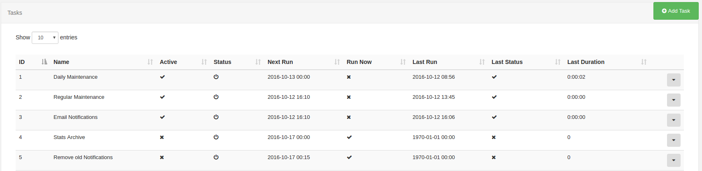

<!--toc=advanced-->
# Routine Tasks
XTR is [[PRODUCTNAME]]'s task scheduler and caters for running routine tasks on the CMS. Typical
 tasks include Maintenance, Email Alerts, Archiving and 3rd party integrations.

## Administration

Tasks and their recent status can be viewed from the CMS web portal by navigating to the Administration ->
Tasks page. This page is usually only available to Super Admin users.



## System Tasks
[[PRODUCTNAME]] comes with some pre-configured tasks which we recommend activating on all installations.
These are:

 - Daily Maintenance
 - Regular Maintenance
 - Email Notifications
 - Stats Archive
 - Remove old Notifications

### Maintenance

Maintenance tasks require some further configuration and are discussed in their own 
[Maintenance Section](cms_maintenance.html).

### Email Notifications

The Email Notifications task sends any email notifications that are due, these can be user submitted
notifications or system notifications.

Only users who have email addresses configured will receive notifications and only if they are manually
assigned the notification, or have the "receive system notifications" flag checked on their user account
or a group they belong to.

The "admin email address" configured in CMS Settings -> Maintenance will also receive an email notification
for any system notifications.


### Stats Archive

The stats archive task exports old statistics to a CSV file which can be opened in a spread sheet program.
It ZIP's the CSV and adds it to the Library for later download.

The default period is 7 days with the task set to run every Monday at midnight.

Archived stats will be deleted and cannot be retrieved, other than in the CSV file.

### Remove old Notifications

This task removes system notifications older than 7 days. The 7 day period can be configured on the task.

## Custom Tasks

The CMS will look in the `/custom` folder for any file ending in `.task`, these files will be loaded
into the Task Add form for deployment on the CMS.

The `.task` file should contain the Tasks configuration information, including an auto-loaded class
definition for the task. An example is shown below:

``` json
{
  "name": "My Custom Task",
  "class": "\\Xibo\\Custom\\CustomTask",
  "options": {
    "option1": "value1"
  }
}
```

This task would expect to be able to instantiate `\Xibo\Custom\CustomTask` at runtime.
