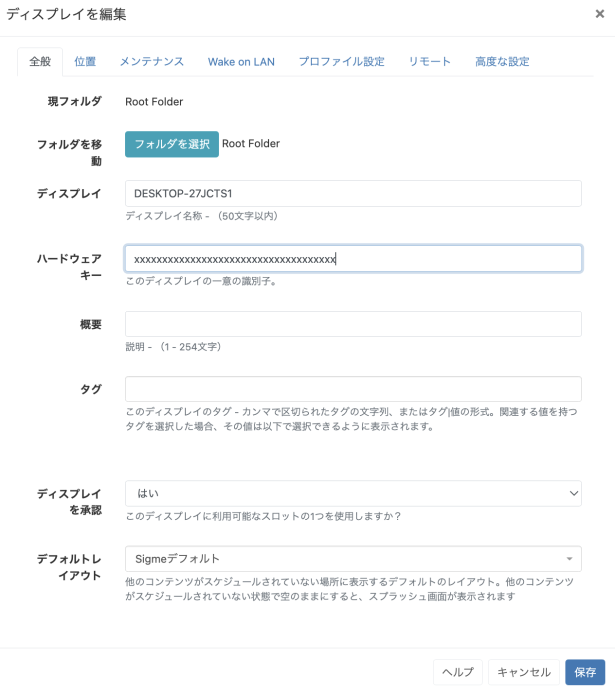

<!--toc=displays-->

# ディスプレイ

[[PRODUCTNAME]]の主な目的は、コンテンツをスクリーンに表示することであり、CMS全体はその目的のために存在しています。
[[PRODUCTNAME]]では、コンテンツをいつ、どのようにスクリーンに表示するかを管理するために、**ディスプレイ**という概念があります。

コンテンツがスケジュールされていない場合、またはスケジュールされたイベントが表示されない問題がある場合、何かがディスプレイ上に**常時表示**されるように、**デフォルトレイアウト**を設定することを強くお勧めします。

独自のデフォルトレイアウトを作成して、既存のレイアウトを置き換えることもできますが、複雑なメディアやウェブコンテンツがないシンプルなデザインにする必要があることに留意してください。

[ディスプレイを編集]を選択するか、行メニューを使用して「デフォルトレイアウト」をクリックし、ドロップダウンメニューから準備したレイアウトを選択します。

{tip}
**注意：** デフォルトレイアウトが設定されていない場合、または設定されているデフォルトレイアウトに問題がある場合、ディスプレイにスプラッシュ画面が表示されます。
{/tip}

ディスプレイは、サイネージ・プレーヤー・ソフトウェアがインストールされたときに生成される**ハードウェア・キー**によって一意に識別されます。このハードウェア・キーは、CMSでディスプレイ・レコードを作成するために使用され、その1つのディスプレイ・レコードに固有のものです。

## ディスプレイの接続

ディスプレイは「XMDS」(Xibo Media Distribution Service)というAPIでCMSに接続し、ほとんどのプレイヤーはURLとCMS Keyだけで利用することが可能です。

また、CMSの**ディスプレイ**ページで6文字の「アクティベーションコード」を入力することで、ディスプレイを追加することも可能です。

**注意：**CMSの**ディスプレイ追加（コード）**を使用してディスプレイを接続する方法は、現在v2 R204以降の**Androidプレイヤー**とv2 R202/R252以降の**Windowsプレイヤー**でのみサポートされています。

{tip}
新しいディスプレイは、コンテンツを送信する前に、**承認済み**としてマークする必要があります。これは、ディスプレイの行メニューを使用して、**承認**アクションをクリックすることによって行うことができます。
{/tip}

## ディスプレイ管理

ディスプレイは、CMSのメインメニューの**管理**セクションにある**ディスプレイ**をクリックすることで管理することができます。 ディスプレイの[グリッド](tour_grids.html)が開き、新しいディスプレイを追加したり、終了したディスプレイを管理することができます。

デフォルトでは、**フォルダ**ツリーが開きます。

- フォルダ/サブフォルダをクリックすると、その内容が検索され、グリッドに適用された任意のフィルタに基づいて結果が返されます。
または
- **全てのフォルダ** にチェックを入れると、ルートフォルダでの検索を含み、グリッドに適用されたフィルターに基づいた結果を返します。

{tip}
フォルダのアイコンをクリックすると、表示/非表示を切り替えることができます。 フォルダを非表示にすると、選択したフォルダのファイルパスが表示されます
{/tip}

{tip}
ログインしたユーザーは、アクセス権が与えられているディスプレイの状態のみを見ることができます。
{/tip}

**ID** - ディスプレイの内部識別のためにのみ使用されます。

**ディスプレイ** - CMS内で簡単に識別できるように、ディスプレイに与えられた名前です（これはディスプレイ自体には表示されません）。

**ステータス** - *ティック* = プレイヤーは最新の状態です（これは緑色で表示されることもあります）。
                 *クラウドアイコン* = プレイヤーはログインしておらず、コンテンツはダウンロード待ちの状態です。
                 *クロス* = プレイヤーは現在新しいコンテンツをダウンロード中で、まだダウンロードを完了していません（これは赤色で表示されることもあります）。

**承認済み** - ディスプレイがCMSのライセンスを付与されているかどうかを、チェックマークまたはクロスで表示します。これにより、未承認のディスプレイがCMSに追加されるのを防ぐことができます。

{tip}
**表示列**ボタンを使って、**商用ライセンス**カラムを含めると、ディスプレイの商用ライセンスの状態を簡単に確認することができます!
{/tip}

**ログイン中** - ディスプレイが最近ログインしたかどうかをチェックまたはクロスで表示します。

**最終アクセス** - ディスプレイに最後にアクセスした日付と時刻。

**MACアドレス** - ディスプレイのメディアアクセスコントロールアドレス（プレーヤーソフトが送信可能な場合）。

{tip}
**表示列**ボタンを使って、利用可能なオプションから、管理目的で表示したい情報を選択します。ディスプレイグリッドからカラムを削除するには、選択を解除します!
{/tip}

## 行メニュー

各ディスプレイには、実行可能ないくつかのアクションを含む行メニューがあります。

{tip}
選択したアクションは、行メニューからアクションをクリックすることで、[フォーム](tour_forms.html)を自動的に送信することができます(**承認**、**ライセンスのチェック**など)。自動投稿機能を持つアクションには、有効化するためのオプションが表示されます。詳しくは、[グリッド](tour_grids.html)をご覧ください。
{/tip}

### 管理

各ディスプレイは独自の**ダッシュボード**を持ち、ディスプレイの現在の状態、帯域幅の使用状況、ファイルの状態、エラーなどを表示します。

{tip}
このダッシュボードは、ディスプレイのトラブルシューティングを行う際に、最初に見るべき項目として役立ちます。
{/tip}

### 編集

**編集**をクリックすると、設定オプションのタブを含むディスプレイ編集フォームが表示されます。

{tip}
インストール時に生成される固有のハードウェアキーは、選択されたディスプレイの全般タブに表示されます。
{/tip}

### フォルダ

ディスプレイは、オプションで**編集フォーム**または行メニューの**フォルダを選択**から**フォルダ**に保存することができます。

{tip}
フォルダに保存されたディスプレイは、ユーザー/ユーザーグループの保存先フォルダに適用された表示、編集、削除の共有オプションを継承します。
{/tip}

- **フォルダを選択**」ボタンをクリックして展開し、保存するフォルダを選択します。

- フォルダを右クリックすることで、その他のオプションにアクセスすることができます。

{tip}
利用可能なオプションは、ユーザー/ユーザーグループに対して有効な[機能と共有](users_features_and_sharing.html)オプションに基づきます!
{/tip}

フォルダアクセスとセットアップに関する詳細については、管理者にご相談ください。

{tip}
グリッド下部の個別選択オプションを使用して、複数のディスプレイをフォルダに割り当てることができます。
{/tip}

選択したフォルダのファイルパスが、フォームの「フォルダ」フィールドの横に表示されます。

### タグ

ディスプレイにはタグを付けることができ、タグによってグループ化された多数のディスプレイを簡単に検索することができます。 フォームのタグフィールドにテキストを入力すると、オートコンプリートヘルパーが一致する候補を表示し、ユーザーが簡単に選択できるようにします。

定義済みの値は、**タグ値**のドロップダウンを使用して表示されます。値が既に知られている場合は、次のフォーマットを使用してフィールドに直接入力することができます。例えば'色|赤`と入力します。

{tip}
管理者によって値が「必須」に設定されている場合、フォームを保存するために値を入力する必要があります。
{/tip}

ユーザーは、**タグ値** フィールドを使用して、定義済みの値をまだ持っていないタグに関連する値を追加することができます。タグの値が必要ない場合は、このフィールドを空白にすることができます。

{tip}
タグは、グリッド下部の[個別選択](tour_grids.html#複数選択-個別選択による)を使って、複数のディスプレイに割り当てることもできます!
{/tip}

使用する**タグ**と**タグ値**の詳細については、管理者にご相談ください。

#### 個々のディスプレイのディスプレイプロファイル設定の上書き

**プロファイル設定**タブでは、選択した「ディスプレイ設定プロファイル」(displays_settings.html)から適用される設定内容を確認できます。

編集アイコンをクリックして、選択した設定を変更し、プロファイルを上書きすることができます。

#### ディスプレイごとの帯域制限を設定

**高度な設定**タブを使用して、**ディスプレイ**が消費できる帯域幅を決定するための制限を適用することができます。

{tip}
グリッドの下部にある「個別選択」オプションを使用して、複数のディスプレイの帯域幅の制限を設定します。
{/tip}

### 削除

**ディスプレイ**を削除すると、**CMS**から完全に削除され、この操作は元に戻せません。削除されたディスプレイは、新しい一意のディスプレイレコードを作成する「登録」手順を繰り返すことで、CMSに再接続することができます。

{tip}
ディスプレイを削除する代わりに**認証解除**することで、後日必要に応じて再認証することができます。ディスプレイの行メニューを使用して、**承認**をクリックすると、**認証解**に切り替わります。これは、**ディスプレイを編集**フォームから、ディスプレイのオーソライズで**いいえ**を選択することによっても実行することができます。
{/tip}

### コマンド送信 

**コマンド送信**機能は、あらかじめ定義されたコマンドを選択することで、XMRを介してプレイヤーで実行されます。例えば、プレイヤーに「再起動」コマンドを送信するのに便利です。

{tip}
管理者があらかじめ定義されたコマンドを作成して使用するため、追加のコマンドが必要な場合は、管理者に連絡してください。
{/tip}

{tip}
このタイプのコマンドは、[コマンドイベント](scheduling.html#イベント)をスケジューリングすることによっても実行可能です。
{/tip}

### ディスプレイを別のCMSに転送する

この機能を利用するには、まず[２要素認証](tour_two_factor_authentication.html)を利用してGoogleに認証を有効化する必要があります。

CMSのメインメニューから**ディスプレイ**をクリックし、行メニューから転送したいディスプレイの**別のCMSに転送**をクリックすると起動されます。

すべてのフォームフィールドが記入されていることを確認してください。

- このDisplayを転送したい完全な**CMS URL**を入力します。
- 転送したいCMSアドレスの**CMS秘密鍵**を入力します。
- アプリに表示されている**２要素認証コード**を入力します。

提供された詳細が認証されると、ディスプレイは'新しい'CMS への登録を試みます。ディスプレイが正常に転送されると、ディスプレイ'古い'CMSとの通信を停止し、**承認済み**欄が「チェック」から「X」に変更されます。

{tip}
グリッドの下にある**個別選択**オプションを使って、転送する複数のディスプレイを選択してください。
{/tip}

{tip}
行メニューの一部のアクションには、「自動投稿」のオプションがあります。詳しくは、[グリッド](tour_grids.html)をご覧ください。
{/tip}

