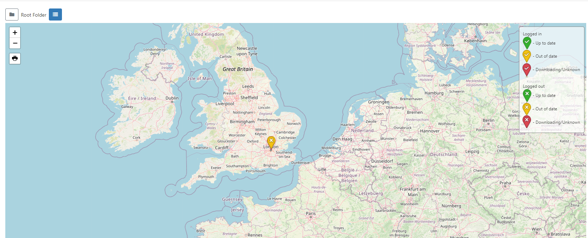
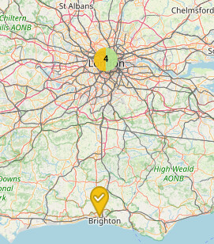
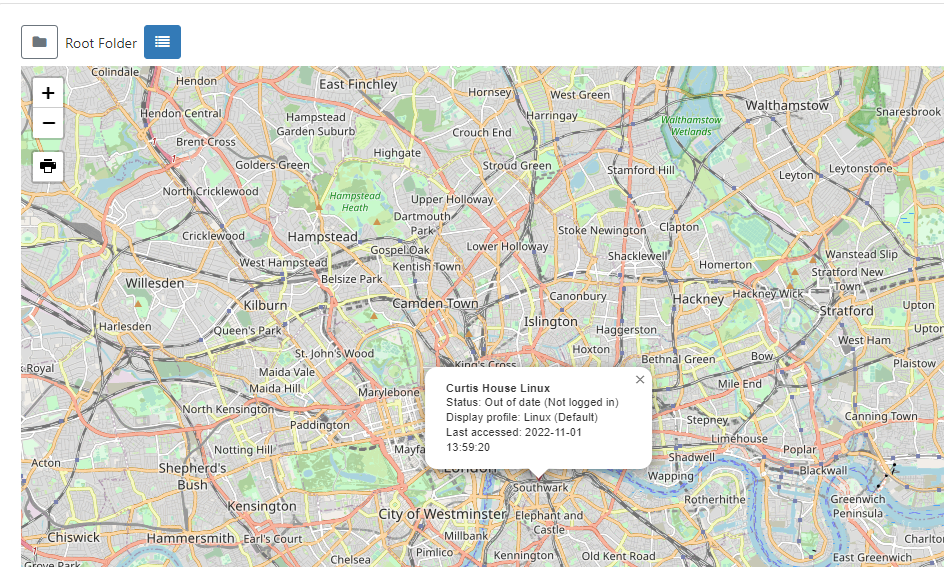

# Displays

The primary purpose of [[PRODUCTNAME]] is to show content on screens with the entire application suite existing for that one purpose. [[PRODUCTNAME]] provides a concept called **Displays** to manage when and how content is shown on a screen.

{nonwhite}
Administrator documentation for Player Installation can be found in our [Administration Manual](/docs/setup/). Select your chosen Player to follow the **Installation** instructions and required steps to **Connect to your CMS**.
{/nonwhite}

{tip}
Ensure that any new Displays have been marked as **Authorised** in the CMS so that they can start receiving content. Use the Display row menu and select **Authorise**.
{/tip}

## Display Administration

Displays are managed in the CMS by clicking **Displays** under the **Displays** section of the main CMS menu. Displays are uniquely identified by a **hardware key** which is generated when the Player software is installed. This hardware key is used to create a unique Display record in the CMS.

{tip}
The Add Display (Code) function can be used after installing the Player in order to easily Connect Players to the CMS.  Players will show a 6 character Activation Code to enter in the form in order to Connect.
{/tip}

{feat}Connect using Authentication Code|v4{/feat}

Displays can be saved to [Folders](/manual/en/tour_folders.html) to easily control User/User User Group levels of interaction for Displays as well as provide an additional way to organise.

{tip}
Displays that are saved in Folders will inherit the View, Edit, Delete [Share](users_features_and_sharing.html#content-share) options that been applied to the destination Folder for the User/User Group!

Assign multiple Displays to a Folder using the **With Selected** option at the bottom of the grid!
{/tip}

The grid will update to show only objects inside a Folder once selected or use **All Folders** to include searching in the Root Folder.

{tip}
Click the Folders icon to toggle on/off from view.  When Folders are hidden from view, the file path for the selected folder will be shown!
{/tip}

Use the Column visibility button to select from the available options to show the information you need for your administration purposes. 

Some of the notable options are listed below:

**ID** - Internal identification of a Display.

**Display** - Friendly name given to the Display for easy identification purposes within the CMS (this is not shown on the Display itself).

**Status**:

- *Tick* = Player is up to date (this may also show as green in colour).
- *Cloud Icon* =  Player has not logged in with content waiting to be downloaded (this may also show as amber in colour, as above)
- *Cross* = Player is currently downloading new content and has yet to complete the download (this may also show as red in colour)	

**Authorised** - Tick or cross to indicate whether the Display has been granted a licence with the CMS. This prevents unauthorised Displays being added to the CMS.

{tip}
Include the **Commercial License** column using the **Column Visibility** button to easily identify the Commercial Licence status of your Displays!
{/tip}

**Logged In** - Tick or cross to show if the Display has logged in recently.

**Last Accessed** - Date and time stamp of when the Display was last accessed. 

**MAC Address** - Media Access Control Address of the Display (if the Player software is capable of sending it).

## Row Menu

Each Display has a row menu containing a number of actions/shortcuts.

{tip}
Selected actions allow for certain [Forms to be automatically submitted](tour_cms_navigation.html#content-automatic-submission-of-forms) such as **Authorise** and **Check Licence**. Actions that have an auto submit capability will display an option to enable. 
{/tip}

### Manage

Each Display has its own **Dashboard** which shows the Displays current status, bandwidth usage, file status and errors.

{tip}
This Dashboard is useful as a first step to look at when troubleshooting issues with a Display!
{/tip}

### Edit

Click **Edit** to manage configuration options for the Display:

- Use the **General** tab to view the unique **Display Hardware Key** which is generated during installation, **Authorise a Display** to use an available Licence Pool slot and set a **Default Layout**.

- Provide Display **Details** such as the **Latitude** and **Longitude** of the Display. If you are using the [Ad Campaign](layouts_campaigns.html#content-ad-campaigns) functionality ensure that you complete the **Cost per play** and **Impressions per play** fields on this tab for all selected Displays.

{tip}
Additional fields have been included designed to enhance advertising needs such as:

- The physical address of the display
- Is the display mobile?
- Venue type
- Languages supported

{/tip}

- Optionally provide **Reference** information for the selected Display. Once added, this information can be viewed in the Display grid and via the API.

- Control **Email Alerts** and **Global Timeout** settings from the **Maintenance** tab.

- Override [Display Profile Settings](displays_settings.html) for individual Displays using the **Settings** tab.

- Use the **Advanced** tab to apply limits to determine the amount of **Bandwidth** a Display can consume and to **Clear Cached Data**.

{tip}
You can easily set bandwidth limits for multiple Displays using the **With Selected** option at the bottom of the Displays grid!
{/tip}

### Delete

Deleting a **Display** will remove it from the **CMS** entirely - this operation cannot be reversed. A deleted Display can be reconnected to the CMS by repeating the **Connect to CMS** procedure which will create a new unique Display record.

{tip}
**Deauthorise** a Display instead of deleting so that it can be re-authorised at a later date if needed. Use the row menu for the Display and click on **Authorise** to toggle to **Deauthorise**. 

This can also be actioned from the **Edit** form on the General tab by selecting **No** for Authorise display.
{/tip}

### Default Layout

When no content is scheduled or if there is an issue that prevents a scheduled Event from showing, a **Default Layout** will be shown on Displays to ensure that something is **always** shown! 

Displays will show the global Default Layout as set in [CMS Settings](tour_cms_settings#content-default-layout) which can be overridden per Display if required:

- Select from the row menu or **Edit** form to choose the Layout to use from the dropdown menu. 
- Leave this field blank to automatically use the global Default Layout.

{tip}
Create your own Layout to select but keep in mind that designs should be kept simple with no complex media or web content.
{/tip}

{version}
**NOTE:** If there is no other content scheduled and the Default Layout is being downloaded/there is an issue with the selected Default Layout, the splash screen will be displayed.
{/version}

### Assign Files / Layouts

[Library files](media_library.html) and [Layouts](layouts.html) can be assigned directly to a Display so that they are always available in the local library of the Player. This is useful for pre-loading a Layout ahead of time when that Layout will be used for some API integration, triggering a change for example.

- Select which files/Layouts to assign and click to **Save**.

Selected files/Layouts will be downloaded to the Display at the next collection interval. If XMR is installed these will be downloaded immediately.

However, this does NOT mean that Library files and Layouts will be shown and will still need to be [Scheduled](scheduling_events.html).

{tip}
Files/Layouts can be unassigned from Displays by following the same steps and deselecting items from the top staging area. These will be 'cleaned up' when the Player needs space or after 30 days of the that file/Layout no longer being required.
{/tip}

### Send Command

The **Send Command** functionality is executed via XMR to Players by selecting a predefined command. This is useful for sending Players 'Reboot' commands for example.

{tip}
This type of [Command](displays_command_functionality.html) can also be executed by scheduling a [Command Event](scheduling_events.html#content-command)
{/tip}

### Transfer Display to another CMS

{feat}Transfer Display to another CMS|v4{/feat}
To use this functionality you will first need to activate Google Authenticator using [Two factor Authentication](tour_user_access.html#content-two-factor-authentication), if you have not already set this up.

Once activated, use the row menu for the Display you want to transfer, and select **Transfer to another CMS**

Ensure all the form fields are completed as explained below:

- Enter the full **CMS URL** you wish to transfer this Display to.

- Provide the **CMS Secret Key** for the CMS Address you wish to transfer to.

- Complete the **Two Factor authentication code**, as displayed on the app.

  

Once the details provided have been authenticated, the Display will attempt registration with the 'new' CMS. Once the Display has been successfully transferred the Display will stop communicating with the 'old' CMS and will change from a 'tick' to a `X` in the **Authorised** column in the Displays grid.

{tip}
Select multiple Displays to transfer using the **With Selected** option at the bottom of the grid!
{/tip}

## Map View

Use the Map view to see the locations and status of Displays.

Click the icon located next to the Folders toggle to switch to the **Map View**:

The status of Displays in marker clusters will be shown as pie charts for easier identification:

{tip}
Logged in Users will only be able to view the status of Displays they have been given access to. 
Use the filter fields in the grid from the List View to isolate Displays to view!
{/tip}

Clicking on a status icon will show further information about the selected Display:

Click the icon - **List** to return to the Display grid view.

#### Next...

[Display Groups](displays_groups.html)

