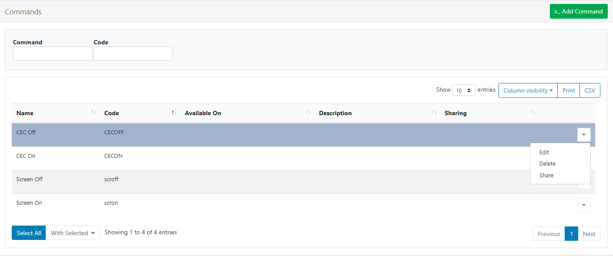

# コマンド機能

[[PRODUCTNAME]] のコマンド機能は、ユーザーが **XMR** 経由で、**スケジュール** で、または **レイアウト** に含めるように選択するコマンド セットを構成するために使用されます。

{tip}
コマンドには、すべてのプレーヤーに適用するコマンド文字列、またはプレーヤーごとに異なるコマンド文字列を含めることができます。これは、ネットワークが混在している場合や異なるディスプレイに接続されている場合、またはプレーヤー ハードウェアがわずかに異なる場合に特に便利です。
{/tip}

**コマンド レコード** が作成され、**ディスプレイ プロファイル**、**スケジュールされたイベント**、**シェル コマンド ウィジェット** で使用できる「汎用コマンド」を作成できます。

{tip}
コマンドを使用すると、RS232、Android インテント、Philips SoC (システム オン チップ) の機能に簡単にアクセスできます。

{/tip}

## コマンド管理

コマンドは、メイン CMS メニューの **ディスプレイ** セクションの **コマンド** から作成および管理されます。



コマンドの行メニューを使用して、[共有](users_features_and_sharing.html#content-share) オプションを編集、削除、および設定します。

### コマンドの追加

**コマンドの追加** ボタンをクリックし、関連するフォーム フィールドに入力します:


**コマンド** ドロップダウン メニューを使用して、次のいずれかのオプションを選択して構成します:

#### フリー テキスト

コマンド文字列を入力します

{tip}
コマンド文字列は、最後に実行されたコマンドを表し、シェルへの直接呼び出しにすることも、**ヘルパー** を指定することもできます。以下の「ヘルパー」セクションを参照してください。{/tip}

#### Philips Android

{version}
Phillips Commercial Display の統合は、Android v2 R200 から利用できます。
{version}

以下のコマンドを使用して、一部の市販のフィリップス ディスプレイの側面にある LED を制御できます:

```
tpv_led|off
tpv_led|red
tpv_led|green
tpv_led|blue
tpv_led|white
```

Android v2 R215 以降では、以下のコマンドを使用して画面のバックライトの電源をオン/オフにするための統合が追加されました:

```
tpv|backlighton
tpv|backlightoff
```

{tip}
以下のコマンドは、特定の Android 4 モデルでのみ使用できます。 2016 モデル [10BDL3051T](https://www.philips.co.uk/p-p/10BDL3051T_00/signage-solutions-multi-touch-display)

```
tpv|screenoff
tpv|screenon
```

`screenoff` は画面をオフにして低電力状態にし、その後 `screenon` でオンに戻すことができます。

その他のすべてのモデルでは、`screenoff` は完全に電源をオフにするため、現場での再起動が必要になるため、`backlighton/off` を使用してください。
{tip}

v2 R215 からは、ミュート/ミュート解除コマンドも追加されました:

```
tpv|mute
tpv|unmute
```

**注意:** `backlighton/off` はオーディオをミュートしないため、オーディオを再生している場合は、上記の `mute/unmute` コマンドも同時にスケジュールする必要があります。

#### RS232

コマンド文字列で `rs232` プレフィックスを使用することで、プレーヤーで RS232 コマンドを実行できます。コマンドの形式は `rs232|<接続文字列>|<コマンド>` です。

Windows では、接続文字列は次の形式で指定する必要があります:

```
<COM#>、<ボー レート>、<データ ビット>、<パリティ|なし、奇数、偶数、マーク、スペース>、<ストップ ビット|なし、1、2、1Point5>、<ハンドシェイク|なし、XOnXOff、RequestToSend、RequestToSendXOnXOff>、<HexSupport|0、1、デフォルト 0>
```

**注意:** コマンドを HEX 形式で送信する必要がある場合は、コマンド文字列でバイト文字列を指定する必要があります。たとえば、`7E 00 00 FF 00 00 00 00 00 00 00 00 00 00 00 00 FF` です。これはプレーヤーによってバイト ストリームに変換されます。接続文字列の `HexSupport` 要素を `1` に設定する必要があります。

Android では、接続文字列は次の形式で指定する必要があります:

```
<DeviceName>、<Baud Rate>、<Data Bits>、<Parity>、<StopBits>、<FlowControl>
```

各設定は対応する数字で表されます:

```
DATA_BITS_5 = 5;
DATA_BITS_6 = 6;
DATA_BITS_7 = 7;
DATA_BITS_8 = 8;
PARITY_NONE = 0;
PARITY_ODD = 1;
PARITY_EVEN = 2;
PARITY_MARK = 3;
PARITY_SPACE = 4;
STOP_BITS_1 = 1;
STOP_BITS_15 = 3;
STOP_BITS_2 = 2;
FLOW_CONTROL_OFF = 0;
FLOW_CONTROL_RTS_CTS = 1;
FLOW_CONTROL_DSR_DTR = 2;
FLOW_CONTROL_XON_XOFF = 3;
```

コマンド自体は、接続の詳細を使用して RS232 経由で送信される文字列です。

#### Android インテント

Android ディスプレイ プロファイルでは、`intent` ヘルパーを使用して、コマンドの実行時に呼び出されるインテントを指定できます。コマンドの形式は、`intent|<type|activity,service,broadcast>|<activity>|[<extras>]` です。

`[<extras>]` は、**Android v2 R206** から使用可能なオプションのパラメータで、インテントに追加データを提供するために使用されます。これは、少なくとも 1 つのオブジェクトを含む配列を含む JSON 形式の文字列である必要があります。オブジェクトの形式は以下のとおりで、1 行にする必要があります。

```json
{
"name": "<extra name>",
"type": "<type|string,int,bool,intArray>",
"value": <上記の型の値>
}
```

たとえば、一部のデバイスでは、ファームウェアをプログラムしてオン/オフの時間を設定できます。

```
[{
"name": "timeon",
"type": "intArray",
"value": [2018, 7, 28, 8, 40]
}, {
"name": "timeoff",
"type": "intArray",
"value": [2018, 7, 28, 21, 40]
}]
```

これはコマンドで次のように設定されます:

```
intent|broadcast|activity|[{ "name": "timeon", "type": "intArray", "value": [2018, 7, 28, 8, 40] }, { "name": "timeoff", "type": "intArray", "value": [2018, 7, 28, 21, 40] }]
```

{tip}
Windows プレーヤーでは、インテント ヘルパーを含むコマンドは無視されます。
{/tip}

### ヘルパー

**コマンド ヘルパー** は、より高度なアクションを実行するためにコマンド文字列に追加できるプレフィックスです。プレフィックスのないコマンドは、プレーヤーを実行するオペレーティング システムのシェルで実行されます。Windows では `cmd.exe`、Android では `shell` です。

{nonwhite}
Xibo for Android [タイム ゾーンを変更するヘルパー コマンド](/docs/setup/helper-command-to-change-time-zone)
{/nonwhite}

### 検証

**検証文字列** は、**コマンド** 出力との比較に使用され、一致した場合はコマンドが成功したと見なされます。検証文字列は完全に一致する必要があります。

これは、Windows と Android のプレーヤーが混在するネットワークで「再起動」というコマンドを使用する場合に役立ちます。Windows での「再起動」のコマンド文字列は `shutdown /r /t 0` で、Android では `reboot` です。

{tip}
同じことは、混合されていないネットワークでも役立ちます。HDMI/RS232 経由で接続されたさまざまなモニターを備えた Windows プレーヤーのネットワークを想像してください。異なるディスプレイ設定プロファイルで表されるさまざまなブランドのモニターを使用して、「モニター オン」という単一のコマンドを作成できます。各モニターには、モニターのオン/オフを切り替えるための異なるコマンド文字列を設定できます。

{/tip}

### 使用可能

コマンドを使用できるディスプレイの種類を選択します。空白のままにすると、すべての種類のディスプレイにコマンドが適用されます。

{tip}
**コマンド** および **検証** 文字列は、[ディスプレイ プロファイル](displays_settings.html#setting_on_the_display) を編集し、[**コマンド**] タブを使用することで上書きできます。

{/tip}

## コマンド XMR を送信

行メニューを使用して、ディスプレイ/ディスプレイ グループから **XMR** 経由でコマンドを実行します。

## コマンドのスケジュール

**コマンドをスケジュール**して、特定の時間に実行されるようにします

- メイン CMS メニューから **スケジュール** をクリックします。
- スケジュール グリッドの上部から [イベントの追加](scheduling_events.html#content-add-event) を選択します。

- イベント タイプ ドロップダウンから **コマンド** を選択します。
- フォーム フィールドに入力し、使用する **コマンド** と **開始時刻** を選択します。

{tip}
スケジュールされたコマンドはプレーヤーで 1 回実行され、**開始** の日付と時刻のみが必要です。コマンドは、選択した時刻から最大 10 秒後に実行できます。
{/tip}

## シェル コマンド

[シェル コマンド ウィジェット](media_module_shellcommand.html) を使用して、レイアウト アクティビティに基づいて外部コマンドを実行します。

コマンドをソースとするシェル コマンドは、通常のシェル コマンドと同じように動作します。コマンドは、ウィジェットがレイアウトに表示されるときに実行されます。

シェル コマンドは、すべてのプレーヤーにオプションが提供されるコマンド文字列にすることもできます。これにより、ユーザーは 1 回限りの使用のために「アドホック」コマンドを追加できます。

{tip}
管理者は、可能な場合は定義済みコマンドを作成することをお勧めします。

{/tip}

## モニターのオン/オフ

### HDMI-CEC

HDMI-CEC は、HDMI コネクタを備えたほぼすべての新しい大画面テレビに実装されているバスです。このバス (通常の HDMI ケーブル内で物理的に接続) は、電源オン、電源オフ、音量調整、ビデオ ソースの選択、およびテレビのリモコンからアクセスできる多くの機能を実行できる制御信号をサポートします。また、HDMI バス上の他のほとんどのハードウェアを制御することもできます。

メーカーの仕様が多数あるため、[[PRODUCTNAME]] は HDMI-CEC への直接インターフェイスを提供していませんが、バッチ ファイルを使用して HDMI-CEC を制御することは可能です。

### シリアル/RS232

業界グレードのモニターには、モニター パネルのオン/オフを切り替えるためのシリアル インターフェイスが備わっていることがよくあります。[[PRODUCTNAME]] は、RS232 コマンド ヘルパーを使用して、これらのコマンドをモニターに送信できます (通常は HEX モードで)。

以下のモニターとコマンドがテストされています:

#### NEC E464

- 電源オン - `rs232|COM1,9600,8,None,One,None,1|01 30 41 30 41 30 43 02 43 32 30 33 44 36 30 30 30 31 03 73 0d`
- 電源オフ - `rs232|COM1,9600,8,None,One,None,1|01 30 41 30 41 30 43 02 43 32 30 33 44 36 30 30 30 34 03 76 0d`

#### Sharp LC-42D69U

- 電源オン - `rs232|COM1,9600,8,なし,1,なし,1|50 4F 57 52 31 20 20 20 0D`
- 電源オフ - `rs232|COM1,9600,8,なし,1,なし,1|50 4F 57 52 00 20 20 20 0D`

#### LG 55LK520

- 電源オン - `rs232|COM1,9600,8,なし,1,なし,1|6B 61 20 30 30 20 30 31 0D`
- 電源オフ - `rs232|COM1,9600,8,なし,1,なし,1|6B 61 20 30 30 20 30 30 0D`

{tip}
各ブランドの他のモデルでも同じコマンドを使用する必要があることに注意してください。
{/tip}

