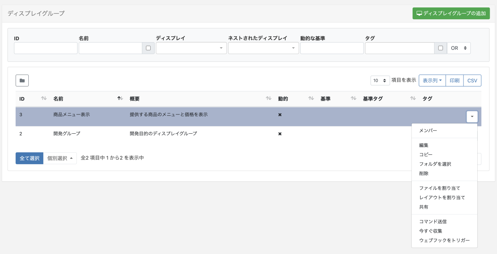
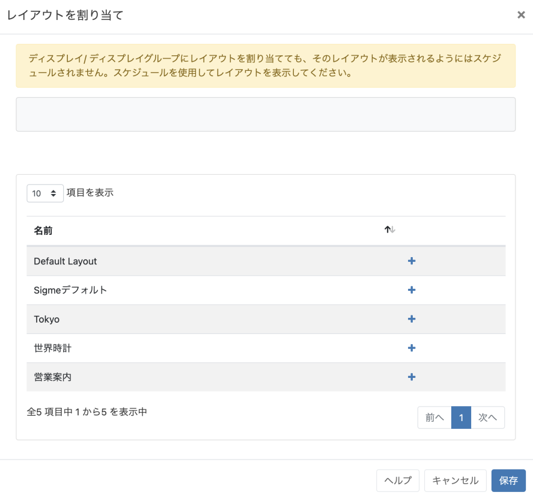

<!--toc=displays-->
# ファイル/レイアウト割り当て

ライブラリファイルやレイアウトは、ディスプレイやディスプレイグループに直接割り当てることができ、プレーヤーのローカルライブラリで常に利用することができます。

**割り当てられたファイルやレイアウトが表示されるわけではありませんので、引き続きスケジューリングが必要です。**

{tip}

これは、例えばレイアウトの変更をトリガーとして、そのレイアウトが何らかの APIでの統合に使用される場合に、前もってレイアウトをロードしておくのに便利です。

{/tip}

## ファイル/レイアウトを割り当てる

選択したディスプレイまたはディスプレイグループの行メニューで直接割り当てる。

直接割り当てたい**ライブラリファイル/レイアウト**を選択し、保存します（これらは、ファイルを選択するとステージングエリアに表示されます）。

選択されたものは、次の収集間隔に**ディスプレイ**にダウンロードされます。XMRがインストールされている場合、これらはすぐにダウンロードされます。

{tip}
直接割り当てられたライブラリファイルやレイアウトを表示するには、ディスプレイやディスプレイグループへの**スケジュール**が必要です。
{/tip}

ファイル/レイアウトは、上記と同じ手順でステージングエリアからアイテムの選択を解除して削除することができます。 これらのファイルは、プレーヤーがスペースを必要とするとき、またはそのファイル/レイアウトが不要になってから30日後に「クリーンアップ」されます。

