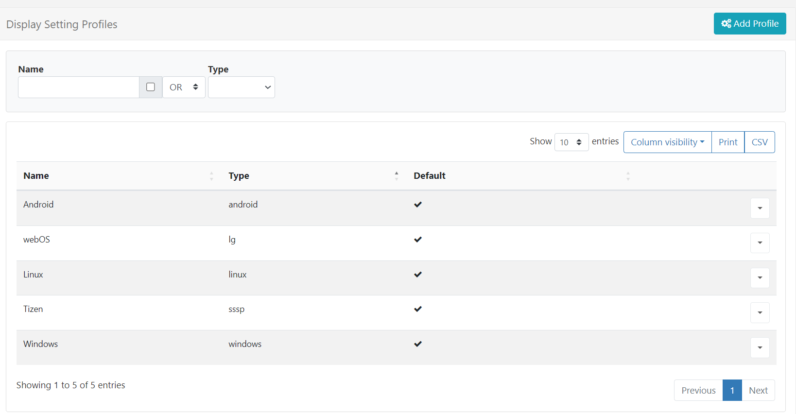

# ディスプレイ設定

インストールして CMS に接続すると、**ディスプレイ設定プロファイル** を使用してディスプレイを自動的に管理および構成できます。各ディスプレイにはデフォルトのプロファイルがあり、管理者は要件に合わせてこれをカスタマイズできます。

使用可能なプロファイルは、メイン CMS メニューの **ディスプレイ** セクションの **ディスプレイ設定** をクリックすると表示されます:

各プロファイルには、**名前**、**タイプ**、および **デフォルト** かどうかを示すフラグがあります。デフォルト プロファイルは、対応するタイプのディスプレイに自動的に割り当てられます。

## プロファイルの追加/編集

新しいプロファイルを **追加** するには:

- **プロファイルの追加** ボタンをクリックし、新しいプロファイルに **名前** を付けて、**ディスプレイ タイプ** を選択します。

- 選択したタイプのすべてのディスプレイの **デフォルト プロファイル** として使用する場合は、ボックスを使用します。

{tip}
**デフォルト プロファイル** として選択できるプロファイルは、ディスプレイ タイプごとに 1 つだけです。

{/tip}

- 新しいプロファイルに必要なすべての設定を完了します。

既存のプロファイルを **編集** するには:

- 選択したプロファイルの行メニューから **編集** をクリックします。

- フォームを使用して、使用可能な設定を調整します。

{tip}
簡単にするために、行メニューを使用してプロファイルを **コピー** すると、必要に応じて調整して新しいプロファイルをすばやく作成できます。
{/tip}

注目すべき設定のいくつかを以下に示します:

### 収集間隔

**全般** タブにある **収集間隔** ドロップダウン メニューを使用して、プレーヤーが新しいコンテンツ/スケジュールを確認する頻度を決定します。これは、プレーヤーが CMS と通信した後、ここで設定された時間までに再度変更を確認することを意味します。

{tip}
**シナリオ:**
プレーヤーの収集間隔が 24 時間に設定されている場合、プレーヤーは変更、保留中のアクション、および次の 24 時間の収集を待機します。この期間内に変更が行われた場合、プレーヤーは再度確認するまでその変更を認識しません。

{/tip}

プレーヤーのディスプレイ プロファイルが変更された場合、プレーヤーは以前の接続間隔に従って接続した後にのみ変更を認識します。

{tip}
**シナリオ:**

収集間隔が 24 時間に設定されているプレーヤーが午後 12 時にチェックを行った場合、翌日の午後 12 時まで変更の有無はチェックされません。24 時間の間隔が経過すると、新しい変更が更新され、この時点から新しいプロファイルに基づいて変更が収集されます。
{/tip}

{nonwhite}
{cloud}

XMR はデフォルトで **Xibo Cloud Hosting** で構成されており、設定されている収集間隔に関係なく、変更がプレーヤーにすぐに伝達されます。つまり、ディスプレイ プロファイルを変更することなく、ディスプレイに迅速かつ動的な変更を加えることができます。
{/cloud}

{noncloud}

クラウド以外のお客様の場合、プレーヤーのアクションが必要な場合は、CMS を XMR インスタンスと通信するように構成できます。管理者にお問い合わせください。
{/noncloud}

{/nonwhite} 

{white}

プレーヤーのアクションが必要な場合、CMS は XMR インスタンスと通信するように設定できます。管理者にお問い合わせください。

{/white}

{tip}

本番環境では 5 分以上の間隔を設定することをお勧めします。通常は 15 ～ 30 分の設定が適切です。

{/tip}

### 統計レポートを有効にする

[**全般**] タブのさらに下にあるボックスを使用して、選択した **ディスプレイ プロファイル** を使用するすべての **ディスプレイ** の **Proof of Play レポート** の統計収集を有効/無効にします。

- 有効にした場合、[**集計レベル**] ドロップダウンを使用して、すべてのレイアウト、メディア、ウィジェット アイテムに適用される Proof of Play 統計の収集レベルを設定します。

- **個別** - デフォルトでは、指定されたときに統計が収集されます。

- **時間ごと** - デフォルトでは、統計は時間ごとに収集されます。

- **毎日** - デフォルトでは統計が毎日収集されます。

ディスプレイの地理的位置がわかっている場合は、チェックボックスをオンにして、各プレイ証明レコードに対して位置を記録します。モバイルディスプレイを使用しているユーザーは、必要に応じてこの設定をオンにできます。

{version}

プレーヤーは**完了したレコードのみ**を集計し、ウィジェットの期間の終了時に収集が行われるため、ウィジェットの期間が 3 時間の場合、ウィジェットの有効期限が切れると統計が記録されます。

{/version}

### ダウンロードおよび更新ウィンドウ

**ネットワーク** タブで、CMS からの**ダウンロード** とプレーヤーへの**更新** の時間ウィンドウを設定します。

#### ダウンロードウィンドウのタイミング

- 開始時刻と終了時刻を選択して、CMS に接続し、行われた変更をダウンロードします。

ダウンロードウィンドウの設定外でコンテンツに変更を加えた場合、プレーヤーは変更をダウンロードできず、代わりに割り当てられたデフォルトのレイアウトまたはスプラッシュ画面が表示される可能性があります。

{tip}
ウィンドウを常に開いたままにするには、デフォルトの 00:00 - 00:00 のままにしてください。

{/tip}

#### 更新ウィンドウのタイミング

- アプリケーションの更新をインストールするには、開始時間と終了時間を選択します。

新しいプレーヤー バージョンなどの更新をプレーヤーにダウンロードする時間を定義します。これには、プレーヤーに更新される新しいスケジュールや既存のスケジュールの変更も含まれます。コンテンツの変更は、設定された更新ウィンドウのタイミング中に更新されません。

{tip}
この設定は、割り当てられたレイアウトまたは遅延公開されたレイアウトと組み合わせて使用するのが最適です。これにより、レイアウトは更新ウィンドウ中に公開されます。

{/tip}

### HTTPS を強制

{feat}HTTPS 接続を強制|v4{/feat}

**ネットワーク** タブからチェックボックスを使用して、HTTPS を使用してディスプレイを CMS に接続します。

{tip}
このオプションは、必要に応じて個々のディスプレイに対して上書きできます。
{/tip}

### 営業時間

定義済みの [Dayparts](scheduling_dayparting.html) を設定して、ディスプレイの **営業時間** を設定します。

- Windows、Android、Linux プレーヤーの場合は **ネットワーク** タブを使用し、ドロップダウン メニューから使用する時間帯を選択します。
- webOS および Tizen プレーヤーの場合は **全般** タブを使用し、ドロップダウン メニューから使用する時間帯を選択します。

{tip}
ディスプレイがオフラインのときに送信されるような「電子メール アラート」は、指定された営業時間外には送信されません。

{/{/tip}

### 変更されたレイアウトを期限切れにする

**詳細** タブにあるこのチェックボックスを使用すると、プレーヤーが CMS から更新を受け取ったときに、レイアウトの再生を直ちに期限切れにしてカットするように [[PRODUCTNAME]] に指示できます。

{tip}
長時間のレイアウトに便利です!
{/tip}

### 複数のデコーダーを使用する

ビデオ コンテンツで **ギャップレス再生** を行うには、デバイスに複数のデコーダーが必要です。この設定は [詳細設定] タブにあり、自動的に [デバイスのデフォルト] が使用されます。

{tip}

再生で問題が発生した場合は、ドロップダウンを使用して [オン] に設定してください。

{/tip}

### デバイスのタッチ機能を有効にする (Android のみ)

ディスプレイを **タッチ スクリーン** として使用する場合は、[詳細設定] タブからこのオプションを有効にします。

{tip}

このオプションを有効にすると、プレーヤーに 1 回限りのメッセージが表示されますが、手動で閉じる必要があります。

{/tip}

無効のままにしておくと、画面をタッチすると [アクション バー モード] オプションに従ってアクション バーが表示されます。

## プロファイルの削除

行メニューを使用してディスプレイ プロファイルを削除します。

タイプごとに **デフォルト** が 1 つ残っていることを確認してください。

## 設定プロファイル

**デフォルト プロファイル** は、同じタイプのすべてのディスプレイにその設定を自動的に適用します。

[ディスプレイ](displays.html) をオーバーライドして、デフォルト以外のプロファイルを使用できます。

メイン CMS メニューのディスプレイ セクションの **ディスプレイ** をクリックします。

- オーバーライドするディスプレイを選択し、行メニューから **編集** をクリックします。
- **設定** タブで、ドロップダウンを使用して、ディスプレイで使用する **設定プロファイル** を選択します。

{tip}
各設定は、個々のディスプレイ要件に合わせてオーバーライドすることもできます。

{/tip}

#### 次へ...

[レポート](displays_metrics.html)
