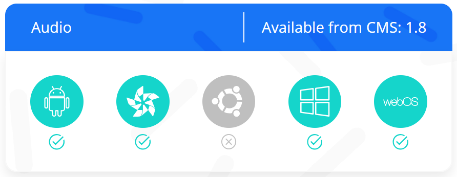
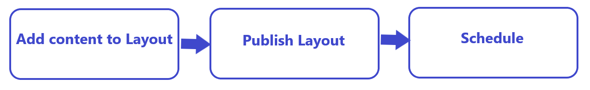

# [[PRODUCTNAME]] User Manual

{nonwhite}
{includeRevisions}**Revision: [[PRODUCTVERSION]]**{/includeRevisions}
{/nonwhite}
{white}**Revision: [[PRODUCTVERSION]]**{/white}

The [[PRODUCTNAME]] software comprises of a central **Content Management System (CMS)** where content is created/uploaded and scheduled to Displays. A **Player** application downloads new content and schedules from the CMS to display on screens:

- The Player application runs on hardware attached to each screen.
- The Player regularly connects to the CMS to check for any new/edited content or schedules which it needs to download.

This User documentation has been created to cover core concepts and CMS features to educate and showcase [[PRODUCTNAME]] capabilities to Users. Pages have been catagorised into clear neat sections to make it easier to find the relevant documentation to match your User role within the CMS.

{tip}
We recommend that all Users start with the **Tour** section of this manual to assist Users with [First Time Access](tour_user_access.html) and to get started [Navigating the CMS](tour_cms_navigation.html)!
{/tip}

{nonwhite}
{noncloud}

Users that are **not** hosting in our [Xibo Cloud](/hosting) will need to install a CMS. Please refer to the [Installation Guides](/docs/setup/cms-installation-guides.html) to assist you in getting up and running with Xibo!

Click [here](/docs/setup/supported-versions-and-environments.html) to view the full list of supported versions and environments for the CMS and Players.

{/noncloud}

If you are an Administrator, further information on the Installation and Set up of the system is available from our [Administration Documentation](/docs/setup/)

{cloud}
If you are hosting in our [Xibo Cloud](/docs/setup/xibo-in-the-cloud.html) your CMS will be set up for you. Keep a look out for an email which will be sent once your CMS is ready with your connection details!
{/cloud}

Throughout this manual you will see tables to show **Player** and **CMS** version support for key features and functionality:

{/nonwhite}

{version}
**IMPORTANT:** This User Manual gives a complete overview of the CMS as a [Super Administrator](/manual/en/users_administration.html#content-super-admin-user) with full access to all [Features and Sharing](users_features_and_sharing.html) options within the CMS. If you have any questions regarding your User access, then please contact your Administrator.
{/version}

# Digital Signage For All!

[[PRODUCTNAME]] provides a flexible and powerful application which has a core ethos in "Digital Signage for all", regardless of skill level or technological knowledge.

The [[PRODUCTNAME]] software centers on 5 core concepts:

## Users

[Users](users_administration.html) are added to the CMS by Administrators and given a **Username** and **Password** to securely log in.

{tip}
For a corporate environment [[PRODUCTNAME]] can also integrate with SAML identity providers such as Active Directory and ADFS!
{/tip}

[[PRODUCTNAME]] supports 3 [User Types](users_administration.html#content-user-types) as well as [User Groups](users_groups.html) and multi-level [Feature and Sharing](users_features_and_sharing.html) access to all system and user objects within the CMS.

## Displays

A [Display](displays.html) is the connection from the Player to the CMS which groups together content and schedule information. Each Display is uniquely identified in the CMS so that each Display can have its own **Media** content, **Layout** designs and **Schedules** available each with uniquely identified [Reporting](displays_metrics.html) statistics.

## Media

Media is the content we want to show on Displays which is generally split into two categories:

- **File based media** - media uploaded and stored in the [Library](media_library.html) (images and video files for example)
- **Layout based media** - media configured directly on a Layout which does not have an associated file (RSS feeds and Weather forecasts for example)

{tip}
[[PRODUCTNAME]] uses powerful [Widgets](layouts_editor.html#content-widgets) which integrate dynamic third-party content from a variety of sources!
{/tip}

## Layouts

A [Layout](layouts.html) is the complete content design to be shown on Displays.  With a powerful [Layout Editor](layouts_editor.html) Users can easily create eye catching content without having to leave the [[PRODUCTNAME]] CMS. Layouts can then be added to [Campaigns](layouts_campaigns.html) to play sequentially when scheduled.

## Scheduling

[Scheduling](scheduling_events.html) is highly flexible and supports scheduling to single Displays as well as to [Display Groups](displays_groups.html). Displays check for new scheduled content periodically and will download new items in advance of playback. 

{tip}
[Default Layouts](displays.html#content-default-layout) should be assigned to Displays to be shown when nothing else is scheduled!
{/tip}

## Core Workflows

[[PRODUCTNAME]] gives Users 2 main workflow options:

1. Creating content from the [Layout Editor](layouts_editor.html)

2. Selecting **Video**/**Image** files or saved **Playlists** to directly [Schedule](scheduling_events.html#content-media-scheduling):

{nonwhite}

## Open Source

The heart of the software is [Open Source](/open-source), including the entire **CMS** platform and **Windows Players**, and has been for many years! We're committed to keeping it that way. The code can be downloaded and used in accordance with our **AGPLv3 Licence**.

## Content Licensing

Please ensure that any content you wish to use complies with Copyright law and is used in the manner as described within its own license. Xibo takes no measures to regulate what is put on displays, beyond what is described in these Manual pages.

## Support

If you would like further help with the information contained in the User Manual please take a look at the [Troubleshooting](troubleshooting.html) section or our [Xibo Community Forum](https://community.xibo.org.uk/).

Customers on a Professional, Business or Enterprise Plan have access to our experts on our Help Desk. Please open a ticket via [My Account](https://xibosignage.com/my-account/tickets?open=true) if you need assistance.

{/nonwhite}

#### Next...

[First time User Access](tour_user_access.html)
