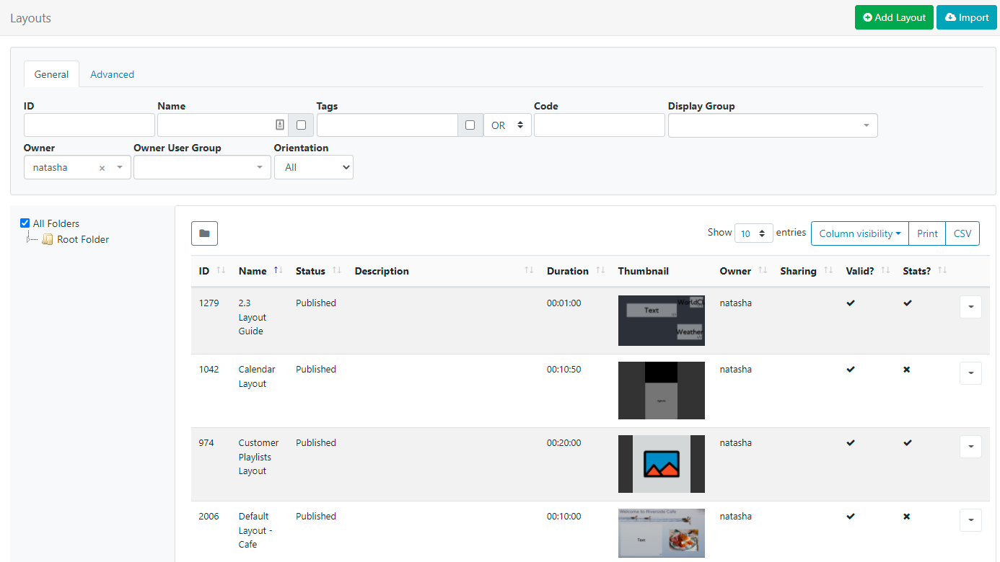

<!--toc=layouts-->

# レイアウト

レイアウトは、コンテンツで構成された画面デザインで、ディスプレイ/複数ディスプレイ/ディスプレイグループにスケジュールされます。**レイアウト**は、コンテンツのプレースホルダーとして機能する1つ以上の**リージョン**で構成され、それぞれが表示する**メディア**の**タイムライン**を含んでいます。メディアは、さまざまなウィジェットを使用してタイムラインに割り当てられます。

{tip}
[モジュール](media_modules.html)のページで、様々なウィジェットを見ることができます。
{/tip}

[[PRODUCTNAME]]には、システムで使用できるレイアウトの数、およびユーザー/ユーザーグループの数に制限はありません。

レイアウトは、メインメニューの **デザイン** の下にある **レイアウト** をクリックすることで管理できます。

{tip}
サムネイルは、公開されたレイアウトに表示されます。以前のバージョンからアップグレードした場合は、サムネイルを更新するために、既存のレイアウトをチェックアウトして公開する必要があります。
{/tip}

 デフォルトでは**フォルダ**ツリーが開きます。

- フォルダ/サブフォルダをクリックすると、その内容が検索され、グリッドに適用された任意のフィルタに基づいて結果が返されます。

または

- **全フォルダー** にチェックを入れると、ルートフォルダでの検索を含み、グリッドに適用されたフィルターに基づいた結果を返します。

{tip}
フォルダのアイコンをクリックすると、表示/非表示を切り替えることができます。 フォルダーを非表示にすると、選択したフォルダーのファイルパスが表示されます
{/tip}

レイアウト[グリッド](tour_grid.html)では、新規作成と既存の編集が可能です。

## レイアウトを追加

{tip}

**いつ新しいレイアウトを作成すべきですか？ユーザーはいつ既存のレイアウトに追加すべきですか？
レイアウトはシステムに大きな柔軟性を与えますが、混乱を招く可能性もあります。レイアウトの推奨される使用法は、同時にスケジュールされるべき一連の関連コンテンツに必要なデザインとメディアのみを含むことです。

**シナリオ**。
火災予防のデモンストレーションのビデオと、近々公開される作品の広告のビデオを別々にレイアウトするのが自然でしょう。

{/tip}

グリッド上部の **レイアウトを追加** ボタンをクリックします。

 

利用可能なオプションから使用するテンプレートを選択します。

- あらかじめ用意されたデフォルトのテンプレートから選択する
- 空白に自分のリージョンを追加する
- 自分で公開した[テンプレート](layouts_templates.html)から選択する
- Select one of our templates from the Xibo Exchange

{noncloud}
CMSの管理セクションに移動し、**アプリケーション**をクリックして、ページを**コネクター**セクションまでスクロールすることにより、Xibo Exchangeからのテンプレートを有効にすることができます。**設定**をクリックし、有効化にチェックを入れ、**保存**で変更します。
{/noncloud}

- 選択したら、フォームの一番下にある **次へ** ボタンをクリックしてください。

- CMS内で簡単に識別できるように、**名前**を記入してください。
- レイアウトは、オプションで**フォルダ**に保存することができます。

{tip}
フォルダに保存されたレイアウトは、ユーザー/ユーザー グループ アクセスのために保存先フォルダに適用された表示、編集、削除 **共有** オプションを引き継ぎます。
ユーザーがレイアウトのコンテンツにアクセスする必要がある場合、これも同じフォルダーに保存されていることを確認します。
{/tip}

- **フォルダを選択**ボタンをクリックして展開し、保存するフォルダを選択します。
- フォルダを右クリックすることで、その他のオプションにアクセスすることができます。
- 選択したフォルダのファイルパスが、フォームの「フォルダ」フィールドの横に表示されます。

{tip}
ユーザー/ユーザーグループのオプションは、有効な[機能と共有](users_features_and_sharing.html)オプションに基づきます!
{/tip}

{white}
フォルダアクセスとセットアップに関する詳細については、管理者にご相談ください。
{/white}

- このレイアウトで使用する解像度を選択します。

レイアウトは対象となるディスプレイの解像度に合わせて設計されており、同じ解像度を持つ **プレイヤー** で表示されたときに最適に機能します。異なる解像度のディスプレイに表示された場合、動的にサイズが変更され、未使用のスクリーンスペースが発生する可能性があります。

{tip}
4:3 の解像度でデザインされたレイアウトを 16:9 のテレビ画面に接続してプレーヤーに送信すると、コンテンツの両脇に 2 本の空白のバーが表示されます。
{/tip}

**もし、リストにある利用可能なオプションに代わる解決策が必要な場合は、管理者に連絡してください。**

- レイアウトの本格的なユーザーに詳細/解説を提供するために、オプションの「説明」が表示されます。
- オプションのタグを利用すると、項目が整理され検索しやすくなります。

{tip}

フォームのタグフィールドにテキストを入力すると、オートコンプリートヘルパーが一致する候補を表示し、ユーザーが簡単に選択できるようにします。

定義済みの値は、**タグ値**のドロップダウンを使用して表示されます。値が既に知られている場合は、次のフォーマットを使用してフィールドに直接入力することができます。'色|赤`と入力します。
管理者によって値が「必須」に設定されている場合、フォームを保存するために値を入力する必要があります。

{/tip}

ユーザーは、**タグ値**フィールドを使用して、あらかじめ定義された値を持たないタグに関連する値を追加することができます。タグの値が不要な場合は、このフィールドを空白にすることができます。管理者によって値が「必須」に設定されている場合、フォームを保存するために値を入力する必要があります。

{tip}
レイアウトグリッドの下部にある [個別選択](tour_grids.html#複数選択-個別選択による) オプションを使用して、複数のレイアウトにタグを割り当てることも可能です。
{/tip}

使用する**タグ**と**タグ値**の詳細については、管理者にご相談ください。

その他のオプションは、**設定** タブで確認できます。

- [インタラクティブアクション](layouts_interactive_actions.html)で使用する際に、このレイアウトを識別するための **識別コード** として使用する文字列を入力してください。

- 新しく追加された**レイアウト**の**実行履歴レポート**の統計情報の収集を有効/無効にするためにボックスにチェックにチェックを入れる/入れない。

  {tip}
  [ディスプレイプロファイル設定](display_settings.html)で、このレイアウトをスケジュールする**ディスプレイ**の**統計情報収集を有効にする**チェックボックスが有効になっていることを確認してください。
  {/tip}

- このボックスをオンにすると、レイアウト上のすべてのウィジェットにデフォルトの **トランジション** 設定が適用されます。チェックを外すと、レイアウト上のすべてのウィジェットのデフォルト設定が無効になります。

{tip}
トランジションは、v2R252以上のAndroid、webOS、Tizen PlayerおよびWindows Playerでサポートされています。
現在、Linux Playerではトランジションはサポートされていません。
{/tip}

{tip}
レイアウトデザイナー上のコンテキストメニューから、ウィジェットやリージョンにトランジションを適用できます。
{/tip}

- レイアウトの追加フォームを**保存**すると、自動的に[レイアウトデザイナー](layouts_designer.html)が表示されます。

## 行メニュー

各レイアウトには、グリッドの **行メニュー** を使用してアクセスできる追加のアクション/ショートカットがあります。

{tip}
**公開済み**レイアウトの行メニューから、以下のオプションが利用できます。
{/tip}

### デザイン

**デザイン**を選択すると、レイアウトの内容やデザインを編集するための[レイアウトデザイナーLayout Designer](layouts_designer.html)が表示されます。

{tip}
2 人のユーザーが同じレイアウトを同時に編集することを防ぐため、編集中のユーザーに対してレイアウトがロックされます。
{/tip} 

レイアウトが公開ステータスの場合、レイアウト デザイナーは **読み取り専用モード** で開きます。編集を可能にするには、レイアウトを「チェックアウト」する必要があります。
If your Layout has a Published status, the Layout Designer will open in a **Read Only Mode**. You will need to 'Checkout' the Layout to enable editing.

### チェックアウト

行メニューからチェックアウトを選択すると、レイアウトは **ドラフト** モードになり、その後で編集をすることができます。一度編集したレイアウトは、**公開済み**することで変更を確定し、既存のレイアウトを上書きすることができます。 **破棄**を行うと、レイアウトは元のパブリッシュされた状態に戻ります。

{tip}
ユーザーは「自動送信」チェックボックスを選択することで、**チェックアウト**が選択されるたびにこのフォームが自動的に送信されるようにすることができます。詳細は、[グリッド](tour_grids.html) ページを参照してください。
{/tip}

{tip}
**チェックアウト**を使用すると、公開されたバージョンに変更が加えられることはなく、あなたがそれを選択するまで予定されている**ディスプレイ**にも表示されないので、編集が必要な場合は時間をかけて編集してください。**公開**は、変更が行われたことを確認し、公開されたバージョンを上書きします。**破棄]を選択すると、下書きが削除され、公開されたバージョンはそのまま残ります。
{/tip}

### レイアウトをプレビュー

公開された**レイアウト**は、最初から最後まで再生され、どのように再生されるかを確認することができます。レイアウトデザインが意図したとおりに再生されるように重要な調整を行った上で、ディスプレイへスケジューリングしてください。

{tip}
レイアウトを開始する前に、すべての**メディア**をブラウザにダウンロードし、確認する必要があるため、この処理中に若干の遅延が発生することがあります。
{/tip}

### 今すぐスケジュール

重要なお知らせやプロモーションを行う際に、時間を節約するために、**レイアウト**を指定したスケジュールで表示することができます。

{tip}
レイアウトは、スケジュールを組む前に、**公開済み**のステータスにする必要があります。
{/tip}

### キャンペーンへの割り当て

選択したレイアウトを既存の[キャンペーン](layouts_campaigns.html)に追加する場合はクリックします。

### リストへジャンプ

選択したレイアウトに関連するプレイリスト、キャンペーン、メディアへ「ジャンプ」する場合に選択します。

### 編集

フォルダーの位置、名前、タグなど、レイアウトレコードを変更します。

### フォルダーを選択

レイアウトを選択したフォルダに移動します。

### コピー

デザインされたレイアウトのコピーを作成し、簡単に修正することができます。新しいレイアウトを作成するためのベースとして使用するために、含まれているすべての**メディア**アイテムを含めることを選択し、時間を節約することができます。

{tip}
レイアウトをコピーすると、レイアウトが最後に公開されたときの正確なコピーが作成されます。変更を保持するために、コピーを作成する前にレイアウトを公開したことを確認してください。
{/tip}

### 稼働停止

レイアウトを稼働停止して、既存の**スケジュール**に影響を与えないようにします。稼働停止したレイアウトは、新しいスケジュール・オプションから隠されますが、既存のスケジュールには影響を与えず、ディスプレイにも表示され続けます。

### 削除

レイアウトとそれに関連するすべてのメディアを既存のすべてのスケジュールから完全に削除します。**注意**このアクションは元に戻せません。

### 統計収集を有効にする

実行履歴情報の収集を有効にします。

### エクスポート

関連するすべてのウィジェット/メディア/データセット構造を含むレイアウトを ZIP ファイルにエクスポートし、簡単に共有できるようにします。

{tip}
レイアウトをエクスポートすると、割り当てられたすべての **レイアウト**、 **プレイリスト** および **メディアタグ** がエクスポートされます。レイアウトのインポート時にこれらのタグを追加するには、**インポートタグ** オプションを選択します。
{/tip}

{tip}
レイアウトとそのコンテンツに設定された共有オプションに関係なく、ユーザー/ユーザーグループのエクスポートを可能にする「エクスポート」[機能](users_features_and_sharing.html)を追加しました!
{/tip}

### 共有

選択したユーザー/ユーザーグループに対して[共有](users_features_and_sharing.html)オプションを有効にします。

## ドラフト状態

**ドラフト**状態のレイアウトを選択すると、以下の行メニューオプションが追加で表示されます。

{tip}
管理者は、CMSの**設定**ページのデフォルト設定を使用して、最後の編集から30分後に自動的にドラフトレイアウトを**公開**することができます。
{/tip}

### 公開

**今すぐ公開**を選択するか、日時を選択してレイアウトの公開期日を設定します。

### 廃棄

クリックすると、変更内容が無視され、以前のパブリッシュされたレイアウトに戻されます。

## ドラフトレイアウトのプレビュー

現在の **ドラフト** 状態のレイアウトのプレビューを再生します。必要な調整を行った後、公開して変更をコミットしてください。

{tip}
**レイアウト** と **ライブラリーファイル** を **ディスプレイ** または **ディスプレイグループ** に直接[アサイン](displays_fileassociations.html)して、プレーヤーのローカルライブラリで常に利用可能にできることをご存知ですか？レイアウトを事前にロードし、スケジュールするのに便利です。
{/tip}

