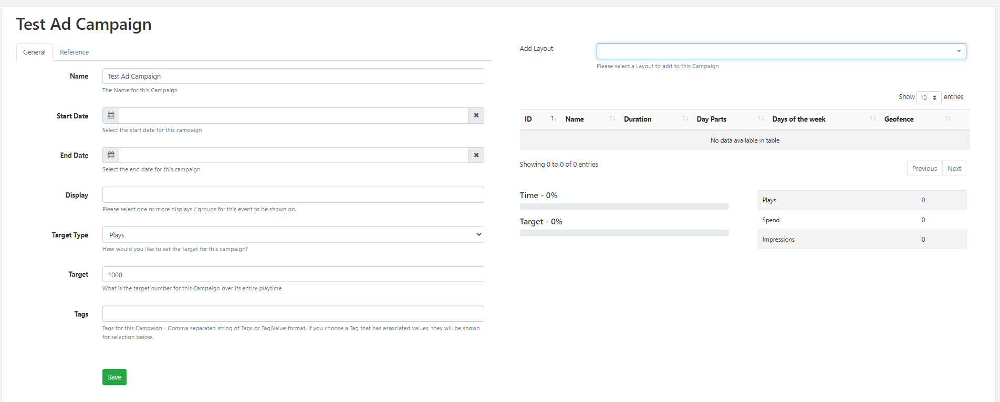

# Ad Campaigns

Create Advertising Campaigns where  [[PRODUCTNAME]] will work out how many plays are needed to satisfy entered criteria and handle the scheduling automatically for you.

{tip}
Enable the **Access to Ad Campaigns** [Feature](users_features_and_sharing.html#content-features) for each User/User Group who should have full access to this feature!
{/tip}

## Create an Ad Campaign

Click on **Campaigns** under the **Design** section of the main CMS menu:

- Click the **Add Campaign** button at the top of the grid.

- Select **Ad Campaign** from the drop down menu and complete the form fields:

[Folders](tour_folders.html) are used to organise, search and easily [Share](users_features_and_sharing.html#content-share) User objects with other Users/User Groups. Ad Campaigns saved to a Folder will inherit the access options applied to that Folder. 

{tip}
If users should also have access to the Layouts/Layout content, ensure that this is also saved to the same Folder!
{/tip}

- Give your Ad Campaign a **Name** for easy identification in the CMS including optional [Tags](tour_tags.html).

{tip}
Tags and Folders can also be assigned to multiple Campaigns using the [With Selected](tour_cms_navigation.html#content-Multi---select--with-selected) option at the bottom of the Campaign grid!
{/tip}

- Use the drop down to set the **Target Type** for this Ad Campaign as **Plays**, **Budget** or **Impressions**.
- Include the total **Target** number for this Ad Campaign in relation to its selected Target Type.

- Click to **Save**.

Next, criteria needs to be set to allow [[PRODUCTNAME]] to work out the play frequency.

- From the grid, use the row menu for the **Ad Campaign** and select **Edit**:

- Provide **Start** and **End** Dates and Times for the Ad Campaign. (This is required information and **cannot** be left blank)
- Select from available **Displays** and **Display Groups** to play this Ad Campaign on. (This is required information and **cannot** be left blank)

{tip}
Ensure that [Displays](displays.html) have had **Display Details** correctly entered for the selected Displays which play this Ad Campaign, ensuring that **Cost per play** and **Impressions per play** fields have been completed!
{/tip}

- Click to **Save**.

{tip}
**Proof of Play** needs to be set to **ON** for all Displays/Display Groups selected here, to ensure accurate reporting and plays!
{/tip}

- Assign a Layout using the **Add Layout** drop down menu.

Once a Layout is selected further scheduling options are available:

- Select which **Days of the Week** this Layout should be active in this Ad Campaign.

- Choose from existing [Dayparts](scheduling_dayparting.html) if this Layout is only to be shown at selected predefined times.

{tip}
Ad Campaigns can include multiple instances of the same Layout with different Dayparts assigned if required.

For example, If you needed to show the same Layout for a defined 'Morning' daypart as well as a defined 'Evening' daypart add the Layout twice and define the required dayparts individually for each!
{/tip}

- Draw areas on the map to provide **geo fenced** based plays for any mobile displays, with content to be shown on entering a defined area.

{tip}
You can have multiple areas defined on the same map!
{/tip}

- Click to **Save**.

The Layout will be added to the Campaign which can be edited/deleted if required using the row menu:

Continue to build your Ad Campaign by selecting Layouts and defining scheduling options.

{tip}
**Proof of Play** needs to be set to **ON** for all Layouts added to the Ad Campaign to ensure accurate reporting and plays!
{/tip}

[[PRODUCTNAME]] will schedule automatically to fulfil the required play criteria to meet entered Targets. 

Ad Campaigns can be viewed on the [Schedule](scheduling_management.html#content-calendar-view) as locked entries which cannot be edited from the scheduler itself. 

[Agenda](scheduling_management.html#content-agenda) can be used to see a more detailed play view of the Ad Campaign and preview included Layouts.

The Ad Campaign progress will be shown in the Campaigns grid and on opening the Ad Campaign, providing that Proof of Play has been set to ON for all Displays and Layouts selected for the Campaign. As well as Cost per play and Impressions per play fields are completed for all selected Displays.

{version}
**NOTE**: If the above information is omitted the reporting cannot update to reflect Plays, Spend, Impressions and Target which will all show a 0 value. The Ad Campaign itself will also try and catch up to increase the Target which will result in Layouts being played more and more frequently until its the only content shown in order to fulfil the target.
{/version}

{tip}
The Reference tab can be used to provide reference information for the selected Campaign. Once added, this information can be viewed in the Campaign grid and via the API.
{/tip}

