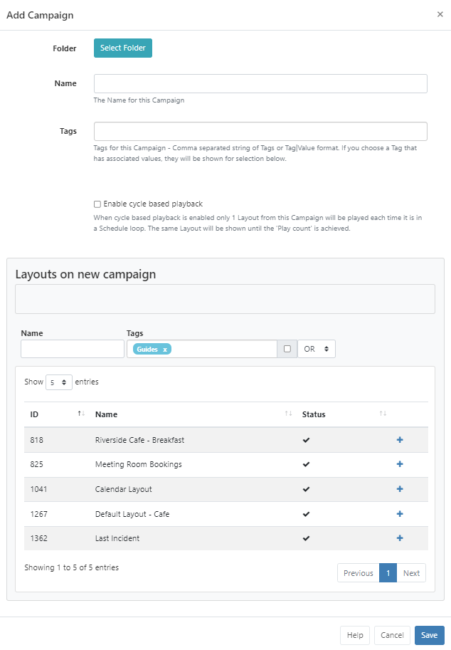

<!--toc=layouts-->

# キャンペーン

レイアウトは、順序付けられたリストにグループ化され、キャンペーンを作成することができます。キャンペーンは、グループ化されたレイアウトを一定の順序で再生するように **スケジュール** することができます。

**キャンペーン**は、CMSメニューの**デザイン**セクションから管理します。

{tip}
[レイアウト](layouts.html)ページで、キャンペーンにグループ化できるレイアウトを追加・作成する方法をご覧ください!
{/tip}

## キャンペーンの作成

グリッドの上部にある **キャンペーンを追加** ボタンをクリックし、該当するフォームフィールドに入力します。

### フォルダー

キャンペーンは、オプションで**フォルダ**に保存することができます。

- **フォルダを選択**ボタンをクリックして展開し、保存するフォルダを選択します。
- フォルダを右クリックすることで、その他のオプションにアクセスすることができます。
- 選択したフォルダのファイルパスが、フォームのフォルダフィールドの横に表示されます

{tip}
フォルダに保存されたキャンペーンは、ユーザー/ユーザーグループのアクセスのために保存先フォルダに適用された表示、編集、削除の**共有**オプションを継承します。

ユーザーがレイアウト/レイアウトコンテンツにもアクセスできるようにする場合、これも同じフォルダーに保存されていることを確認してください。
{/tip}

{tip}
ユーザー/ユーザーグループのオプションは、有効な[機能と共有](users_features_and_sharing.html)オプションに基づきます!
{/tip}

{white}
フォルダアクセスとセットアップに関する詳細については、管理者にご相談ください。
{/white}

- CMS内で簡単に識別できるように、**名前**を記入してください。

- オプションのタグを含めると整理され、検索しやすくなります。

{tip}

フォーム上のタグフィールドにテキストを入力すると、オートコンプリートヘルパーが一致する候補を表示し、ユーザーが簡単に選択できるようにします。

定義済みの値は、**タグ値**のドロップダウンを使用して表示されます。値が既に知られている場合は、次のフォーマットを使用してフィールドに直接入力することができます。'色|赤`と入力します。
管理者によって値が「必須」に設定されている場合、フォームを保存するために値を入力する必要があります。

{/tip}

ユーザーは、**タグ値** フィールドを使用して、定義済みの値をまだ持っていないタグに関連する値を追加することができます。タグの値が必要ない場合は、このフィールドを空白にすることができます

{tip}
タグは、キャンペーングリッドの下部にある[個別選択](tour_grids.html#複数選択-個別選択による)オプションを使用して、複数のキャンペーンに割り当てることもできます。
{/tip}

使用する**タグ**と**タグ値**の詳細については、管理者にご相談ください。

- このキャンペーンで**繰り返し再生**をチェックすると有効になります。
- キャンペーンで次のレイアウトに移る前に、レイアウトの「再生回数」を決定するための**再生回数**を設定します。

サイクルプレイバックを有効にしてキャンペーンをスケジュールすると、スケジュールされたイベントが表示されるたびに、キャンペーンから設定された回数だけ1つのレイアウトが表示されます。

## キャンペーンにレイアウトを割り当てる

- レイアウトの割り当ては、プラスアイコンで行います。押すと、ステージング・エリアにレイアウトが表示されます。

- ステージングエリア内のレイアウトの横にあるマイナスアイコンをクリックすると、レイアウトを削除することができます。
- ステージングエリア内のレイアウトをドラッグ＆ドロップで並び替え、設定した順番で再生できるようにします。
- **保存**をクリックすると、変更が保持されます。

{tip}
行メニューにある**コピー**ボタンを使って、既存のキャンペーンのコピーを簡単に作成できます。また、選択したユーザー/ユーザーグループに対して[共有](users_features_and_sharing.html)オプションを有効にします。
{/tip}

{tip}
レイアウトは、[レイアウト] グリッドから直接キャンペーンに割り当てることができます。追加するレイアウトの行メニューを使用し、**キャンペーン割り当て**をクリックします。レイアウトは、デフォルトで選択されたキャンペーンの最後に割り当てられます。

{/tip}

{tip}
[イベントをスケジュール](scheduling_events.html)で**表示順**を使用すると、ディスプレイ上でキャンペーンを再生する方法をさらに制御できることができます。
{/tip}
