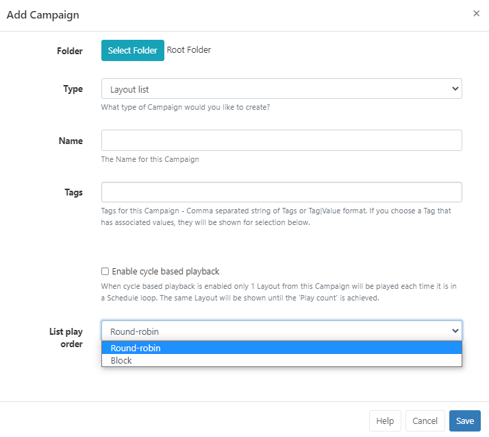

# キャンペーン

[[PRODUCTNAME]] には 2 つの **キャンペーン** タイプがあります:

- [レイアウト リスト](layouts_campaigns.html#content-create-a-layout-list) - 順序付きリスト内のレイアウトのコレクション。
- [広告キャンペーン](layouts_ad_campaigns.html) - 広告キャンペーンを作成できます ([機能](users_features_and_sharing.html#content-features) が有効)。

## レイアウト リストを作成する

**レイアウト リスト キャンペーン** を使用すると、ユーザーは、定義された順序でレイアウトのグループの再生を設定できます。

{nonwhite}{video}rMuYujq_LV8{/video}{nonwhite}

{tip}
レイアウトをプレゼンテーション デッキの 1 つのスライドと考えると、キャンペーンはプレゼンテーション全体です。

{/tip}

メイン CMS メニューの [**デザイン**] セクションの [**キャンペーン**] をクリックします。

- グリッドの上部にある [**キャンペーンの追加**] ボタンをクリックします。

- ドロップダウンから**レイアウト リスト**を選択し、フォーム フィールドに入力します:

[フォルダー](tour_folders.html)は、ユーザー オブジェクトを整理、検索し、他のユーザー/ユーザー グループと簡単に[共有](users_features_and_sharing.html#content-share)するために使用されます。フォルダーに保存されたキャンペーンは、そのフォルダーに適用されたアクセス オプションを継承します。

{tip}
ユーザーがレイアウト/レイアウト コンテンツにもアクセスできるようにする場合は、これも同じフォルダーに保存してください。

{/tip}

- CMS で簡単に識別できるように、キャンペーンに**名前**を付けます。オプションの[タグ](tour_tags.html)も含めます。

{tip}
タグとフォルダは、キャンペーン グリッドの下部にある [選択済み](tour_cms_navigation.html#content-multi-select---with-selected) オプションを使用して、複数のキャンペーンに割り当てることもできます。

tip}

### サイクル ベースの再生

**サイクル ベースの再生** を有効にして **キャンペーン** をスケジュールすると、設定された再生回数に対して 1 つのレイアウトが表示されます。再生回数が達成されるまで、スケジュール ループごとに同じレイアウトが表示されます。

{feat}キャンペーン サイクル再生|v4{/feat}

有効にしたら、**再生回数** を指定して、キャンペーン内の次のレイアウトに移動する前にレイアウトを何回「再生」するかを決定します。

### リスト再生順序

サイクル ベース再生が有効になっていないキャンペーンの場合、**リスト再生順序** オプションを使用して、同じ表示順序の別のキャンペーンと同時にスケジュールされたときに、キャンペーンに割り当てられたレイアウトがどのように再生されるかを指定できます。

**ラウンド ロビン** - 各キャンペーンのレイアウトが交互に再生されます。

**ブロック** - レイアウトは、キャンペーンから完全に再生されてから、次のキャンペーンに移動します。

## キャンペーンにレイアウトを追加する

**保存** すると、フォームが再度開き、追加のタブが表示されます。

**レイアウト** タブを使用して、追加するレイアウトを選択します。

- `+` アイコンを使用して、追加する **レイアウト** を選択します。

- 選択したレイアウトは、フォームの上部にある「ステージング領域」に追加されます。
- レイアウトはここからドラッグ アンド ドロップで **並べ替え** できます。
- レイアウトを削除するには、`-` アイコンをクリックします。
- 変更を保存するには、**保存** をクリックします。

{tip}
[参照] タブを使用すると、選択したキャンペーンの参照情報を提供できます。追加すると、この情報はキャンペーン グリッドと API 経由で表示できます。

{/tip}

キャンペーン グリッドの行メニューを使用すると、キャンペーンのコピーを簡単に作成できるほか、選択したユーザー/ユーザー グループの [共有](users_features_and_sharing.html#content-share) オプションを有効にできます。

{tip}
レイアウトは、[レイアウト](layouts.html#content-layout-grid) グリッドからキャンペーンに直接割り当てることができます。レイアウトの行メニューを使用して追加し、[**キャンペーンに割り当て**] をクリックします。レイアウトは、デフォルトで選択したキャンペーンの最後に割り当てられます。

{/tip}

