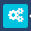
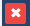
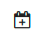
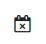
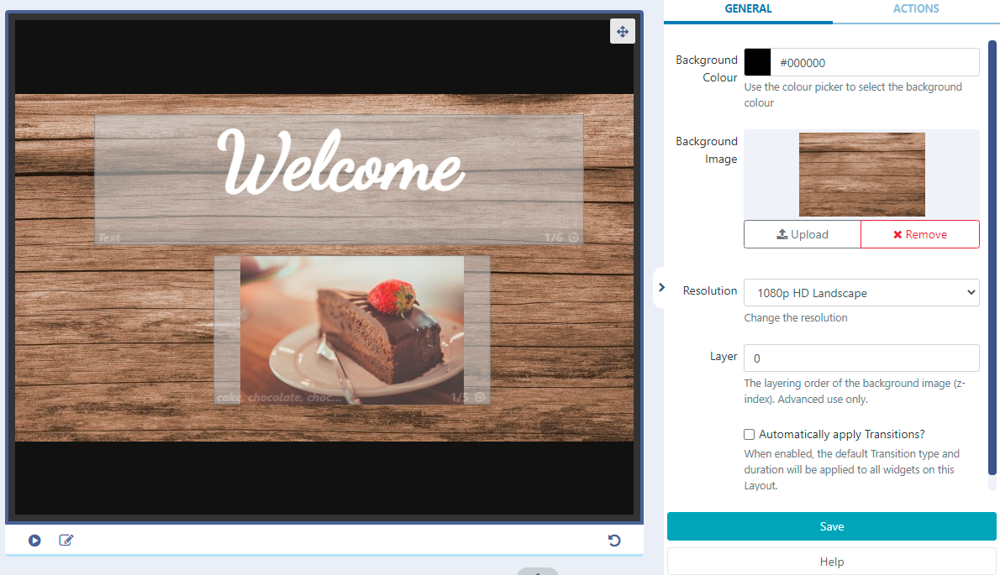

<!--toc=layouts-->

# レイアウトデザイナー

## 概要

レイアウト・デザイナーは[[PRODUCTNAME]]における **コンテンツ作成** の中核をなすものです。新しいレイアウトを追加したり、既存のレイアウトのデザインを変更したりするたびに、レイアウト・デザイナーが使用されます。

新規にレイアウトを追加するか、レイアウトの行メニューから［デザイン］をクリックすると、**レイアウトデザイナー** が開きます。

 

## ステータスバー

左側のアイコンは、選択したレイアウトの現在の「再生」ステータスを表示します。

 - このレイアウトはまだ構築されていません。

 - このレイアウトは有効で、1度公開された時点でスケジュールすることができます。

 - このレイアウトは無効であり、スケジューリングで公開されません。

 - プレイヤー側でしか評価できないメディアを収録したレイアウトで、一度公開するとスケジュールすることができます。

{tip}
最後のアイコンは、レイアウトにウェブページなどのオンライン・コンテンツが含まれる場合に表示される、通常のレイアウト・ステータスです。このコンテンツは、CMS から直接送信されるのではなく（ファイル ベースのメディア、画像、ビデオなど）、プレーヤー側にキャッシュ（保存）されるため、CMS は、プレーヤーがこのコンテンツを表示すると言うことはできません。 プレーヤーは、そのようなコンテンツを正常に表示するために、信頼できるインターネット接続を持っている必要があります。
{/tip}

{tip}
アイコンにカーソルを合わせると、現在ご覧になっている状態についての詳細な情報が表示されます
{/tip}

アイコンの横には、選択したレイアウトの合計**時間**が秒単位で表示され、**メディア**アイテムが追加されたり、既存の**時間**が編集されたりするたびに更新されます。

{tip}
レイアウト全体の期間は、レイアウト上で最も長く稼働している[リージョン](layouts_regions.html) に基づいて算出されています!
{/tip}

{tip}
レイアウトに追加されたインタラクティブアクションは、ステータスバーに表示されます。

{/tip}

**レイアウトセレクター**は、ログインしているユーザーが編集権限を持つすべてのレイアウト間を、レイアウトデザイナーページを離れることなく簡単に移動することができます。検索条件を入力し、ドロップダウンメニューを使用して、現在表示/編集しているレイアウトを変更します。

{tip}
チェックボックスを使用して、自分のレイアウトにのみアクセスできます。
{/tip}

ステータスバーの右側にある**メニュー**は、レイアウトのオプションのリストです。

**ドラフト**ステータスのレイアウトには、以下のメニューがあります。

- デザインに満足したら、レイアウトを**公開**に設定し、スケジュールの準備をします。

レイアウトは、すぐに**公開**するように設定でき、スケジュール内のレイアウトには自動的に更新がプッシュされます。**公開日**を選択すると、指定した日時にレイアウトを公開することもできます。

{tip}
また、選択したレイアウトの**行メニュー**を使用して、**公開**を即時または設定した日付に設定することができます。
{/tip}

- このレイアウトの変更を破棄し、以前の公開済みバージョンに戻してもよろしいですか？

- 他のユーザーが同じレイアウトを編集しようとしている場合、**レイアウトのロック解除**が表示されます。

  既に編集中のレイアウトをユーザーが編集しようとすると、そのレイアウトは編集できないようにロックされます。ロックは一定時間（ロックメッセージに表示されます）、またはこのメニューから解除されるまで継続されます。

  {tip}
  **ロックを解除** ボタンを選択すると、レイアウトグリッドにリダイレクトされます。
  {/tip}

**公開済み**レイアウトには、以下のメニューがあります。

- **チェックアウト**を行うと、公開されたレイアウトは下書きの状態になり、編集が可能になります。

- **削除**で完全に削除されます。

- レイアウトデザイナーを離れることなく、公開されたレイアウトを1つまたは複数のディスプレイに**スケジュール**することができます。

- 作成したデザインを[テンプレート](layouts_templates.html)として、次なるレイアウトを作成することで、時間短縮でき、企業イメージ/スタンダードを維持することができます。

## ビューアー

ビューアーはレイアウトのデザインに合わせて更新され、ユーザーは追加された内容を明確に把握し、必要な編集を行うことができます。

ビューアーの下にある**レイアウトを編集**アイコンを使って、レイアウトに[リージョン](layouts_regions.html)を編集または追加するエディターを開きます。

{tip}
レイアウトは少なくとも1つのリージョンを含んでいなければならず、**更に**各リージョンは少なくとも**1つ**のメディアアイテムを含んでいなければなりません。
{/tip}

エディタを終了し、ビューアの左上にあるバック矢印を使ってレイアウトビューに戻ります。

## コンテキストメニュー

すべてのウィジェット/ライブラリメディアおよびリージョンには、適用可能なオプションが含まれた**コンテキストメニュー**があります。このメニューは、選択したウィジェットやリージョンのビューアの下、または選択したウィジェットやリージョンを右クリックすることで表示されます。

- [共有](users_features_and_sharing.html)オプションで、ユーザー/ユーザーグループの表示、編集、削除を制御します。
- ウィジェットに添付する**オーディオ**ファイルをライブラリから選択します。

{tip}
音量とループパラメータを入力することで、そウェジェットの間、音声をループさせるか、一度だけ再生するかを決定することができます。親ウィジェットの再生が終了すると、音声は停止されます。
{/tip}

ウィジェットにオーディオファイルが添付されると、**タイムライン**にスピーカーアイコンが表示され、クリックして再度開いて編集することができます。

{tip}
音声が領域内の唯一のウィジェットに割り当てられた場合、ウィジェットの持続時間が終了すると音声は停止しますが、ウィジェットはレイアウトの残りの時間が終了するまで画面に表示されたままです。
{/tip}

- ウィジェットの**開始時間**と終了時間**を入力します。

{tip}
**注意** 有効期限は、現在Linuxプレイヤーではサポートされていません。
{/tip}

有効期限が設定されているウィジェットは、**タイムライン**に表示される以下のアイコンによって識別することができます。

- 開始日が将来の日付/時間に設定されている。

- 有効期限が設定されています。

- ウィジェットは、有効期限に達すると削除されるように設定されています。

- ウィジェットの有効期限が切れても、レイアウト上に残っている場合

  {tip}
  終了日を過ぎると、ウィジェットはリージョンから削除されます。期限切れのウィジェットで、**期限切れで削除**に設定されていないものは、レイアウトデザイナーに表示されたままなので、必要に応じて**開始**と**終了**の時間を再調整することができます。
  {/tip}

アイコンをクリックすると、再度開いて編集することができます。

ウェジェット の有効期限切れによりリージョンが空になった場合、レイアウトは無効と判定され、プレイヤーに送信されないことに注意してください。また、ダウンロード時に有効なレイアウトがあったにもかかわらず、プレイヤーがオフラインになった場合、レイアウトは空の領域で表示されることに注意してください。

- ウィジェットの再生開始時の**フェード/フライ イントランジション**を選択します。

- **フェード/フライ アウトのトランジション**を選択すると、タイムライン上の次のウィジェットに移動します。

  続くウィジェットがない場合やレイアウトが削除中の場合は、[リージョンオプション](layouts_regions.html#リージョンオプション)で設定した **終了トランジション** が適用されます。

{tip}
トランジションは、v2 R252からAndroid/webOS、Tizenプレイヤー、Windowプレイヤーに対応しました。現在、Linuxプレイヤーではサポートされていません。
{/tip}

管理者は、**設定**ページの**デフォルト**タブで、デフォルトのトランジションタイプと期間を入力し、すべてのウィジェットに適用させることができます。

適用されたデフォルトは、プロパティパネルのボックスをオフにすることで、レイアウトにオーバーライドすることができます。

{tip}
デフォルトでウィジェットにトランジションが適用された場合、プロパティパネルは空白になります。 手動で入力したトランジションのみがフォームに表示されます。
{/tip}

ビューアーの下部にある**プレイ**ボタンをクリックすると、レイアウトの**プレビュー**を再生することができます。

{tip}
プレビューをフルスクリーンで見るには、このウィンドウの右上にあるアイコンをクリックしてフルスクリーンに切り替え、「再生」を押してください。
{/tip}

リージョンに割り当てられたすべてのコンテンツも表示することができます。矢印を使用して、割り当てられたすべてのウィジェットを順次循環表示させることができます。

{tip}
動画ファイルは、フルスクリーンのレイアウトプレビューでのみ再生されます。
{/tip}

## ツールバー

左側のツールバーからアクセスできる「ウィジェット」（layouts_widgets.html）と「ライブラリメディア」（layouts_library_search.html）を使って、レイアウトにコンテンツを追加することができます。

## プロパティパネル

**レイアウト**、**リージョン**、割り当てられた**ウィジェット**のすべての要素を、右側にあるプロパティパネルの利用可能なオプションを使用して編集してください。

タブで選択をして、コンテンツに利用可能なオプションのメディアアイテムを設定します。

{tip}
**レイアウト**、*リージョン**、*ウィジェット**には、タッチ、クリック、ウェブフックによってレイアウトを変更するための**アクション**を付けることができます。[対話型アクション](layouts_interactive_actions.html)は、プロパティパネルの**アクション** タブから作成および管理されます。
{/tip}

メインレイアウトビューでプロパティパネルを使用すると、背景色の追加や背景として使用する画像の選択/アップロードなど、レイアウトに適用するその他の設定にアクセスすることができます。

{tip}
ツールバーの「画像ライブラリ検索」機能から画像を選択し、クリックまたはドラッグしてプロパティパネルに移動します。

確実に**保存する**こと

{/tip}

## レイアウトタイムライン 

[レイアウトタイムライン](layouts_timeline.html)は、個々のウィジェットの再生時間を表示し、設定したメディアがレイアウト上でどのように再生されるかの概要を示します。適用されたオプションを示すアイコンが表示され、クリックすると詳細が表示され、編集することができます。

## 対話型ドロワー

タイムラインの右側にあり、[対話型アクション](layouts_interactive_actions.html)を設定する際に使用するウィジェットを追加するためのドロワーです。

-  ドロワーを開いてトグルし、ウィジェットやライブラリファイルをクリックして追加するか、ドラッグ＆ドロップで追加します。

- 追加したら、**対象リージョン**を設定し、プロパティパネルで利用可能なオプションを使用して設定します。

{tip}
ドロワーに追加されたウィジェットを探すには、ドロワーの検索フィールドを使用します。
{/tip}

### 削除/取り消しボタン

デザイン作成時に使用し、変更を元に戻したり、レイアウトから完全に削除することができます。

{tip}
ボタンの上にカーソルを置くと、ボタンを選択したときの詳細が表示されます。
{/tip}

上部の **終了** ボタンをクリックすると レイアウトデザイナーが終了し、レイアウトグリッドに戻ります。

