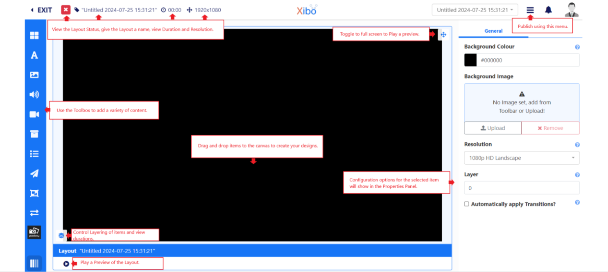
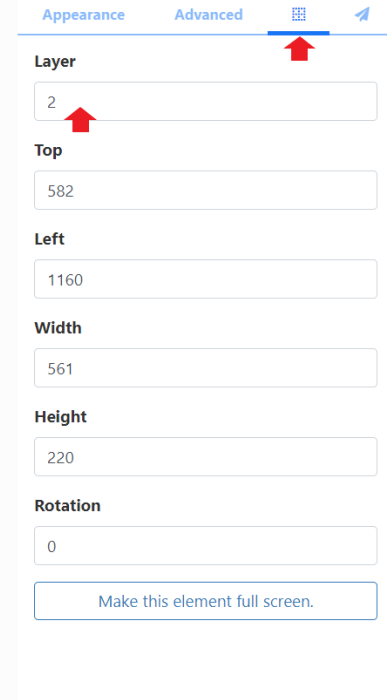
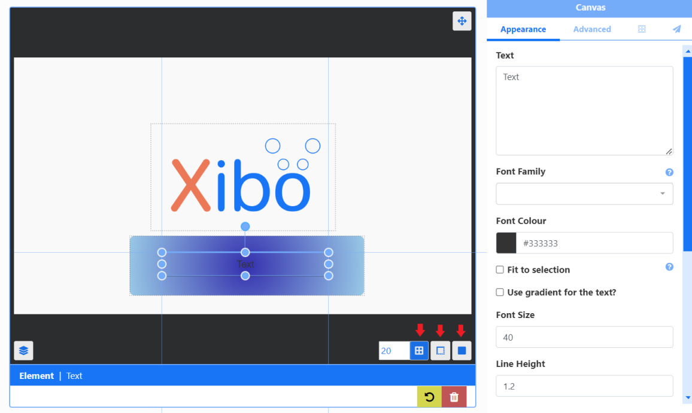
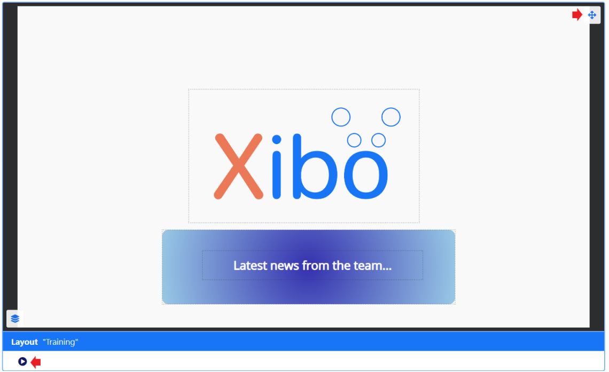

# レイアウト エディタ

レイアウト エディタは、[[PRODUCTNAME]] における **コンテンツ作成** の中心です。新しいレイアウトが追加されるたびに、または既存のレイアウトのデザイン変更が必要になるたびに、レイアウト エディタが使用されます。

{nonwhite}{video}nfb9aCqbcIA{/video}{nonwhite}

**新しいレイアウトを追加**するか、既存のレイアウトの行メニューから**デザイン**をクリックして**レイアウト エディター**を開きます:

新しいレイアウトは「無題」として追加され、名前を付ける必要があります:

- 「**無題のテキスト**」をクリックして**名前**を入力し、必要に応じてフォームのその他のフィールドに入力します。

- [フォルダー](tour_folders.html) は、ユーザー オブジェクト (レイアウト、プレイリスト、メディア ファイルなど) を整理したり、他のユーザー/ユーザー グループと簡単に共有したりするために使用されます。フォルダーに保存されたレイアウトは、そのフォルダーにすでに適用されている共有オプションを継承します。

{tip}
ユーザーがレイアウト コンテンツにアクセスする必要がある場合 (たとえば、レイアウトに追加する必要がある画像ファイル)、これらも同じフォルダーに保存されていることを確認してください。

{/tip}

- オプションの [タグ](tour_tags.html) を含めます。

{tip}
レイアウト グリッドの下部にある [選択あり](tour_cms_navigation.html#content-multi-select---with-selected) オプションを使用して、タグとフォルダーを複数のレイアウトに割り当てることもできます。

{/tip}

- [インタラクティブ アクション](layouts_interactive_actions.html) を使用する場合、文字列をレイアウトの **コード識別子** として使用できます。
- [Proof of Play レポート](displays_metrics.html) の統計の収集をレイアウトに対して有効にできます。

{tip}
レイアウトの Proof of Play の収集を有効にする前に、[ディスプレイ プロファイル設定](displays_settings.html) を使用して、レイアウトがスケジュールされる **ディスプレイ** の [統計収集を有効にする] チェック ボックスが有効になっていることを確認してください。
{/tip}

- 新しいレイアウト レコードを [保存] するにはクリックします。

{tip}
[テンプレート](layouts_templates) をデザインのベースとして使用する場合は、レイアウト エディター内の **ツールバー** から追加できます。
{/tip}

## ステータス バー

エディターの左上では、レイアウトの現在の「再生」ステータスを確認できるほか、レイアウト レコードを編集したり、レイアウトの全体的な再生時間を表示したりできます。

ここに表示されるアイコンは、レイアウトの現在のステータスを表します。

- **青い歯車** - レイアウトはまだ構築されていません。

- **緑のチェック マーク** - レイアウトは有効で、公開およびスケジュールできます。

- **赤い十字** - レイアウトは無効で、スケジュール用に公開しないでください。

- **オレンジ色の感嘆符** - レイアウトには、プレーヤー側でのみ評価でき、公開およびスケジュールできるメディアが含まれています。

{tip}

アイコンの上にマウスを置くと、現在のステータスの詳細が表示されます。

オレンジ色の感嘆符は、レイアウトに Web ページなどのオンライン コンテンツが含まれている場合の通常のレイアウト ステータスです。この種類のコンテンツは CMS から直接送信されず、プレーヤー側にキャッシュ (保存) されるため、CMS はプレーヤーがコンテンツを表示するかどうかを判断できません。このようなコンテンツを正常に表示するには、プレーヤーに信頼性の高いインターネット接続が必要です。

{/tip}

レイアウトの現在の **名前** は、ステータス アイコンの横に表示されます。これをクリックすると、名前、フォルダーの場所、タグなどを編集できます。

レイアウトの合計 **期間** は、レイアウトで最も長く実行されているアイテムに基づいて、分と秒で表示されます。

{tip}
各アイテムにはデフォルトの期間があり、**プロパティ パネル** の [詳細] タブを選択すると、これを上書きできます。

{/tip}

レイアウトのサイズは、レイアウト構成の **プロパティ パネル** で選択した **解像度** によって設定されます。

右上のレイアウト ジャンプ リストを使用すると、すべてのレイアウト間を簡単に移動できます。ログインしたユーザーは、レイアウト エディターを離れて切り替えることなく、編集にアクセスできます。

レイアウト ジャンプ リストの横には、レイアウトが [公開済み](layouts.html#content-layouts-in-a-published-status) か [下書き](layouts.html#content-layouts-in-a-draft-status) かに応じて、使用可能なアクションを表示する項目のメニューがあります。

## プロパティ パネル

**プロパティ パネル** は、レイアウトに追加されるすべての項目とレイアウト自体を構成するために使用されます。

{tip}
構成オプションと使用可能なタブは、追加された項目によって異なります。
{/tip}

コンテンツのない新しいレイアウトを追加すると、プロパティ パネルに設定オプションが表示されます:

{tip}
レイアウトの作成中は、背景の任意の場所をクリックすると、どの段階でもレイアウト プロパティに戻ることができます。

{/tip}

背景として使用する色または画像を選択します:

- [**背景色**] フィールドをクリックし、使用する色を選択します。

- ツールバーの [画像ライブラリ検索](layouts_editor_library_search.html) から画像をドラッグし、[**背景画像**] ボックスにドロップします。

- [**アップロード**] を使用して、新しい画像を選択して追加します。

{tip}

ここでアップロードした画像は、CMS ライブラリに自動的に保存されます。

{/tip}

- ドロップダウンを使用して、ディスプレイに最適な [解像度](layouts.html#content-resolutions) を設定します。

{tip}
カスタム解像度はスーパー管理者が作成できます!

{/tip}

- レイアウトに追加されたすべてのウィジェットにデフォルトの [トランジション](tour_transitions.html) 設定を適用するには、チェックを入れます。

## レイヤー化

テンプレート ゾーン、レイアウト コンテンツ、レイアウトの背景は、z インデックス設定を使用して順序付けできます。

レイアウトに追加されたすべての要素 (ビデオ ファイル、プレイリストなど) には、独自のキャンバス レイヤーが割り当てられ、追加されたすべての要素が保持されます。これらの要素は、レイヤーを 1 つとして上下に移動できます。

{tip}
背景画像のレイヤーを設定するには、背景をクリックし、プロパティ パネルから設定します。

{/tip}

- アイテムをクリックして、プロパティ パネルで構成オプションを開きます。

- 配置タブ (グリッド アイコン付き) を選択します。

- レイヤーを決定するための番号を入力します。

{tip}
数値が大きいほどレイヤーは高くなります。

[コンテキスト メニュー](layouts_editor.html#content-context-menu) と [レイヤー コントロール パネル](layouts_editor.html#content-layer-control) を使用すると、選択したアイテムを簡単に前後に移動できます。

{/tip}

{version}
**注意:** Windows プレーヤーを使用している場合、Edge ブラウザーを使用するように構成された HLS ウィジェットと埋め込み/Web ウィジェットは透明ではなく、その下に配置されたものが表示されません。

{/version}

## ツールボックス

ツールボックスは、レイアウトに追加するさまざまなコンテンツ タイプにアクセスするために使用されます。

{tip}
下部の展開アイコンをクリックすると、メディアのサムネイル ビューが変更され、メディアの割り当てが簡単になります。

作業中の画面サイズに応じて適切なレベルまでしか拡大されません。1600 ピクセル未満の画面でレイアウト エディターを使用すると、表示可能なレベルの合計数が制限されます。
{/tip}

[テンプレート](layouts_templates.html) は、レイアウト エディター内のツールボックスから選択されます。

{nonwhite}
[Xibo Exchange.](layouts.html#content-xibo-exchange) から、テンプレートの下のボタンをクリックして、弊社が設計したテンプレートの 1 つを選択します。
{/nonwhite}

{version}
**テンプレート** を選択すると、現在作業中のレイアウトが選択したテンプレートに置き換えられます。この操作は元に戻せないため、注意して使用する必要があります。
}

## レイアウト コンテンツの配置

柔軟なドラッグ アンド ドロップ、回転、サイズ変更ツールを使用して、コンテンツを必要な場所に正確に配置します。

{tip}
右下の [スナップ ボタン] を使用して、**グリッドにスナップ**、**境界線にスナップ**、または **要素にスナップ** を選択すると、レイアウトにアイテムを追加するときに簡単に配置できます。

{/tip}

レイアウトに追加された複数のアイテムをブロックで移動します。

- 背景をクリックして押したままにします。
- ドラッグして四角形のアウトラインを作成します。

移動する必要があるすべてのアイテムが四角形内に含まれていることを確認します。

- クリックすると、レイアウト上のアイテムのブロックの位置が変更されます:

- ブロックの外側の任意の場所をクリックすると、配置した個別のアイテムに戻ります。

## レイヤーコントロール

左下にある**レイヤーコントロール**から、レイアウトに追加されたすべてのアイテムのレイヤーとアイテムの持続時間を表示します:

{tip}
レイヤーコントロールを使用すると、他のアイテムの背後に配置されているアイテムを簡単に選択して編集できます!
{/tip}

## コンテキスト メニュー

レイアウトに追加されたアイテムには、選択したアイテムを右クリックするとアクセスできる追加のメニューがあります:

{tip}
表示されるオプションは、選択したアイテムによって異なります!

{/tip}

ウィジェットには、ウィジェット名/タイプの下に表示される追加のオプションがあります:

オプションには、[オーディオ](media_module_audio.html) ファイルをウィジェットに添付することや、[共有](users_features_and_sharing.html) オプションを制御して、ユーザー/ユーザー グループの選択したアイテムを表示、編集、削除することが含まれます。

## プレビュー

**再生** ボタンをクリックして、レイアウトの完全な **プレビュー** を再生します。

{tip}
レイアウトを開始する前に、すべての **メディア** をブラウザにダウンロードして検証する必要があります。この処理中は若干の遅延が発生する場合があります。

再生を押す前に、プレビュー ウィンドウの右上隅にあるアイコンをクリックして全画面で表示してください。

{/tip}
