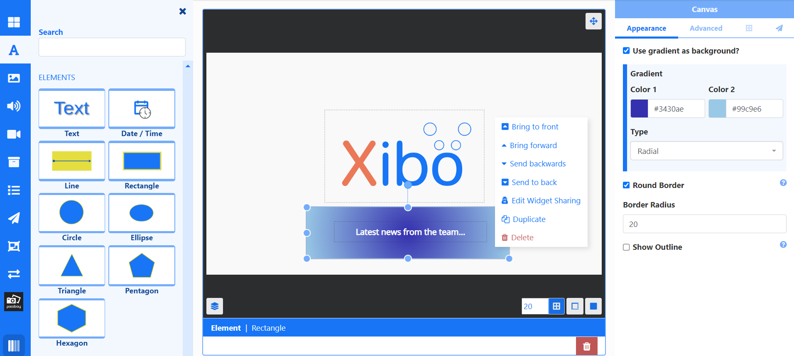

# グローバル要素

さまざまなグローバル要素から選択してレイアウトに追加し、目を引くデザインを作成し、他のコンテンツを強化します。

{nonwhite}{video}4NxcXfiKBfM{/video}{nonwhite}

## 機能の概要

- レイアウト デザインを強化します。
- 配置とサイズ設定の柔軟性。
- スタイルと外観を適切なものに構成します。
- レイアウト上のすべてのウィジェット/データ要素と互換性があります。
- レイアウトにテキストを簡単に追加します。
- さまざまな図形と線から選択して、デザインを目立たせます。

グローバル要素は、レイアウト エディター内の **ツールボックス** からアクセスできます。

- 要素をドラッグ アンド ドロップするかクリックして、キャンバスをクリックして追加します。
- 位置とサイズを変更します。
- **プロパティ パネル** からスタイルを設定します。

{tip}
**テキスト** を直接編集するには、レイアウト上のテキスト要素をダブルクリックして、テキスト ボックスに入力します。この要素を右クリックすると、プロパティ パネルからではなく直接編集するための **テキスト編集** オプションも表示されます。
{/tip}

グローバル要素は単独で使用することも、レイアウトに既に追加されている既存のコンテンツを補完するために使用することもできます。

{version}
グローバル要素はレイアウト エディターからのみ使用でき、プレイリスト エディターでは使用できません。
{version}

[レイヤー コントロール](layouts_editor.html#content-layer-control) を使用してドラッグし、図形を他のコンテンツの背後に簡単に配置したり、グローバル要素を右クリックして **送信/移動** オプションを使用したりできます。

{tip}
要素には独自のキャンバス [レイヤー](layouts_editor.html#content-layering) があり、これを使用して、プレイリストやビデオなどの他のネイティブにレンダリングされた要素との関係で、要素がどこに表示されるかを決めることができます。

{tip}

