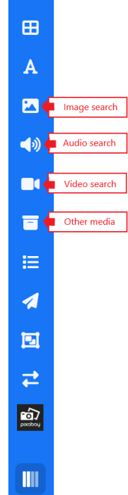
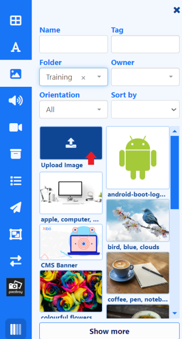

# ライブラリ検索

ライブラリ検索機能を使用して、[CMS ライブラリ](media_library.html) にすでに存在するメディアをレイアウト/プレイリストに追加します。

{nonwhite}{video}yOd7QVuF16g{/video}{nonwhite}

ライブラリ メディアは次のものから構成されます:

- [画像](media_module_image.html)
- [オーディオ](media_module_audio.html)
- [ビデオ](media_module_video.html)
- その他のメディア ファイル

{tip}
**その他のメディア** 検索には、[Flash](media_module_flash.html)、[HTML パッケージ](media_module_htmlpackage)、[PDF](media_module_pdf.html)、[PowerPoint](media_module_powerpoint.html#content-3-upload-a-prepared-ppt-file-windows-players-only) ファイルが含まれており、[**タイプ**] ドロップダウン メニューから選択できます。

{/tip}

{tip}
使用可能なフィルターを使用して検索を絞り込みます。
{/tip}

- ドラッグまたは選択してハイライトし、追加するレイアウトをクリックします。
- 配置とサイズを変更します。
- 構成オプションはプロパティ パネルに表示されます。

選択したタイプの新しいファイルもここから追加できます:

- 追加するメディア タイプのライブラリ検索をクリックします。その他のメディア検索を使用してファイルを追加する場合は、ドロップダウンからファイル タイプを選択していることを確認してください。
- レイアウトに [**アップロード**] をドラッグまたはクリックします。
- ファイルを追加し、必要に応じてフォルダーを選択して [**アップロード**] します。
- [**完了**] をクリックすると、ファイルが追加され、配置/サイズ変更と構成の準備が整います。

{tip}
レイアウト/プレイリストに直接アップロードされたファイルは、CMS ライブラリに自動的に追加されます。
{/tip}

## リモート検索

Pixabay からの統合により、レイアウト エディターを離れることなくレイアウトに追加できる画像ファイルとビデオ ファイルへの追加リソースがユーザーに提供されます。

{cloud}
Pixabay 統合は、Xibo in the Cloud の新規顧客に対してデフォルトで有効になっています。

以前のバージョンからアップグレードする場合は、CMS の **管理** セクションに移動して **アプリケーション** をクリックして有効にする必要があります。ページを下にスクロールして **コネクタ** セクションに移動します。**構成** をクリックして有効にするにはチェックを入れ、変更を **保存** します。

{/cloud}

{noncloud}

Pixabay は、CMS メニューの **管理** セクションで **アプリケーション** をクリックし、ページを下にスクロールして **コネクタ** セクションに移動することで有効にできます。Pixabay アカウントにサインアップした後、構成をクリックして API キーを入力します。 [PixabayAPI ドキュメント](https://pixabay.com/api/docs/)
{/noncloud}

- **Pixabay** をクリックし、検索するファイルの **タイプ** を選択します。
- 名前フィールドに検索条件を入力して結果を返します。
- ドラッグまたはクリックして追加、配置/サイズ変更、および構成を行います。

{tip}
サムネイルの右上にある矢印をクリックすると、別のウィンドウでプレビューが再生されます。このウィンドウは、左上の矢印を使用して拡大することもでき、上部の `+` ボタンをクリックしてここからレイアウトに追加することもできます。

{/tip}

{tip}
Pixabay から使用するために選択された画像/ビデオは、ライブラリに自動的に追加され、画像/ビデオ ライブラリ検索機能から将来使用できるようになります。

{/tip}
