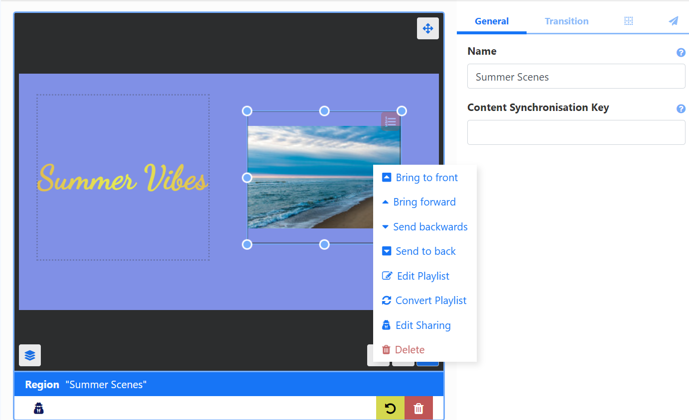

# プレイリスト

プレイリストは、メディア アイテムのシーケンス (画像スライドショーなど) を表示するために使用されます。プレイリストを作成するには、次の 2 つの方法があります:

- レイアウト エディターからレイアウトに直接 [プレイリストを追加](layouts_editor_playlists.html#content-add-playlists) します。ローカル プレイリストは、グローバル プレイリストとして再利用できるように変換して保存できます。保存したプレイリストはレイアウト エディタに表示され、レイアウトに追加できます。
- レイアウトとは独立して [プレイリスト](media_playlists.html#content-creating-a-playlist) を作成します。グローバル プレイリストは、レイアウトを作成しなくてもディスプレイにスケジュールできます。レイアウト エディタの外部で作成されたプレイリストは、レイアウト エディタの [プレイリストの追加] 機能から選択できます。

## プレイリストの追加

**レイアウト エディタ** から新しいプレイリストを作成するか、既存のプレイリストを選択して、レイアウトに表示するコンテンツのタイムラインを作成します。

## 機能の概要:

- レイアウト上で直接作成および構成します。
- レイアウト上で作成されたプレイリストをグローバル プレイリストに変換して、後で使用できるように保存します。
- 1 つ以上のプレイリストに保持されているコンテンツの「スライドショー」を簡単に表示します。
- 同期イベントの一部である他のレイアウト上のプレイリストと同期します。
- さまざまなプレイリストからコンテンツを組み合わせて表示します。
- プレイリストから表示するアイテムの最大数を設定します。
- プレイリストの各アイテムが次のアイテムに移動する前に表示される時間を制御します。
- プレイリストに追加されたメディア アイテムの有効期限を設定します。
- 指定された再生回数ごとに 1 つのアイテムを再生します。
- 各サイクルで再生するランダム ウィジェットを選択します。
- ビューアでプレイリストに含まれるアイテムを循環して、シーケンスを簡単に確認します。

## レイアウトへのプレイリストの追加

- [レイアウト エディター](layouts_editor) で、**ツールボックス** から **プレイリストの追加** をクリックします。

- **新しいプレイリスト** または既に作成されている名前付きプレイリストをクリックして追加するか、ドラッグします。
- サイズ変更と配置:

**プロパティ パネル** から、**コンテンツ同期キー** を使用して他のレイアウトのプレイリストと同期します。レイアウトが [同期イベント](scheduling_events.html#content-synchronised-events) としてスケジュールされると、同じキーを持つプレイリストが同期されます。

{tip}
**シナリオ:**

3 つのディスプレイと 3 つの異なるレイアウトを持つ同期イベントがあります。各レイアウトの上部にはテキストがあり、中央には 3 つすべてが同期して再生される必要があるプレイリストがあります。

また、2 つの異なるプレイリストを異なる方法で同期するように設定することもできます。たとえば、`sync_1` と `sync-2` に設定できます。
{/tip}

- 必要に応じて、プロパティ パネルからプレイリストのアイテムの [トランジション](tour_transitions.html#content-playlist-transitions) を設定します。

{tip}

デフォルトのトランジションが適用されると、プロパティ パネルは空白になります。フォームには手動で入力したトランジションのみが表示されます。

レイアウトのプロパティ パネルで [トランジションを自動的に適用する] チェック ボックスをオフにすると、デフォルトを上書きできます。

{/{/tip}

- プレイリストの右隅にあるアイコンをクリックして [プレイリスト エディター](media_playlists.html#content-playlist-editor) を開き、コンテンツを追加して構成します。

{tip}
[プレイリスト エディター](media_playlists.html#content-playlist-editor) には、プレイリストでのみ使用できる **スペーサー** ウィジェットと **リッチ テキスト** ウィジェットが含まれています。

プレイリストに追加されたメディアには、[有効期限](media_playlists.html#content-widget-expiry-dates) を使用して開始時間と終了時間を設定することができます。

{/tip}

{version}
**注:** すでに作成されている名前付きプレイリストを追加すると、プレイリストに加えられた編集は、プレイリストが現在使用されているすべての場所に適用されます。

{/version}

- 上部の [**戻る**] ボタンをクリックしてプレイリスト エディターを終了し、レイアウト エディターに戻ります。

レイアウト上のプレイリストの右下にある矢印を使用して、プレイリストのタイムラインに追加されたすべてのコンテンツを表示します。

- コンテンツの順序を切り替えます:

## プレイリストの変換

レイアウトに **新しいプレイリスト** を追加すると、これを保存済みのプレイリストに変換できます。変換されたプレイリストは、レイアウト エディターのプレイリスト選択と [プレイリスト](media_playlists.html#content-playlists-grid) グリッドに表示されます。

- レイアウト上のプレイリストをクリックして選択し、**プロパティ パネル** の **一般** タブから **名前** を付けます。

- 右クリックして、メニューから **プレイリストの変換** を選択します。

レイアウト エディターの下部に、プレイリストがグローバル プレイリストとして保存されたことを示すポップアップ メッセージが表示されます。

{tip}
[さらに表示] ボタンをクリックすると、使用可能なプレイリストのリストにプレイリストが追加されます。

{/tip}

変換されたプレイリストは [プレイリスト グリッド](media_playlists.html#content-playlist-grid) に保存されます。

## プレイリストに追加

レイアウトに **新しいプレイリスト** がある場合は、タイムラインに新しいプレイリストまたはグローバル プレイリストを追加して、プロパティ パネルでさらに設定オプションを開くことができます。

- プロパティ パネルから複数のプレイリストを選択して [埋め込み](media_playlists.html#content-embedding-playlists) する場合は、プレイリスト、スポット オプション、プレイリストの順序を選択します。

レイアウトの **新しいプレイリスト** に **プレイリスト** を追加すると、ランダム ウィジェット機能を含む追加の [サイクル ベース再生](layouts_editor_playlists.html#content-cycle-based-playback) オプションが使用できます。

{tip}
再生順序を結合するために複数のプレイリストを追加する場合は、タイムラインにプレイリストを 1 つだけ追加し、プロパティ パネルのオプションを使用して追加のプレイリストを選択して構成することをお勧めします。
{/tip}

- ### サイクル ベースの再生

有効にすると、選択したすべてのプレイリストが 1 つの「リスト」として扱われ、レイアウトが再生されるたびに 1 つのウィジェットのみが表示され、追加されたすべてのプレイリストからのコンテンツが循環します。

- プロパティ パネルでサイクル ベースの再生を有効にするにチェックを入れます。
- **再生回数** を指定して、プレイリストの各ウィジェットがタイムラインの次のウィジェットに移動する前に再生する回数を決定します。

**サイクルごとにランダム ウィジェット** オプションを使用すると、サイクルごとにタイムラインからウィジェットがランダムに再生されます。

{version}
**注:** これらの追加オプションは、レイアウトに直接追加された [グローバル プレイリスト](media_playlists.html#content-feature-overview) タイムラインに 1 つ以上のプレイリストを追加する場合には **利用できません**。

{/version}

{tip}
レイアウトとは独立して作成および管理される [プレイリスト](media_playlists.html) では、コンテンツを追加および管理するためにレイアウトまたはレイアウト エディターへの追加のユーザー アクセス権は必要ありません。

これらのグローバル プレイリストは、最初にレイアウトを作成して追加することなく、直接 [スケジュール](scheduling_events.html#content-media-scheduling) することもできます。

{/tip}
