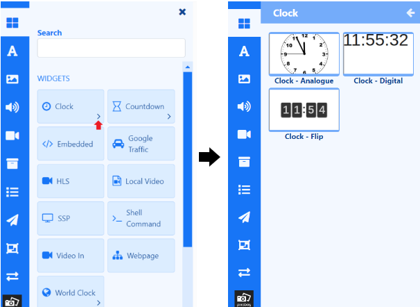

# Widgets

Widgets are a core component of [[PRODUCTNAME]] and are used to display content on a **Layout** or in a **Playlist**. 

{nonwhite}{video}-pGgF0ijzBg{/video}{/nonwhite}

## Feature Overview

- Selection of powerful Widgets to choose from.
- Create content quickly and easily.
- Integrated content from third parties.
- Show dynamic content on screens.
- Select which Modules to make available to other users of the CMS.

All Widgets have an associated [Module](media_modules.html) which tells [[PRODUCTNAME]] what information is required from the User for configuration as to how it should be displayed.

{tip}
Widgets can be disabled/enabled by an Administrator in the **Modules** section of the CMS.
{/tip}

Widgets are available from the **Toolbox**:

- Click the top button to view available Widgets.

Widgets can be marked as **Favourites** to appear in their own section for easier selection:

-  Click the star icon at the top left of a Widget card.

{tip}
Click the star to deselect from the Favourites section.
{/tip}

Widgets that have an `>` need to be opened to select from additional Widget templates:

Add to Layouts by drag and drop or click in the Widget card to highlight then click on the canvas to add:

- Position and resize.
- Configure from the available options in the **Properties Panel**.

Next [Data Widgets](layouts_editor_data_widgets.html)...

