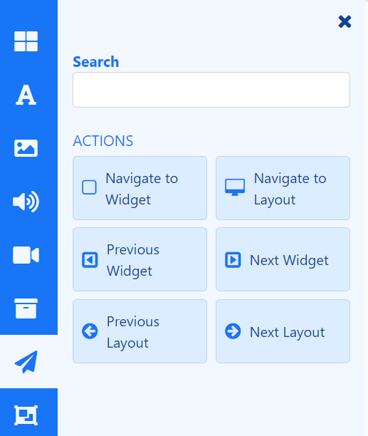
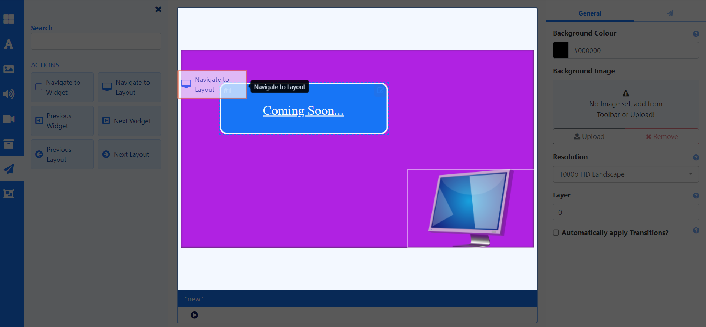

# Interactive Actions

{version}
**PLEASE NOTE:** We are aware of some issues with Interactive Actions and are currently working on improvements to the work flow and accompanying documentation.
{/version}

## Documentation under review...

Actions can be attached to an entire **Layout** or a **Widget** which can be used to effect changes to the Layout. These can be triggered by **Touch or Click** or programmatically by **webhook**.

{feat}Interactive Actions Layouts/Regions|v4{/feat}

{tip}
**Scenario**:
A Product display has a product that the customer can pick up. An 'internet of things' device, such as a light sensor could be used to trigger a webhook to [[PRODUCTNAME]] which loads that particular products information into a Layout to be shown.
{/tip}

{nonwhite}
More information on webhooks can be found in our Developer documentation [here.](/docs/developer/player-control/webhooks)
{/nonwhite}

## Adding an Action

Widgets can have Actions attached to effect changes to the Layout, triggered by Touch, click or webhook.

Actions are created and managed from the Toolbox inside the [Layout Editor](layouts_editor.html#content-toolbox) and are shown on the **Actions** tab from the Properties Panel for a selected item:

- Select the required **Action** and drag to the Target.

- Once added, use the properties panel to set the **Trigger Type** and **Target**.

Set the **Trigger Type**:

- Trigger by touching or clicking anywhere on a Layout or a specific Widget.

or

- Include a Trigger Code for a Web Hook, which must be present in the URL ``trigger=` parameter.

{tip}
When triggering by touch using Android, ensure that **Touch** capabilities are enabled for the device from [Display Settings](display_settings.html) using the **Advanced** tab!
{/tip}

Configure the **Trigger Target**. Options available here will be dependent on the type of Action added:

- **Navigate to Layout** uses a **Layout Code** to identify the Layout to be used. Therefore ensure that Target Layouts have a **Code Identifier** assigned from the  Edit Layout form, in order to be included in this list for selection. 
- **Next Widget** and **Previous Widget** Actions are only applicable for adding to **Playlists** to Target the 'Next' and 'Previous' items in a Playlists timeline.
