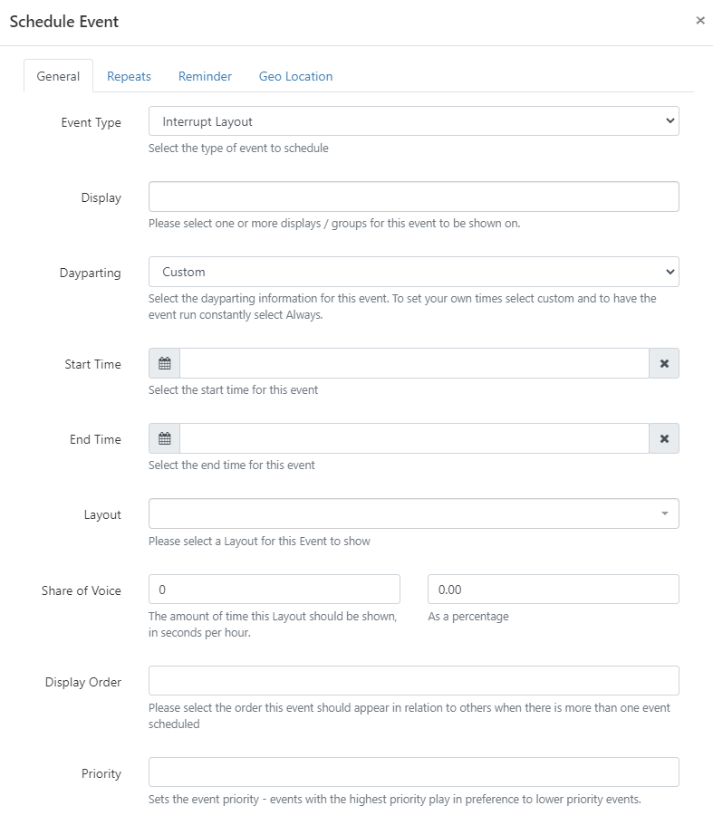

<!--toc=layouts-->

# 割り込みレイアウト

レイアウトが**割り込みレイアウト**としてスケジュールされている場合、[[PRODUCTNAME]]はイベントに入力された**音声の共有**時間または割合を使用して「通常のスケジュール」のレイアウトの間にどのように再生されるべきかを計算します。

{tip}
例えば、通常のスケジュールの中で、特定の時間だけ表示する必要があるアナウンスなどがある場合に有効です。
{/tip}

## 割り込みレイアウトの作成

**割り込みレイアウト**は、他のすべての[レイアウト](layouts.html)とまったく同じ方法で作成されます。

## スケジューリング

割り込みレイアウトは、[イベント](scheduling_events.html)をスケジューリングする際に、**イベントタイプ**として選択します。

選択したら、フォームの各項目を入力してください。

### 音声の共有

**割り込みレイアウト**が通常のスケジュールを占有する時間（1時間あたりの秒数、またはイベント期間（開始と終了の差分）に対する割合（0〜100%）で表示する量を入力してください。

{tip}
**注意** メインレイアウトが長時間の場合、入力されたSoV基準を満たすために、割り込みレイアウトがブロック表示されることがあります!
{/tip}

