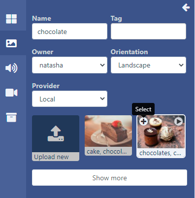
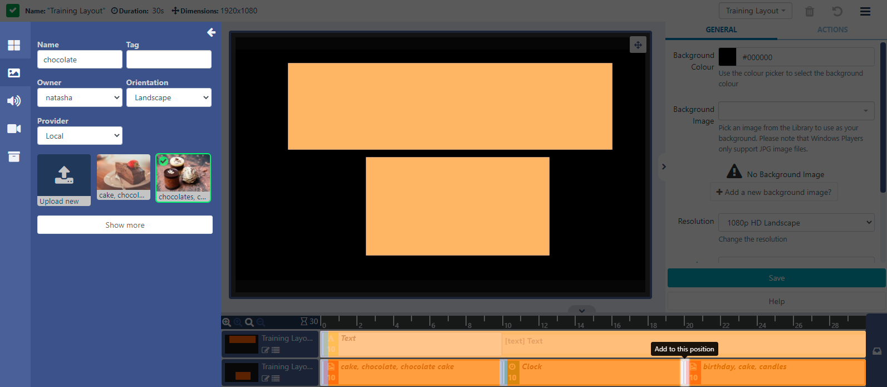
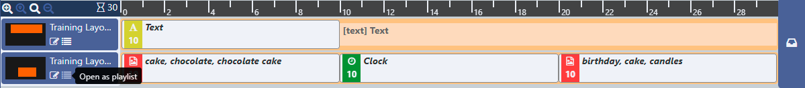
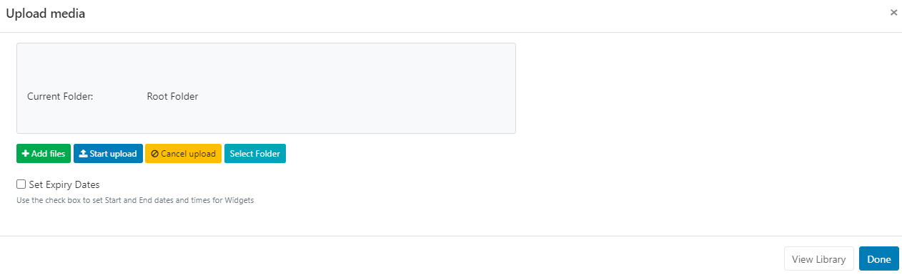

<!--toc=layouts-->

# ライブラリ検索

**ツールバー**には、[ライブラリ](media_library.html)に既に存在するメディアをレイアウトやプレイリストに簡単に割り当てることができる、複数の**ライブラリ検索**オプションがあります。

- 開くファイルを画像、音声、動画、「その他のメディア」から選択します。

- フィールドを使用して、検索を絞り込むことができます。

Pixabayとの連携により、ここに画像や動画を追加表示することができます。

Pixabayは、CMSメニューの**管理**セクションの**アプリケーション**をクリックし、ページをスクロールして**コネクター**セクションに移動し有効にすることができます。'設定'をクリックし、Pixabayアカウントにサインアップした後にAPIキーを入力します。[PixabayAPI ドキュメント](https://pixabay.com/api/docs/)

{tip}
Pixabayからレイアウトに使用する画像/動画を選択すると、自動的にライブラリに追加されます。
{/tip}

- メディアファイルの左上にある**+**のアイコンをクリックして選択します。

{tip}
複数のファイルを選択して、対象のリージョンに一括で追加します。選択した順番にタイムラインに表示されます。
{/tip}

- 選択したら、追加する対象のリージョンをクリックします。

- ファイルをドラッグ＆ドロップでリージョンに追加することも可能です。

マーカーで示された**タイムライン**上の特定のポイントに選択範囲を追加することもできます。

ファイルを選択する前に、プレビューすることができます。

- メディアファイルの右上にある再生アイコンをクリックします。

ファイルは別ウィンドウで表示され、矢印で大きなウィンドウサイズに切り替えられます。

- プレビューウィンドウからメディアを選択するには、**+**のアイコンをクリックします。

- リージョンまたはタイムラインに追加します。

ライブラリメディアは、タイムラインの右側にあるメニューをクリックすることで、プレイリストビューとしてリージョンに追加することもできます。

プレイリストビューが開き、クリックで追加、またはドラッグ＆ドロップで同じようにメディアを追加することができます。

{tip}
ツールバーの紫色の **複数ウェジェットを選択** ボタンを使って、プレイリスト上の複数のアイテムを削除し、タイムライン上のメディアをクリックして選択します。ビンアイコンをクリックすると、すべての選択項目が削除されます。
{/tip}

- プレイリストのウィンドウを閉じて、プレイリストビューを終了します。

## 新規アップロード

新しいファイルを**ツールバー**からアップロードして、レイアウトで直接使用したり、ライブラリに保存したりすることができます。

- ライブラリを開く 画像・音声・動画を検索し、**新規アップロード**を選択し、リージョンに追加してください。

追加するための、ファイルアップローダが開きます。

- **ファイルを追加**をクリックし、アップロードするファイルを選択します。

{tip}
以下のファイル形式を推奨します。

- **オーディオ** - mp3.wav
- **画像** - jpg,jpeg,png,bmp,gif (アニメーションGIFは、どのプレイヤーでもサポートされていません。).
- **ビデオ** - H264 MP4

{/tip}

CMS上でファイルを識別しやすくするための名前と、オプションでタグを設定します。

{tip}
名前フィールドを空白にすると、アップロード時に元のファイル名と同じ名前が付けられます!
{/tip}

ファイルを**フォルダ**に直接アップロードすることも可能です。

{tip}

フォルダに保存されたファイルは、ユーザー/ユーザーグループのアクセス用に保存先フォルダに適用された表示、編集、削除、[共有](users_features_and_sharing.html)オプションを引き継ぎます

{/tip}

- **フォルダを選択**ボタンをクリックして展開し、保存するフォルダを選択します。

- フォルダを右クリックすることで、その他のオプションにアクセスすることができます。

{tip}
用可能なフォルダーオプションは、ユーザー/ユーザーグループの有効な[機能と共有](users_features_and_sharing.html)オプションに基づきます。
{/tip}

- フォルダーの保存先を選択し、**完了**をクリックします。
- **現在のフォルダー**には、選択したファイルのパスが表示されます。

{white}
フォルダアクセスとセットアップに関する詳細については、管理者にご相談ください。
{/white}

レイアウトに直接アップロードされたメディアは、**有効期限を設定**というオプションがあります。

{tip}
これは、後日表示するメディアをあらかじめロードしておく必要がある場合に特に便利です。
{/tip}

- **有効期限を設定**にチェックを入れます。

{tip}
**注意** 有効期限は現在Linuxプレイヤーではサポートされていません!
{/tip}

- **開始**と**終了**の日時を選択します。

- チェックボックスを使って、期限切れでプレイリストからメディアファイルを削除したり、ライブラリから削除したりすることができます。

- **アップロード開始**ボタンをクリックすると、追加されたすべてのファイルのアップロードが開始されます。フォルダ/有効期限が選択されており、追加されるファイルが複数ある場合、すべてのファイルは指定された場所にアップロードされ、有効期限も同じに設定されます。
- アップロードに成功したら、**完了**をクリックします。

ファイルを個別にアップロードし、異なるフォルダの場所/有効期限を指定することも可能です。

アップロード開始ボタンをクリックする代わりに、追加されたファイルの行の最後に表示される**青いアップロード**ボタンをクリックしてください。

同様に **フォルダーを選択** ボタンを使ってフォルダの場所を変更し、行の最後にある青いボタンをクリックすると、そのファイルだけがアップロードされます。

- すべてのファイルを個別にアップロードしたら、**完了**をクリックします。

{tip}
タイムラインからアップロードされたメディアのアイコンをクリックして、有効期限を確認・変更できます!
{/tip}

## 画像ファイル

{tip}
画像は以下のファイル形式を推奨します。

- jpg,jpeg,png,bmp,gif

  アニメーションGIFは、どのプレイヤーでもサポートされていません。

{/tip}

アップロードする画像ファイルを選択する際、ユーザーは画像の解像度を確認し、意図した画面サイズ内に収まるようにする必要があります。非常に大きな画像をアップロードすると、プレーヤーに問題が発生する可能性がありますので、注意が必要です。

設定オプションについては、[Image](media_module_image.html)のページを参照してください。

## オーディオファイル

{tip}
**注意** Linuxプレイヤーは、オーディオファイルをサポートしていません。
{/tip}

{tip}
オーディオファイルは以下のファイル形式を推奨します。

- mp3.wav

{/tip}

設定オプションについては、[オーディオ](media_module_audio.html)のページをご覧ください。

## ビデオファイル

{tip}
ビデオは以下のファイル形式を推奨しています。

-  H264 MP4

{/tip}

動画ファイルをアップロードする際、スクロールバーを使ってCMSのサムネイルとして使用するフレームを選択することができます。

{tip}
サムネイルはライブラリメディアグリッドで使用され、識別しやすくなります。また、Video モジュールの設定で **プレビュー可能** がチェックされている場合、リージョンプレビューにも使用されます。
{/tip}

設定項目については、[ビデオ](media_module_video.html)のページをご覧ください。

