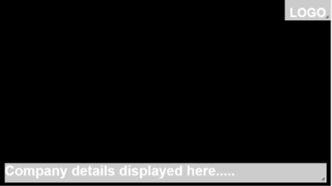
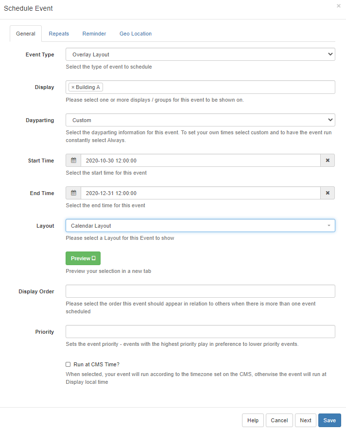

<!--toc=layouts-->

# オーバーレイレイアウト

**オーバーレイレイ**としてスケジュールすると、通常の**スケジュール済みレイアウト**の上にレイアウトを表示するように[[PRODUCTNAME]]に指示します。オーバーレイは上に表示されたまま、下にある通常のスケジュールされたコンテンツが変化します。ロゴ、重要な情報、緊急のお知らせなどに特に便利です。

## オーバレイレイアウトの作成

オーバーレイ レイアウトは、他のすべての **レイアウト** とまったく同じ方法で作成されます。既存のコンテンツに合うようにリージョンを追加して、オーバーレイレイと同時に**スケジュール**されている他のレイアウトの「上」にオーバーレイレイレイを配置することができます。 オーバーレイレイアウトは、重要なコンテンツを表示し、その下にあるレイアウトはローテーションで再生されます。

{tip}
レイアウトがオーバーレイ レイアウトとしてスケジュールされている場合、[[PRODUCTNAME]]はプレーヤーの背景をレンダリングしません。

**注意** Edge ブラウザーを使用するウィジェット/メディアを含むレイアウトは、このような状況では他のコンテンツの上にコンテンツを配置できないため、オーバーレイ レイアウトで使用することはできません。これには、HLSや埋め込み型Youtubeなどが同様です。

コンテンツがビデオでない場合は、CEFブラウザを代わりに使用することができます。
{/tip}

{tip}
オーバーレイレイアウトは、キャンペーンにも使用することができます。
{/tip}

## スケジューリング

オーバーレイレイは、[イベントをスケジュール](scheduling_events.html)において、**イベントタイプ**として選択され、オーバーレイとしてスケジュールされた場合、通常のレイアウトとは異なる挙動をします。

- #### リフレッシュコンテンツ

オーバーレイアウトがスケジュールされると、**メディアコンテンツ**が一度レンダリングされ、リフレッシュされたコンテンツは表示されません。

{tip}
これを回避するには、オーバーレイ レイアウトに 2 番目のメディア アイテムを追加して、アイテム 2 を読み込んでからアイテム 1 を再読み込みします（コンテンツが更新されます）。これは、たとえば、カレンダーやティッカーウィジェットを含むオーバーレイレイレイアウトを作成する場合に特に便利です。
{/tip}

- #### 複数のオーバーレイをスケジューリング

オーバーレイレイは、スケジューリングで次々に表示されるのではなく、**スタック**されます。

{tip}
**シナリオ**  2つのメディアアイテムは、画面の同じリージョンで他のスケジュールされたイベントを「オーバーレイ」するために必要です。割り当てられたメディアで2つのオーバーレイレイを作成するのではなく、1つのオーバーレイレイを作成し、その中に2つのメディアアイテムが含まれるようにする必要があります。
{/tip}

[オーバーレイレイアウト](https://www.youtube.com/watch?v=Dy62LZG7B0U)の使い方については、YouTubeの便利なガイドをご覧ください。（英語）
