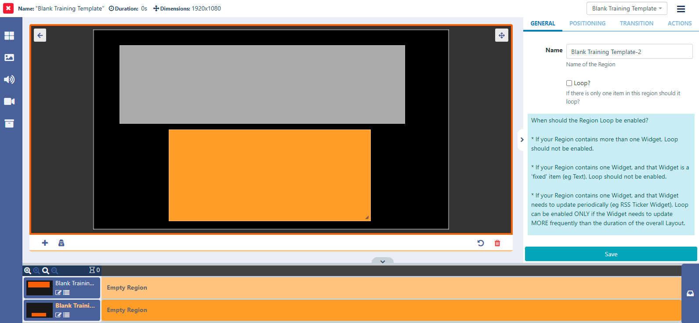
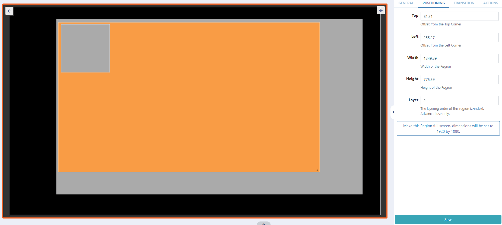

<!--toc=layouts-->

# リージョン

リージョンは、**レイアウト**上に**メディア**を保持する領域を定義し、ビューアの下にあるレイアウト編集アイコンを使って追加・編集することで、タイムリーなコンテンツのセットを形成することができます。

{tip}
白紙のテンプレートが必要な場合、'ブランク'バナーをクリックしてエディターを開くこともできます。
{/tip}

- **リージョン**をクリックして選択し（選択するとオレンジ色にハイライトされます）、右下隅にあるハンドルを使用してサイズを変更します。
- 選択した領域をドラッグ＆ドロップで移動させることができます。

{tip}
エディターの右上にあるアイコンでフルサイズ画面に切り替えることができます。
{/tip} 

{tip}
'編集'モードでは、ウィンドウがオレンジ色の枠で囲まれていることに気がつくはずです。
{/tip}

- 左下にある**+**ボタンをクリックすると、さらにリージョンを追加できます。

 

- キャンバス上のどこかをクリックすると、リージョンに加えられた変更が保存されます。
  

その他のオプションは、プロパティパネルで確認できます。

- リージョンをハイライトするとオプションが表示されます

- **全般** タブでは、CMS で識別しやすいようにリージョンの **名前** を作成したり、**ループ** オプションが必要な場合はそれを有効にすることができます。

{tip}

**Loopを有効にするタイミング**

1つのメディアアイテムを持つリージョンでは、そのアイテムが終了したときに再読み込みすることが望ましい場合があります。**ループ**をチェックすると、メディアアイテムは期限が切れるたびに再読み込みされ、他のリージョンが完全に再生されるまで更新されたコンテンツを表示します。ループはメディアアイテムが1つしかないリージョンに対してのみ有効で、コンテンツが変化する特定のメディアタイプ（ティッカーRSS、カレンダーなど）に対してのみ使用する必要があります。

**リージョン・ループ・オプションの使用を考える際には、以下のルールを考慮するとより良い結果が得られるでしょう。**

- リーションが複数のウェジェットを含む場合、ループは有効にしないでください。
- リージョンが1つのウィジェットを含み、そのウィジェットが「固定」アイテム（例：テキスト）である場合、ループは有効化すべきではありません。
- リージョンに1つのウィジェットが含まれ、そのウィジェットが定期的に更新する必要がある場合（例：RSSティッカーウィジェット）、ループは、ウィジェットがレイアウト全体の期間よりも頻繁に更新する必要がある場合にのみ有効にすることができます。

{/tip}

- 位置調整**タブでは、より正確なリージョンのサイズと位置、および再生時の**レイヤ-**を設定することができます。

#### リージョンを重ねるためのルール

{tip}
**注意** Edge ブラウザーを使用するウィジェット/メディアを持つ領域には、何もオーバーレイできないので、ご注意ください。これには、HLS や埋め込み型 Youtube が含まれます。
ビデオ以外のコンテンツには、代わりに CEF(Chromium Embedded Framework)ブラウザを使用することができます。
{/tip}

必要であれば、z-indexの設定により、オーバーラップしているリージョンを再生順に並べることができます。

**レイヤー**の欄に数字を入力し、スタック全体の中でリージョンが表示される順番を決めます。

**レイヤー**の順番はここに入力した番号で決まり、1が一番下のレイヤーとみなされます。数字が大きくなるほど、レイヤーが高くなります。

{tip}
一部のデバイスでは、**ビデオ** または **ビデオイン** ウィジェットを表示しているxxiリージョン領域に何もオーバーレイできないことがあります。可能かどうかは、デバイスとハードウェア アクセラレーションによる再生が使用されているかどうかに依存します。一般に、Android（[ディスプレイ設定プロファイル](displays_settings.html)で SurfaceView オプションを使用していない場合）、Linux、Tizen、webOS プレーヤでは可能ですが、この要件がある場合は、使用するデバイスを慎重にテストし、使用例でこれが機能するかどうかを確認する必要があります。
{/tip}

このタブの下にある**このリージョンをフルスクリーンにする**のテキストをクリックすると、ここに表示されている寸法で示されるようにサイズが変更されます。

- **トランジション**タブを選択すると、リージョンの再生が終了したときに、**終了トランジション**を適用することができます。

終了トランジションは、あるリージョンの最後のメディアアイテムが表示されたときに起こり、他のリージョンのすべてのメディアアイテムが期限切れになったときにのみ発生する。

{tip}
トランジションは、Android、webOS、Tizen Player、Windows Player では v2 R252 からサポートされていますが、Linux Player では現在 **サポートされていません**。
トランジションは事前に設定する必要がありますので、お問い合わせは管理者にお願いします。
{/tip}

- 編集した内容が **保存** ボタンで保存されていることを確認してから、レイアウトビューに戻ります。

**アクション**は、リージョンにアタッチしてレイアウトを変更することができます。詳細は[インタラクティブアクション](layouts_interactive_actions.html)ページでご確認ください。

### リージョンの共有オプション

リージョンに対して、どの**ユーザー**/**ユーザーグループ**が**表示**/**編集**/**削除**のアクセスを持つことができるかを制御します。

{tip}
**注意** **レイアウト**の所有者は、共有に関する完全なコントロールを持っています。
{/tip}

- [共有](users_features_and_sharing.html)オプションの割り当てと編集は、対象のリージョンを右クリックしてフォームを開きます。

{tip}
ビューアーの下部にあるコンテキストメニューから、共有オプションにアクセスすることもできます。
{/tip}

ビューアまたはタイムラインで削除するリージョンをハイライトして、ビンアイコンをクリックすることでリージョンを削除します。**注意：このアクションは元に戻せません！**。

エディタを終了し、ビューア左上の戻る矢印でレイアウトビューに戻ります。
