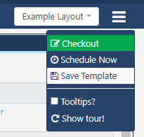
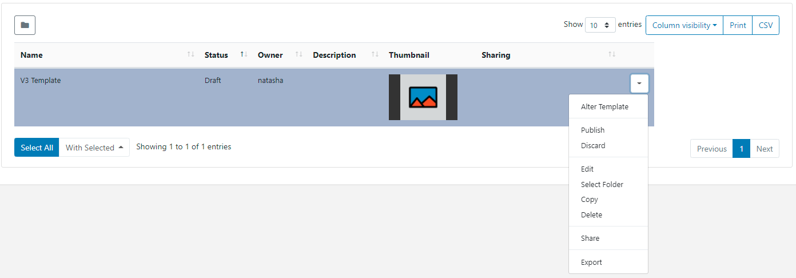

<!--toc=layouts-->

# テンプレート

テンプレートは、デザインされた **レイアウト** の保存コピーで、新しいレイアウトを作成する際に使用することができます。テンプレートを使用することで、デザインプロセスをスピードアップし、企業イメージや標準を維持することができます。

## テンプレートの作成

テンプレートは、2つの方法で作成することができます。

1 - **テンプレート**のページから直接追加する

2 - 既存の**レイアウト**をテンプレートとして保存する

## 1. テンプレートページからレイアウトを追加する

- メインメニューの **デザイン**セクションの下にある**テンプレート**をクリックします。
- **テンプレートを追加**ボタンを選択し、該当するフォームの項目を入力します。

- テンプレートは、オプションで**フォルダ**に保存することができます。

{tip}
フォルダに保存されたテンプレートは、そのユーザー/ユーザーグループの保存先フォルダに適用されている表示、編集、削除の**共有**オプションを引き継ぎます。

ユーザーがテンプレートのコンテンツにアクセスできるようにする場合、同じフォルダに保存されることを確認してください。
{/tip}

- **フォルダ選択**ボタンをクリックして展開し、保存するフォルダを選択します。

- フォルダーを右クリックすることで、フォルダーオプションにアクセスすることができます。

{tip}
ユーザー/ユーザーグループのオプションは、有効な[機能と共有](users_features_and_sharing.html)オプションに基づきます!
{/tip}

- 選択されたフォルダのファイルパスが、フォームの「フォルダ」フィールドの横に表示されます。

{white}
フォルダアクセスとセットアップに関する詳細については、管理者にご相談ください。
{/white}

- CMS内で簡単に識別できるように、**名前**を記入してください。

- オプションの**タグ**を含めると整理され、検索しやすくなります。

{tip}

フォームのタグフィールドにテキストを入力すると、オートコンプリートヘルパーが一致する候補を表示し、ユーザーが簡単に選択できるようにします。

定義済みの値は、**タグ値**のドロップダウンを使用して表示されます。値が既に知られている場合は、次のフォーマットを使用してフィールドに直接入力することができます。'色|赤`と入力します。

管理者によって値が「必須」に設定されている場合、フォームを保存するために値を入力する必要があります。
{/tip}

ユーザーは、**タグ値**フィールドを使用して、定義済みの値をまだ持っていないタグに関連する値を追加することができます。タグの値が必要ない場合は、このフィールドを空白にすることができます。

{tip}
テンプレートグリッドの下にある[個別選択](tour_grids.html#複数選択-個別選択による)を使って、複数のテンプレートにタグを割り当てることも可能です。
{/tip}

使用する**タグ**と**タグ値**の詳細については、管理者にご相談ください。

- このテンプレート/レイアウトで使用する**解像度**を選択します。

テンプレート/レイアウトは、意図されたディスプレイの解像度に合わせて設計されており、同じ解像度を持つ**プレイヤー**で表示されたときに最もよく機能します。異なる解像度のディスプレイに表示された場合、動的にサイズが変更され、未使用のスクリーンスペースが発生する可能性があります。

{tip}
4:3 の解像度でデザインされたレイアウトを 16:9 のテレビ画面に接続してプレーヤーに送信すると、コンテンツの両脇に 2 本の空白のバーが表示されることになります。
{/tip}

**If you require an alternative resolution to the available options listed, contact your Administrator**
**リストアップされた利用可能なオプションに代わるが解像度が必要な場合、管理者に連絡してください。**

- CMS内で簡単に識別できるように、**名前**を記入してください。

- フォームを保存すると、自動的に「レイアウトデザイナー」（layouts_designer.html）が起動されます。

## 2. レイアウトをテンプレートとして保存する

**公開済みレイアウト**は、**レイアウトデザイナー**でステータスメニューから**テンプレートとして保存**を選択してテンプレートとして保存することができます。

{tip}
レイアウトグリッドのレイアウトの**行メニュー**から**テンプレートとして保存**を選択すると、レイアウトをテンプレートとして保存することもできます。
{/tip}

選択したレイアウトをテンプレートとして保存するために、関連するすべてのフォームフィールドを入力します。

- 表示されている現在のフォルダー位置から移動する場合は、**フォルダーを選択**を使用します。
- レイアウトを追加する際に、ユーザーがテンプレートのドロップダウンから簡単に選択できるように、テンプレートに識別可能な **名前** を付けます。
- 必要であれば、**タグ**を割り当てます。
- このテンプレートを使用する他のユーザーに、任意の説明/解説/指示を記述します。
- レイアウトに追加されたすべての**ウィジェット**をテンプレートに含めるには、チェックボックスを使用します。
- **保存**

一度保存したテンプレートは、テンプレートグリッドから管理することができます。

各テンプレートには、行メニューからアクセスできる追加のアクション/ショートカットがあります。

**テンプレートを変更** - レイアウトデザイナーを開いて、テンプレートのデザインを変更するときに使用します。

**チェックアウト** - テンプレートが公開されている場合、チェックアウトして編集します。

**公開** - テンプレートを公開すると、新しいレイアウトを追加する際に、選択リストに追加されます。

**破棄** - 以前の公開バージョンに戻し、ドラフト状態での変更をすべて破棄します。

**編集** - フォルダーの場所、名前、タグなど、テンプレートレコードを変更します。

**フォルダーを選択** - 選択されたフォルダーパスの追加や編集を行います。

**コピー** - テンプレートのコピーを作成し、含まれているすべての**メディア**アイテムを選択して、新しいテンプレートを作成するためのベースとして、または単に変更を加えるために使用します。 

**削除** - テンプレートとその関連メディアをすべて削除します。テキスト/RSS などのレイアウト固有のメディアは削除されます。**注意** この操作は元に戻せません!

**共有** - 選択したユーザー/ユーザーグループの[**表示**、**編集**、**削除**](users_features_and_sharing.html)アクセスを有効にします。

**エクスポート** - 関連するすべてのウィジェット/メディア/データセットの構造を含むテンプレートをZIPファイルにエクスポートし、簡単に共有できるようにします。

{tip}
テンプレートをエクスポートすると、割り当てられたすべての**レイアウト**、**プレイリスト**、**iメディアタグ**がエクスポートされます。レイアウトインポート時にこれらのタグを追加するには、**インポートタグ**オプションを選択します。

{/tip}

{tip}
テンプレート[グリッド](tour_grids.html)の下部にある**個別選択**を使用すると、タグの編集、削除、共有を一括で行うことができます。
{/tip}

