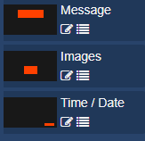
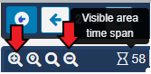

<!--toc=layouts-->

# レイアウトタイムライン

レイアウト上の各リージョンは、コンテンツの**プレイリスト**を持ち、プレイヤーによって指定された順序で表示される。

プレイリストは、**1つのアイテム**（会社のロゴなど）、または**複数のアイテム**（画像のスライドショーなど）で構成されています。

リージョンのプレイリストは、レイアウトデザイナーの**タイムライン**で表示/編集されます。

タイムラインは、各リージョンに割り当てられたウィジェットがどのように再生されるかを明確に示しています。グレーアウトした項目は、その項目自身の持続時間を超えたときに何が再生されるかを示しています。

リージョンの左側のウィンドウは、レイアウト上のリージョンの位置のプレビューを提供します。

ここでリージョンをクリックするとエディタが開き、プロパティパネルに利用可能なオプションが表示されます。

{tip}
編集アイコンでエディターを開くこともできます。
{/tip}

ビューア左上の戻る矢印をクリックすると、エディタが終了し、レイアウトビューに戻ります。

## コンテンツの割り当て

レイアウトデザイナーのツールバーから[ウィジェット](layouts_widgets.html)を追加したり、[ライブラリ検索](layouts_library_search.html]を使って、すでにライブラリにアップロードされているコンテンツを追加したりすることができます。

{tip}
利用可能なウィジェットは、CMSの[モジュール](media_modules.html)セクションで管理者が有効/無効を設定することができます。
{/tip}

メディアを追加すると、タイムラインは自動的に新しく追加されたコンテンツ（緑色で表示）にスクロールし、簡単に設定することができます。

{tip}
タイムライン上でウィジェットをドラッグすると、そのリージョンで再生する順番を変更することができます。
{/tip}

タイムラインボタンでズームイン・ズームアウトして、見える時間を短くしたり長くしたり、青いスクロールバーでタイムライン上にあるすべての割り当てられたコンテンツを見ることができます。

{tip}
タイムラインをスクロールしているときに、**選択したウィジェットにスクロール**ボタンで、現在作業中のウィジェットに簡単にスナップバックすることができます。
{/tip}

タイムライン上の特定のポイントにコンテンツを追加することができます。

タイムライン上に表示されているポジションマーカーに、ドラッグやクリックでメディアを追加することができます。

プレイリストビューのリージョンにメディアを追加するには、リージョンの右側にあるメニューアイコンをクリックします。

プレイリストビューが開き、同じようにコンテンツを追加することができます。

### リージョンからの削除

削除するには、レイアウトタイムラインで割り当てられたウェジェットをクリックし、画面右下の赤い**削除アイコン**をクリックします。

{tip}
タイムライン上のウィジェットを右クリックすると、コンテキストメニューが表示され、さらにオプションを選択することができます。

オーディオ添付、有効期限の設定、ユーザー/ユーザーグループへの共有アクセス権の設定などができます。

矢印でウィジェットをタイムラインに沿って移動させ、順番を入れ替えることができます。
{/tip}

コンテキストメニューで利用できるオプションの詳細については、[Layout Designer](layouts_designer.html) のマニュアルページを参照してください。

{tip}
{white}
[メディアのデュレーションと再生への影響について(Understanding Media duration and how it affects playback](https://community.xibo.org.uk/t/understanding-media-duration-and-how-it-affects-playback/20011)のガイドをご覧ください。
(英語）
{/white}
{/tip}

