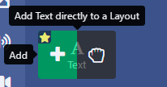
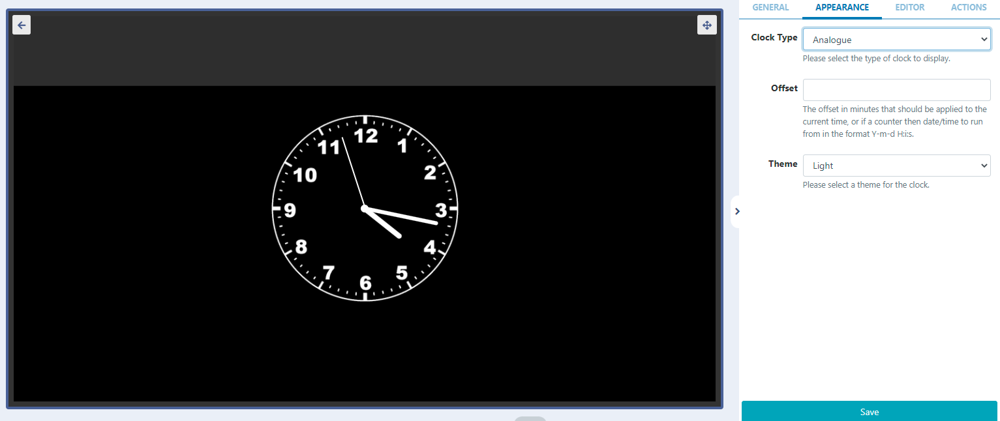

<!--toc=layouts-->

# ウェジェット

[レイアウトデザイナー](layouts_designer.html)のツールバーから利用できる様々な**ウィジェット**を使用して、レイアウトにコンテンツを追加することができます。

{tip}
利用可能なウィジェットは、管理者がCMSの[Modules](https://xibo.org.uk/manual/en/media_modules.html)セクションで無効化/有効化することができます。
{/tip}

検索フィールドを使用して、簡単にウィジェットを見つけ、お気に入りとしてマークして、選択を容易にするためにそれらをグループ化することができます。

- ウィジェットにカーソルを合わせ、左上の星のアイコンを選択すると、お気に入りとして登録されます。

- 星をクリックすると、選択を解除してお気に入りから外すことができます。

## レイアウトにウィジェットを追加する

ウィジェットをクリックすると、**追加** のオプションが表示されます 

または

は、**掴む** でドラッグアンドドロップします。

- ウィジェットを追加するには、対象の**リージョン**（ビューアまたはタイムラインのリージョン）を直接クリックするか、ドラッグしてください。

ウィジットを追加すると、プロパティパネルで選択したウィジットの利用可能なオプションを使用して、ウィジットを設定することができます。

- **タイムライン**上の特定のポイントにウィジェットを追加します。追加するマーカーをドラッグまたはクリックします。

ウィジェットは、プレイリストビューのリージョンに追加することもできます。

- タイムラインの右側にあるメニューをクリックします。

プレイリストビューが開き、クリックによる追加やドラッグ＆ドロップで同じようにウィジェットを追加することができます。

{tip}
左側の**複数ウェジェットの選択**ボタンを使って、プレイリスト上の複数のアイテムをハイライトして削除することができます。
{/tip}

{tip}
**レイアウトタイムライン**または**プレイリストビュー**でウィジェットをクリックし、プロパティパネルで利用可能なオプションを開いて**編集**を行うことができます。
{/tip}

