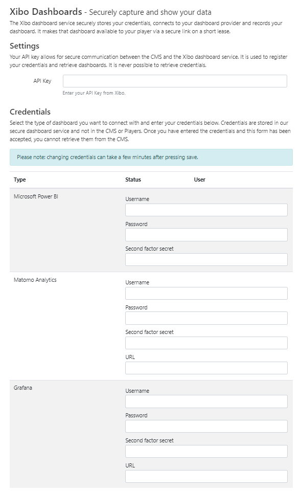

# Dashboard Service

{white}
If you would like to take advantage of this feature, please contact your Administrator.
{/white}

{nonwhite}
The Xibo Dashboards Service is a commercial feature which allows Users to securely display dashboard services; Microsoft Power BI, Grafana and Matomo, on Layouts with automation and authentication handled by Xibo.

**Please note:** This commercial feature requires an API for configuration as further explained [here](/pricing#dashboards).

Once the Connector has been configured, add dashboards to display in Layouts using the [Dashboards Widget](/manual/en/media_module_dashboard.html)

## Configure Connector

From the CMS:

- Click on **Applications** under the **Administration** section of the main menu.
- Scroll down to the **Connectors** section of the page. 
- Click the **Configure** button for the **Xibo** **Dashboard Service** connector:

- Enter the API key you have been given (available in [My Account](/login)).

{tip}
Customers on a Business or Enterprise Plan will have their API key pre-filled!
{/tip}

- Tick to **Enable** to start providing the dashboard services

- Click to **Save.**

- Click the **Configure** button again for the Xibo Dashboard service connector.
- Using the **Credentials** section of the form, select the dashboard service(s) you wish to use:

Enter the following credentials:

- Username
- Password
- Two Factor Secret (if required)
- URL (if required)

{tip}
Grafana does not support multi factor authentication, so please leave the **Two Factor** **Secret field empty** when configuring this integration.

Please see the following page for further information on obtaining a URL to use with this service, supported authentication mechanisms and possible limitations [Xibo Dashboard Service](/docs/setup/xibo-dashboard-service)
{/tip}

- Click to **Save** and wait a few moments whilst those credentials are successfully registered.

Your Dashboard is ready to be added to Layouts using the [Dashboard Widget](/manual/en/media_module_dashboard.html)
{/nonwhite}