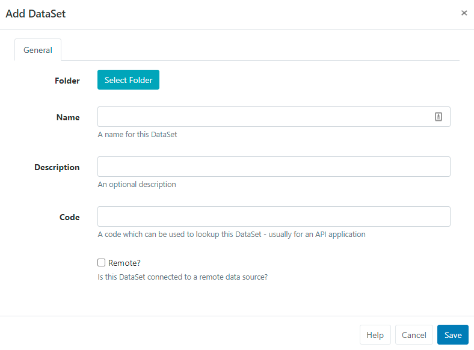
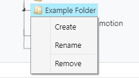

<!--toc=media-->

# データセット

データセットは、**表形式**のデータを設計し、保存する機能です。一度設計したデータは、CSVファイルからのインポート、手入力、API経由のJSON、スケジュールでのリモート同期が可能です。データセットは、他のシステムからデータをインポートし、[[PRODUCTNAME]]に表示するための便利な方法として提供されます。

データセットの活用例。

- バーのドリンクメニュー
- ゴルフクラブでのティオフタイム
- ミーティングルームの予約

データセットは汎用的で再利用できるように設計されており、2つの部分から構成されています。

1. **データセット**（データ構造とデータ）
2. **ディスプレイ** ([データセットビュー](media_module_dataset_view.html)/[データセットティッカー](media_module_dataset_ticker.html)/[チャート](media_module_chart.html) またはカスタムモジュール用のデータソース)

データセットは最初に定義され、レイアウトに追加された複数のデータセット・ビュー/ティッカー/チャート・ウィジェットで再利用することができます。メインメニューのライブラリセクションからデータセットに移動してアクセスします。


データセット[グリッド](tour_grid.html)では、既存の編集と新規作成が可能です。

デフォルトでは、**フォルダ**ツリーが開きます。

- フォルダ/サブフォルダをクリックすると、その内容が検索され、グリッドに適用されたフィルターに基づいた結果が返されます。

または

- **全フォルダ**にチェックを入れると、ルートフォルダでの検索を含み、グリッドに適用されたフィルターに基づいた結果を返します。

{tip}
フォルダメニューをクリックすると、表示/非表示が切り替わります。 フォルダーを非表示にすると、選択したフォルダーのファイルパスが表示されます。
{/tip}

## 新しいデータセットの作成

データセットの作成は、2つのステップで行います。

1. データセットのレコードを追加する
2. カラムの作成と設定

### データセットのレコードを追加する

データセットを追加ボタンをクリックし、適切なフォームフィールドに入力します。



データセットは、オプションで**フォルダ**に保存することができます。

{tip}
フォルダに保存されたデータセットは、ユーザー/ユーザーグループのアクセス用に保存先フォルダに適用された表示、編集、削除 **共有** オプションを継承します!
{/tip}

- **フォルダ選択**ボタンをクリックして展開し、保存するフォルダを選択します


フォルダを右クリックすることで、その他のオプションにアクセスすることができます。



{tip}
利用可能なオプションは、ユーザー/ユーザーグループの有効な[機能と共有](users_features_and_sharing.html)オプションに基づきます。
{/tip}

- 選択されたフォルダーファイルパスは、フォームのフォルダーフィールドの横に表示されます。

{white}
フォルダアクセスとセットアップに関する詳細については、管理者にご相談ください。
{/white}

- CMS内で簡単に識別できるように、データセットに**名前**を付けます。
- オプションで**説明**を指定し、このデータセットのユーザーに詳細や指示を与えることができます。
- このデータセットを検索するためのコードを入力します（通常、API経由で参照するために使用します）。
- このデータセットがリモートデータソースと同期する場合は、**リモート接続** チェックボックスをオンにすると、さらに詳細な設定オプションが表示されます。

データセットが**リモートでない**場合、クリックして**保存**し、このページの[列の作成と設定](media_datasets.html#列の作成と設定)のセクションから続けてください。

### リモートデータセット

リモートデータセットは、サードパーティデータソースから定期的に同期される特別なタイプのデータセットです。[[PRODUCTNAME]]は、選択された期間にURLを呼び出し、データセットレコードと**リモート**として定義された任意の**カラム**に設定された指示に従って、データを処理します

リモート接続を選択すると、追加のタブフィールドが表示され、リモートデータセットのレコードを完成させることができます。


各タブを使用して、リモートデータソースのURL、リクエストメソッド、リクエストパラメータ、および認証情報を入力します。

**リモート** - リモートデータソースのURLとリクエストメソッドを入力します。

**認証** - 認証情報およびオプションのカスタムHTTPヘッダーの文字列を入力します。

**データ** - リモートデータソースは、JSONフォーマットまたはCSVを選択することができます。

- #### JSONソース

JSONデータは、リモートタイプとして定義されたカラムに従って入力されます。'リモートカラム'を指定する場合、'データパス'を入力する必要があります。これは、指定された**データルート**に対して、そのカラムのデータへのJSON構文パスとなります。

{tip}
JSONデータソースの例で考えてみましょう。

```json
{
    "base": "EUR",
    "date": "2017-12-22",
    "rates": {
        "GBP": 0.88568,
        "THB": 38.83,
        "USD": 1.1853
    }
}
```

もし、通貨記号とその値を取得する列を作りたい場合は、**データルート** を `rates` に設定し、列に次の指定する必要があります。

Symbol - data path = 0

Value - data path = 1

{/tip}

- #### CSVソース

CSVソースにヘッダーが含まれる場合、最初の行を無視するようにチェックを入れます。

{tip}
どちらの場合も、**データ取得URLをテスト**を使用して、目的の構造が返されることを確認します!
{/tip}

**高度な設定** - リモートデータを取得し、インポートする頻度を設定します。

- 完了したら、データセットレコードの**保存**をクリックします

### 2. カラムの作成と設定

列は、データの構造を定義するために使用されます。

- 選択したデータセットレコードの行メニューを使用し、**列の表示**を選択します。


{tip}
データセットに作成されたすべてのカラムがここに表示されます。デフォルトでは、すべての新しいデータセットに **Col1** が追加されます。これは行メニューを使用して編集または削除する必要があります。
{/tip}

- 新しい列を作成するには、**列を追加** ボタンをクリックします。
- フォームフィールドを使用して、設定を定義します。


- コラムを識別するために、**見出し**を入力します。
- ドロップダウンを使って、必要なカラムの種類を選択します。
  {tip}
  選択された特定のタイプについては、以下のセクションで解説する追加情報が必要になります。
  {/tip}
- 必要とするデータの種類に応じて使用する形式を選択します。
- データを閲覧・編集する際に、このカラムが表示される位置を設定します。
- 選択したカラムにフィルタ**またはソート**が必要な場合は、追加のチェックボックスを使用します。

#### カラムタイプに必要な追加情報

選択された列の種類に応じて、追加の情報が必要となります。

- **値** - このフィールドで選択可能な値のカンマ区切りリストを提供する。

- **式** - SELECT' 文で使用するのに適した MySQL 文、または日付フィールドをフォーマットする文字列 `$dateFormat(<col>,<format>,<language>)` を入力してください。

  {tip}
  日付の書式が機能するように、`<col>` に日付と時刻が指定されていることを確認してください。
  言語が設定されていない場合、デフォルトは英語となります。
  {/tip}

- **リモート** - サードパーティのデータソースからデータにアクセスする方法を示すJSON構文文字列を提供する。

[[PRODUCTNAME]]がサポートするカラムの数に理論的な制限はありませんが、より小さなデータセットの方が管理や表示が簡単になる場合があります。

{tip}
データを収集した後でも、列の順序やリストの内容を変更することができます。
{/tip}

[[PRODUCTNAME]]は、PHPの正しい日付書式であれば、どんな日付書式でも受け入れるはずです。このページの一番下にある **日付フォーマット表** を参考にしてください

## データ行

- データセットに必要なカラムを定義したら、いくつかのデータを追加する必要があります。これはいくつかの方法で行うことができます。

  - CMSユーザーインターフェースによる手動操作
  - CSVファイルによるインポート
  - APIを使用する
  - リモートで同期

### 手動

データの追加・編集は、列ページの **データ表示** ボタン、またはデータセットの行メニューから行います。

データテーブルには、設定された通りに各カラムが表示されます。


- **行を追加**するボタンをクリックして、新しいデータ行を追加し、数式以外の列のタイプの情報を入力します。
- さらに行を追加するために、**次へ**をクリックしてデータの追加を続行します。
- すべてのデータの入力が完了したら、**保存** をクリックします。

- **編集**する行をクリックして必要な変更を行い、**保存**をクリックします。

- 選択した行の末尾にある十字をクリックし、確定することで行を**削除**します。

{tip}
グリッド上のボタンを使って、**マルチセレクトモード**に切り替えることができます。このモードでは、複数の行を選択して、**行を削除**をクリックすると、一括して削除することができます。

完了したら、**編集モード**ボタンをクリックして、マルチセレクトモードを解除してください。
{/tip}

### CSVのインポート

CMSにはデータセットCSVインポーターがあり、**CSVファイル**からデータを抽出し、データセットに入れることができます。**CSVインポート**機能は、あらゆるデータセット（リモートデータソース用に設定されたデータセットを除く）の行メニューからアクセスすることができます。

インポーターを開くと、既存のデータをインポートファイルのデータで上書きするオプションや、CSVファイルに見出しがある場合、最初の行を無視してインポートするオプションが用意されています。

データセットのリモートカラムがリストアップされ、その横に、リストアップされたカラムヘッダに対応するCSVファイルのカラム番号を示すフィールドが表示されます。

このフォームの例を以下に示します。


{tip}
非ASCII文字を使用している場合、CSVファイルのファイルエンコーディングが正しいことを確認することが重要です。非ASCII文字は、英語以外の言語では非常に一般的です。最も一般的に使用されているファイルエンコーディングは、UTF-8です。

ExcelでCSVファイルを編集した場合、名前を付けて保存ダイアログの「ツール」→「Webオプション」→「エンコード」タブで「Unicode（UTF-8）」を選択していることを確認する必要があります。
{/tip}

### APIを通じて

[[PRODUCTNAME]]を使ってデータセットにデータを同期させる独自のアプリケーションを作成することができます。データは行ごとに追加することも、JSON構造体全体をインポートすることも可能です。

### リモートで

リモートデータセットは、**フェッチリモートデータセット**というタスクで同期が保たれています。このタスクはデフォルトで設定されており、1分間に1回実行されます。

#### i依存関係

リモートデータセットは、他のデータセットに依存してリクエストを作成することができます。依存するデータセットの各行は、親データセットのリクエストパラメータを使用して リクエストを作成するために使用されます。

## 行メニュー

- データセットの行メニューを使用して、追加のアクションにアクセスします。

- RSS を表示することで、自分のデータセットにあるデータを RSS フィードとしてレイアウトに掲載することができます。**RSS表示**をクリックすると、URLがコピーされ、[ ティッカー ](media_module_ticker.html) ウィジェットの設定に含めることができます。

- データセットをCSVで書き出すことが可能です。

削除を選択すると、データセットに含まれるすべてのデータを削除するオプションが表示されます。

{tip}
データセットは、使用されていない場合にのみ削除することができます。

グリッド下部の個別選択オプションにより、複数のデータセットを一括して選択・削除することができます。
{/tip}

- 他のユーザー/ユーザーグループに対して、[閲覧、編集、削除のアクセス権](users_features_and_sharing.html)を割り当てる

{tip}
データセットはレイアウトと独立して編集されるため、データセットが追加されたレイアウトにアクセスしたり編集したりする必要はありません。
レイアウトを編集する必要はなく、変更はすぐにシステムに反映され、プレイヤーの次のコレクションに反映されます。
{/tip}


## 日付フォーマット表

| 文字 | 説明                                                  | 返される文字の例                 |
| ---------------- | :----------------------------------------------------------- | --------------------------------------- |
|                  | **日**                                                      |                                         |
| d                | ゼロから始まる２桁の日付              | 01 から 31                                |
| D                | 日を表すテキスト, ３文字            | Mon から Sun                         |
| j                | ゼロをつけない日付                       | 1 から 31                                 |
| l                | (小文字‘L’) 日を表す完全な文字列 | Sunday から Saturday                 |
| N                | ISO-8601で定義された曜日を表す数字(PHP 5.1.0で追加された) | 1 (月曜日) から 7 (日曜日)   |
| S                | 日にちに対する英語の序数サフィックス、2文字| st, nd, rd または th. jとともに使われる     |
| w                | 曜日の数字表現         | 0 (Sunday) から 6 (Saturday) |
| z                | 年初からの日（0から始まる)                        | 0 から 365                           |
|                  | **週**                                                     |                                         |
| W                | ISO-8601で規定する週の数字, 週は月曜日から始まる(PHP 4.1.0で追加) | 42 (一年の中の４２週目)          |
|                  | **月**                                                    |                                         |
| F                | 月のテキスト表現, January や March | January から December                |
| m                | ゼロで始まる月の数字表現        | 01 から 12                           |
| M                | 月の短いテキスト表現、３文字     | Jan から Dec                         |
| n                | 月の数字表現、先頭にゼロはつかない| 1 から 12                            |
| t                | 月の日数                            | 28 から 31                           |
|                  | **年**                                                     |                                         |
| L                | うるう年かどうか                                     | 1 うるう年, 0 それ以外.    |
| o                | ISO-8601できていされた年. これはYと同じ値です。ただし、ISOの週番号（W）が前後の年に属している場合は、その年が代わりに使用されます。(PHP 5.1.0で追加) | 1999 または 2003                            |
| Y                | 年の４桁数字表現            | 1999 または 2003                            |
| y                | 年の２桁数字表現                         | 99 or 0                                 |

