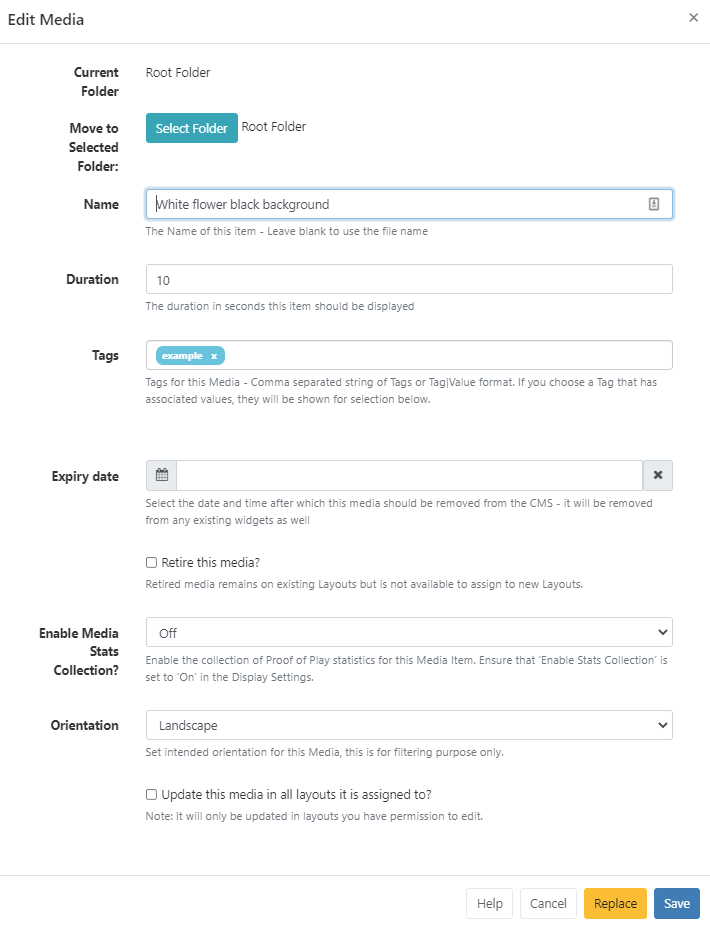

<!--toc=media-->

# ライブラリ

{tip}

CMS ライブラリには、レイアウトで使用するためにアップロードされたすべてのファイルベースのメディアが保存されます。

{tip}
レイアウトやプレイリストに使用するために選択されたPixabayの画像やビデオもライブラリに追加されます!
{/tip}

ライブラリーのメディアは、メインメニューの**ライブラリーセクション**にある**メディア**から管理します。

絞り込み検索が簡単にできます。

{tip}
複数の**タグ**を割り当てたアイテムをフィルタリングするには、**AND**オプションを使用します。
{/tip}

{tip}
サムネイルが設定されている画像や動画は、方向でフィルタリングすることも可能です。行メニューから、画像/動画ファイルの**編集**を選択して設定します。 フォームの一番下までスクロールして、目的の**画像の向き**を設定します。
{/tip}

フォルダに保存されたメディアを見るには、**フォルダ検索**を使用します

- フォルダ/サブフォルダをクリックすると、その内容が検索され、グリッドに適用されたフィルターに基づいた結果が返されます。

または

- **全フォルダ**にチェックを入れると、ルートフォルダでの検索を含み、グリッドに適用されたフィルターに基づいた結果を返します。

フォルダを利用することで、ユーザーはオブジェクトを簡単に整理、検索、共有することができます。 詳しくは、[グリッド]のページ(tour_grids.html)をご覧ください。

## メディアを追加

ライブラリメディアは、**メディアを追加**ボタンを使用して直接アップロードするか、**メディアを追加（URL）**ボタンを使用してURLを提供することでアップロードすることができます。

{tip}
ライブラリにアップロードして、[ライブラリ検索](layouts_library_search.html)のオプションで選択できるようにメディアを準備します!
{/tip}

### アップロード

- グリッドの上部にある**メディアを追加**ボタンを選択します。

  

- **ファイルを追加**をクリックし、アップロードするファイルを選択します。

{tip}
ドラッグ＆ドロップでファイルを追加することも可能です。
{/tip}

- CMSで識別しやすいように**名前**を付け、オプションで**タグ**を付けてください。

{tip}
名前フィールドが空白のままだと、アップロード時に元のファイル名と同じ名前が付けられます!
{/tip}

また、指定した**フォルダ**に直接メディアをアップロードすることも可能です。

{tip}
フォルダに保存されたメディアファイルは、ユーザー/ユーザーグループのアクセス権のために保存先フォルダに適用された表示、編集、削除の共有オプションを継承します
{/tip}

- **フォルダ選択**ボタンをクリックして展開し、保存するフォルダを選択します。

- フォルダを右クリックすることで、その他のオプションにアクセスすることができます。

{tip}
利用可能なフォルダーオプションは、ユーザー/ユーザーグループの有効な[機能と共有](users_features_and_sharing.html)オプションに基づきます。
{/tip}

- ファイルをアップロードするフォルダをクリックし、**完了**をクリックします。
- **現在のフォルダ**に選択したファイルのパスが表示されるようになりました。

- **アップロードを開始**」ボタンをクリックすると、全ファイルのアップロードが開始されます。フォルダが選択されていて、複数のファイルを追加した場合、すべてのファイルがその場所にアップロードされます。

ファイルを個別にアップロードし、異なるフォルダの場所を指定することも可能です。
アップロード開始ボタンをクリックする代わりに、追加されたファイルの行の最後に表示される**青いアップロード**ボタンをクリックしてください。

- 先ほどと同様に**フォルダを選択**ボタンでフォルダの場所を変更し、行の最後にある青いボタンをクリックすると、そのファイルだけをアップロードすることができます。

{white}
フォルダアクセスとセットアップに関する詳細については、管理者にご相談ください。
{/white}

- すべてのファイルが正常にアップロードされたら、**完了**をクリックします

{tip}
メディアファイルの、画像、オーディオ、ビデオファイルについては、[Library Search](layouts_library_search.html) 機能のアップロードツールを使用してレイアウトに直接アップロードすることも可能です。その他のファイル タイプ（PDF など）は、関連するウィジェット**をレイアウト**に追加してアップロードすることができます。レイアウトに直接追加されたファイルは、デフォルトでライブラリに保存されます。
{/tip}

### URLでメディアを追加する

- グリッド上部の **メディアを追加（URL）** ボタンを選択します。

- このメディアファイルを追加する特定のフォルダを選択/作成する必要がある場合は、[フォルダを選択]ボタンを使用します。
- ファイルのリモート URL を指定します。
- システムで識別しやすくするために、ファイル名の代わりに使用する「名前」を入力します。
- クリックで**保存**。

## フォントをアップロード

[[PRODUCTNAME]]には、現在、テキストエディタツール-CKEditorが提供する標準フォントのセットが付属しています。

- Aileron Heavy Regular (Aileron-Heavy.otf)
- Aileron Regular (Aileron-Regular.otf)
- Dancing Script Regular (DancingScript-Regular.ttf)
- Railway Regular (Railway.ttf)
- Linear Regular (linear-by-braydon-fuller.otf)

アップローダーツールを使って、**ライブラリ**にフォントを追加することができます。追加されたフォントは、テキストエディタで使用することができます。

{tip}
アップロード後、テキストエディタに新しいフォントが表示されない場合は、ブラウザのキャッシュをクリアしてみてください
{/tip}

{tip}
**注意** フォントには、**OS/2タグ**として知られているプリファレンスが組み込まれています。 [[PRODUCTNAME]]はOS/2プリファレンスをチェックし、**OS/2タグ0または8を持つ**フォントを使用することができます。他のOS/2タグを持つフォントは、アップロード時にエラーを発生させ、正しく表示されないかもしれません。
{/tip}

{tip}
日本語環境でのフォントは、Gooleが無料で公開している[Google Fonts](https://fonts.google.com/)がお勧めです。日本語を選択すれば、数多くのフォントが公開されています。美しいフォントを選ぶことにより、サイネージをより一層目立たせることができます。
{/tip}

**ライブラリ**の各項目には、ユーザーがアクション/ショートカットのリストにアクセスできる行メニューがあります。

### 編集

フォルダの場所、名前、期間などを変更することができます。

- **現在のフォルダ**には、現在のファイルパスが表示されます。 別の場所に移動する場合は、**フォルダを選択** をクリックします。
- **タグ** - ファイルの順序付けを可能にし、見つけやすくします。

フォームのタグフィールドにテキストを入力すると、オートコンプリートヘルパーが一致する候補を表示し、ユーザーが簡単に選択できるようにします。

定義済みの値は、**タグ値**のドロップダウンを使用して表示されます。値が既に知られている場合は、次のフォーマットを使用してフィールドに直接入力することができます。'色|赤`

{tip}
管理者によって値が「必須」に設定されている場合、フォームを保存するために値を入力する必要があります。
{/tip}

ユーザーは、** タグ値** フィールドを使用して、定義済みの値をまだ持っていないタグに関連する値を追加できます。タグの値が必要ない場合は、このフィールドを空白にすることができます。

{tip}
ライブラリグリッド下部の[個別選択](https://xibo.org.uk/manual/en/tour_grids.html#複数選択-個別選択による)を使って、複数のメディアファイルにタグを割り当てることも可能です!
{/tip}

使用する**タグ**と**タグ値**の詳細については、管理者にご相談ください。

- **有効期限** - 選択したメディアファイルをCMSから完全に削除する日時を設定します。

{tip}
**注意** 現在、Linux プレイヤーでは、有効期限はサポートされていません。
{/tip}

{tip}
**注意** 選択したファイルを含むレイアウトからメディアを削除します。
{/tip}

{tip}
メディア ファイルを完全に削除せず、既存のレイアウトに割り当てたままにする場合は、**このメディアを稼働停止** オプションにチェックを入れます。メディア ファイルは、新しいレイアウトの選択対象として表示されなくなります。
{/tip}

- **メディア統計情報収集** - 選択したメディアファイルの[実行証明](displays_metrics.html#proof_of_play) 統計の収集をオン / オフ / 継承に設定します。

{tip}
実行証明の記録を収集するには、[表示設定](displays_settings.html)で統計レポートを有効にすることにチェックが入っていることを確認してください。
{/tip}

- **画面の向き** - 画像とビデオに適用され、フィルタリングに設定するために、ランドスケープまたはポートレートに設定します。

{tip}
**割り当てられているすべてのレイアウトでこのメディアを更新**チェック ボックスをオンにすると、このメディア ファイルが現在割り当てられているレイアウトに編集が反映されます。編集は、編集権限のあるレイアウトにのみ反映されます。
{/tip}

既存のファイルの新しいリビジョンをアップロードすることが必要な場合があります。これは、フォームの下部にある **置換** ボタンを使用することによって行うことができます。

先ほどと同じ手順で置換ファイルをアップロードし、現在割り当てられているすべてのレイアウトに更新するかどうか、古いバージョンを削除するかどうかを選択します。

### コピー

選択したメディアファイルのコピーを作成し、コピーしたファイルに新しい**名前**と**タグ**を付与します。

### フォルダーを選択

メディアファイルの保存先フォルダを選択します。

### 削除

メディアファイルを CMS から削除できるのは、既存の **レイアウト** で使用されていない場合のみです。既存のレイアウトから強制的に削除するオプションは、削除したファイルを元に戻すことができないため、慎重に使用する必要があります。

{tip}
**稼働停止コンテンツ**とは、新しいレイアウトに割り当てることはできなくなりますが、割り当てられている既存のレイアウトには**残る**ということで、スケジュールされたコンテンツは影響を受けずに残ります。**編集**をクリックし、メディア編集フォームで稼働停止にチェックを入れてください。
{/tip}

XMDSを使用したハードプッシュを有効にし、プレイヤーのローカルストレージからファイルを完全に削除する場合は、ボックスにチェックを入れます。

### 共有

選択したユーザー/ユーザーグループに対して[共有](users_features_and_sharing.html)オプションを有効にします。

### ダウンロード

共有しやすいように、**メディアファイル**をダウンロードしてください。

### 統計収集を有効に

実行証明の統計情報の収集を有効にする。

### 利用状況レポート

選択した**メディアファイル**が**ディスプレイ**に直接割り当て/スケジュールされているかどうかが表示されます。

- レイアウトタブで、メディアファイルが現在どの**レイアウト**に含まれているかを確認します。

{tip}
**利用状況レポー**は、メディアファイルを整理する前の最終チェックに最適です。
{/tip}

{tip}
ライブラリ[グリッド](tour_grids.html)の下部にある**個別選択**オプションを使って、タグの編集、フォルダへの移動、削除、共有を一括して行うことができます!
{/tip}
